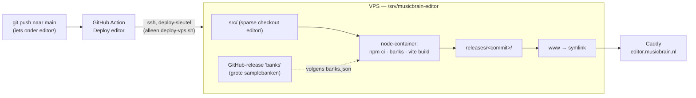

# Editor deploy — editor.musicbrain.nl

De patch-editor/simulator (`editor/`) is een zelfstandige **statische**
Vite/React-SPA: geen database en geen server. Hij draait op het subdomein
**editor.musicbrain.nl** en wordt vanuit dít repo gedeployd, op eigen
release-tempo. De publiekssite (musicbrain.nl, Imprint) linkt er alleen naartoe
via zijn `/editor`-pagina; er is geen koppeling tussen de twee.

**Sinds september 2026 draait de editor op de VPS** (vps1, naast musicbrain.nl
en Omnium), gedeployd door een GitHub Action. De Plesk-opzet bij Quickhost staat
onderaan als historie.

## Hoe een wijziging live komt



1. Je pusht naar `main`, met een wijziging onder `editor/`.
2. De workflow `.github/workflows/deploy-editor.yml` logt in op de VPS met een
   SSH-sleutel die daar **alleen** `editor/deploy-vps.sh` mag starten (forced
   command: geen shell, geen tunnels), en geeft de commit mee.
3. `deploy-vps.sh` haalt die commit op, laat een node-container `npm ci`,
   `npm run banks` en `npm run build` draaien, zet het resultaat in
   `releases/<commit>/` en zet de symlink `www` om. Gaat een stap mis, dan
   blijft de live versie staan en wordt de Action rood.
4. De Action controleert via `version.txt` dat precies die commit live staat.

De voortgang zie je op GitHub onder **Actions → Deploy editor**. Handmatig
starten kan daar ook (**Run workflow**), of vanaf een machine met toegang tot
de VPS:

```bash
ssh vps1 /srv/musicbrain-editor/src/editor/deploy-vps.sh          # laatste main
ssh vps1 /srv/musicbrain-editor/src/editor/deploy-vps.sh 1a2b3c4  # terug naar een eerdere commit
```

De laatste 3 releases blijven bewaard. Terugdraaien naar een van die drie is
direct, want er wordt dan niets opnieuw gebouwd.

## Grote bestanden buiten git (banken, ROM's, …)

Kleine samplebanken staan gewoon in git (`editor/public/banks/`, zie de README
daar). Bestanden onder `editor/public/` die niet in git kunnen of mogen, hangen
als bijlage aan de GitHub-release **`banks`**:

- samplebanken die te groot zijn (GitHub weigert bestanden boven 100 MB), zoals
  de YDP-vleugel;
- `dx7/roms.bin`, de ROM-banken die de DX7-module ophaalt. Die valt onder de
  regel `*.bin` in `.gitignore`, en stond daarom nooit online (404 bij
  Quickhost);
- en later elk ander soort bestand: het gaat om een pad onder `public/`, niet
  om het type.

Welke bestanden dat zijn, staat in **`editor/banks.json`** (pad onder `public/`,
bijlagenaam, sha256, grootte). Dat bestand staat wél in git, dus een commit
bepaalt ook welke bestanden online staan.

```bash
cd editor
npm run banks                                               # ontbrekende bestanden ophalen (desktop, laptop, VPS)
npm run banks:publish -- "public/banks/ydp-grand-2laags.mmbs"   # staat al onder public/: pad volgt vanzelf
npm run banks:publish -- ~/elders/roms.bin --to dx7         # staat ergens anders: --to zegt waar hij hoort
git add banks.json && git commit -m "banken: …" && git push # → live via de Action
```

- `publish` vereist `gh` (ingelogd). De eerste keer maakt het de release aan.
  Opnieuw publiceren met dezelfde naam vervangt de bijlage en werkt de sha256
  bij.
- De release is plat. Het pad zit in de bijlagenaam: `dx7/roms.bin` wordt
  `dx7--roms.bin`.
- `npm run banks` haalt alleen wat ontbreekt of gewijzigd is, en controleert
  elke download op zijn sha256. Na een verse clone is het dus: `npm install`,
  `npm run banks`, `npm run dev`.
- Ophalen gaat over gewone HTTPS; `gh` is daar niet voor nodig.
- Het ophalen ruimt niets op. Haal je een regel uit `banks.json`, dan blijft het
  bestand staan op elke machine die het al had — ook in de checkout op de VPS,
  waar het dus in de build blijft komen. Zo'n bestand moet je met de hand weg.

Zodat je `npm run banks` na een pull niet vergeet, staat er een hook in het
repo. Per machine één keer aanzetten (hooks zelf gaan niet mee in git, de
instelling ook niet):

```bash
git config core.hooksPath tools/githooks
```

`tools/githooks/post-merge` (ook als `post-rewrite`, voor `git pull --rebase`)
draait `npm run banks` zodra een pull `editor/banks.json` heeft gewijzigd, en
laat de pull staan als het ophalen faalt. Op de VPS is dit niet nodig:
`deploy-vps.sh` roept `npm run banks` zelf aan.

Let op: alles in de release is openbaar (het repo is openbaar), net als alles
op de editor-site. Zet er alleen bestanden in die herverdeeld mogen worden.

## Inrichting op de VPS (eenmalig; staat er sinds 19 september 2026)

```bash
sudo mkdir -p /srv/musicbrain-editor && sudo chown omnium: /srv/musicbrain-editor
cd /srv/musicbrain-editor
git clone --filter=blob:none --no-checkout https://github.com/MarkWestbroek/MusicBrain.git src
cd src && git sparse-checkout set editor && git checkout main     # ±150 MB i.p.v. het hele repo
```

**Kip-en-ei:** de Action start het script *uit deze checkout*, en het script
doet zelf de `git pull`. De checkout moet het script dus al bevatten. Bij de
eerste inrichting stond hij op een commit van vóór `deploy-vps.sh`, en de eerste
twee runs faalden met "No such file or directory". Eenmalig met de hand
`git pull` in `src/` loste dat op. Gevolg voor later: een wijziging aan
`deploy-vps.sh` zelf werkt pas vanaf de run **na** de push die hem bevat,
omdat de lopende run nog de oude versie draait.

- **Deploy-sleutel**: in `~/.ssh/authorized_keys` van de deploy-gebruiker op de VPS staat
  `command="/srv/musicbrain-editor/src/editor/deploy-vps.sh",restrict ssh-ed25519 … github-actions@MusicBrain deploy-editor`.
  De privésleutel staat alleen in de GitHub-secret `VPS_SSH_KEY`. Vervangen:
  nieuw sleutelpaar maken, de regel in `authorized_keys` vervangen en de secret
  overschrijven. Gebruiker en host staan in de secrets `VPS_USER` en `VPS_HOST`
  (bewust niet in dit openbare repo).
- **`VPS_KNOWN_HOSTS`**: de host-sleutel van de VPS (ed25519), vastgepind. Met
  de Windows-`ssh-keyscan` lukt het ophalen niet (die kent de sleuteluitwisseling
  van de VPS niet); gebruik die van Git Bash, of neem de regel uit je eigen
  `known_hosts`.
- **Caddy**: blok `editor.musicbrain.nl` in `/etc/caddy/Caddyfile` (repo-kopie
  in het Bitemporal-repo, `deploy/vps/Caddyfile`), `root` op
  `/srv/musicbrain-editor/www`.
- **DNS**: A-record `editor.musicbrain.nl` → `62.129.142.42` (DNS bij Quickhost).

## Build

`vite.config.ts` gebruikt `base: '/'` (de default): correct voor een
subdomein-**root**. Moet de editor ooit onder een subpad komen te staan
(bijvoorbeeld `…/editor/`), zet dan `base: '/editor/'`. Lokaal:

```
cd editor && npm install && npm run banks && npm run build   # → editor/dist
```

## Site-kant (Imprint-repo, apart)

De publiekssite heeft een `/editor`-landingspagina met een verhaal en de knop
"Open the editor" → `https://editor.musicbrain.nl`, en "Editor" in het
hoofdmenu. Die pagina is content in de database van musicbrain.nl en wordt in
de admin bewerkt.

## Historie: Plesk bij Quickhost (juli–september 2026)

Tot september 2026 stond de editor als Plesk-subdomein bij Quickhost: Plesk
pullde bij elke push (webhook), draaide
`npm install && npm run build` met `/opt/plesk/node/21/bin` en serveerde
`editor/dist`. Dat bleef werken nadat Quickhost Node voor apps uitzette, maar
grote banken konden er niet bij (niet in git, geen geautomatiseerde weg), en
het was een tweede, aparte deploy-omgeving naast de VPS. Na de verhuizing:
de Plesk-webhook op GitHub (`655461008`) en de Git-koppeling in Plesk
verwijderen.
