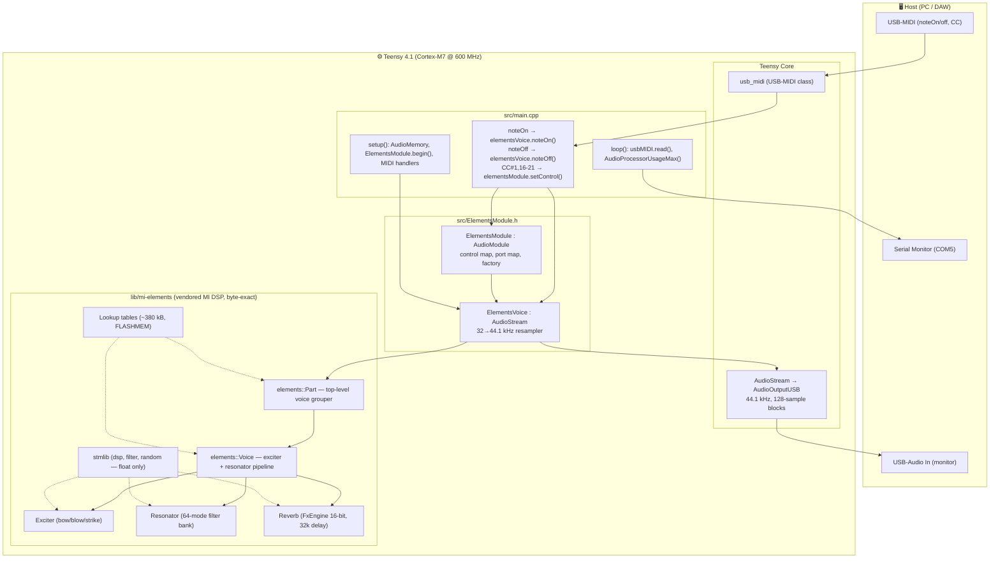
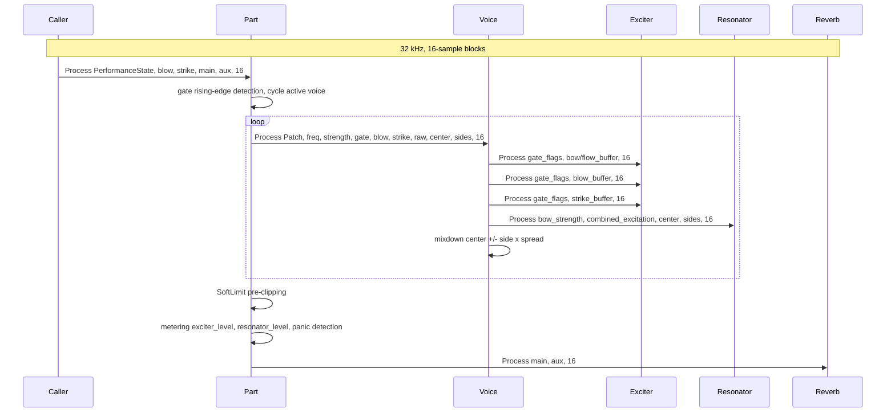
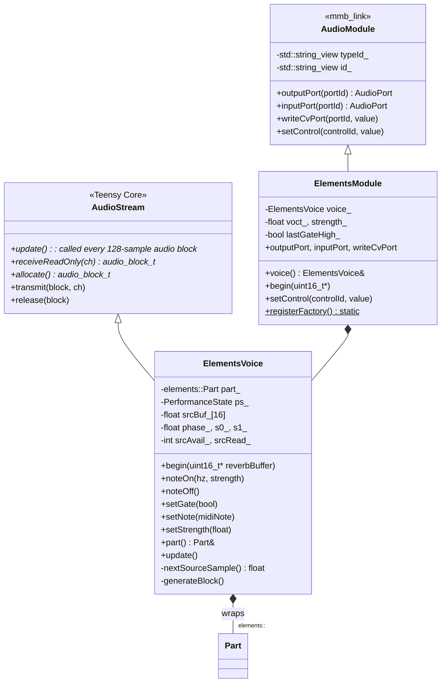
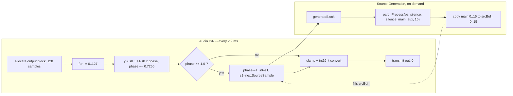
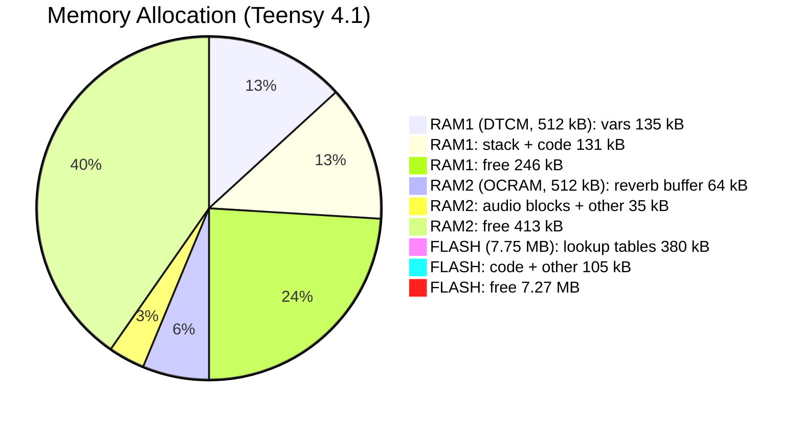
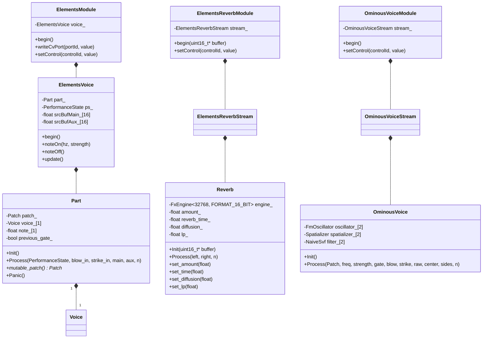
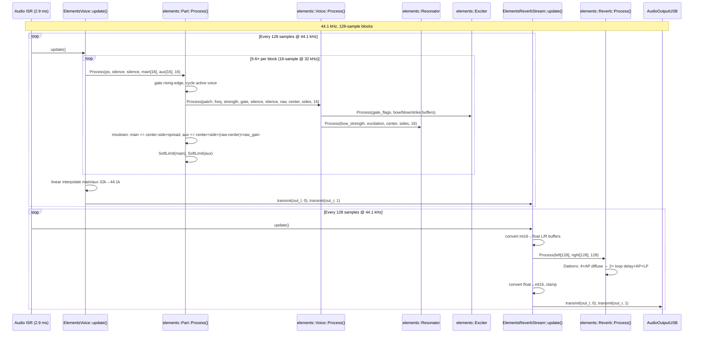
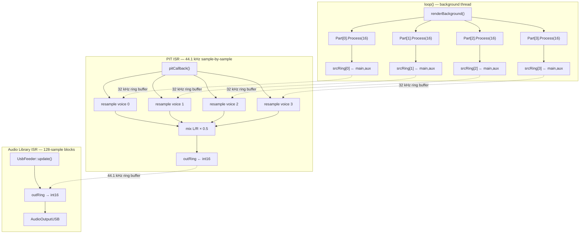

# Elements Spike Architecture

A port of the Mutable Instruments **Elements** (MIT, © Emilie Gillet) modal /
physical-modelling synth voice to the **Teensy 4.1** (Cortex-M7 @ 600 MHz + FPU),
wrapped as a MusicBrain `tp_mmb_elements` AudioModule.

---

## Layer Diagram



---

## Original Elements DSP (vendored)

All files live under `lib/mi-elements/`. Only the subset reachable from
`elements::Part` was copied; the STM32 HAL/CMSIS `third_party/` tree was
excluded. See `VENDORED.md` for provenance and licensing.

### DSP Class Diagram


### Native Sample Rate & Block Size

The upstream DSP renders **32 kHz** in blocks of **16 samples** (`kMaxBlockSize`).
All timing, envelope rates, LFO frequencies, and filter coefficients are expressed
in terms of `elements::kSampleRate = 32000.0f`.



---

## Wrapper Layer (Teensy Audio Adapter)

Our integration layer lives in `src/ElementsModule.h`.



### Resampler: 32 kHz → 44.1 kHz

`ElementsVoice::update()` performs **linear interpolation** between consecutive
32 kHz source samples to produce 44.1 kHz output. The resampler is fully
contained in the `update()` loop:



The source block (16 samples @ 32 kHz) lasts **0.5 ms**. At 44.1 kHz output, the
resampler calls `generateBlock()` roughly every **23 output samples**
($128 \times 0.7256 \approx 93$ source samples consumed per `update()`, or
$\lfloor 93/16 \rfloor = 5$–$6$ Part calls per block).

---

## Memory Map



| Region | Used | Free | Notes |
|--------|------|------|-------|
| **RAM1 (DTCM)** | ~267 kB | ~245 kB | Fast core-coupled RAM. Audio processing, stack. |
| **RAM2 (OCRAM)** | ~99 kB | ~425 kB | Slower. Reverb buffer (`DMAMEM uint16_t[32768]`), audio block pool. |
| **FLASH** | ~485 kB | ~7.6 MB | Code + `FLASHMEM` lookup tables (~380 kB). |

**The reverb delay line (64 kB) is too large for DTCM.** It lives in OCRAM,
initialised via `Part::Init(reverbBuffer)` in `setup()`. The ~380 kB lookup
tables (`resources.cc`) are tagged `FLASHMEM` so they stay in flash instead of
being copied to DTCM.

---

## Control Flow (MIDI → DSP)

```mermaid
sequenceDiagram
    participant KSP as Keystep Pro / DAW
    participant USB as USB-MIDI Host
    participant Loop as loop
    participant EM as ElementsModule
    participant EV as ElementsVoice
    participant Part as Part
    participant Voice as Voice
    participant Resonator as Resonator
    participant Exciter as Exciter

    Note over KSP, Voice: Note + gate
    KSP->>USB: NoteOn
    Loop->>EM: handleNoteOn
    EM->>EV: noteOn
    EV->>EV: set note, strength, gate
    Note over EV: next genBlock triggers Part.Process

    Note over KSP, Voice: Parameter change
    KSP->>USB: ControlChange
    Loop->>EM: handleControlChange
    EM->>Part: update patch values

    Note over Part, Voice: real-time vs next-note
    Part->>Resonator: set_brightness immediately
    Part->>Exciter: store geometry/position for next strike

```

### Parameter Categories

| Parameter | CC | Takes effect | Notes |
|-----------|----|-------------|-------|
| **envelope** | 1 | real-time | Exciter envelope shape (mod wheel) |
| **exciter** | 16 | next note | 0=bow, 1=blow, 2=strike |
| **geometry** | 17 | next note | Resonator shape → mode frequency ratios |
| **brightness** | 18 | real-time | Modal filter cutoff |
| **damping** | 19 | real-time | Mode decay time |
| **position** | 20 | next note | Excitation position on resonator |
| **space** | 21 | real-time | Reverb amount + stereo spread |

---

## Boot & Runtime Sequence

```mermaid
sequenceDiagram
    participant Setup as setup
    participant AM as AudioMemory 60
    participant EV as ElementsVoice
    participant Part as elements::Part
    participant Loop as loop

    Setup->>AM: allocate 60 x 128-sample blocks
    Setup->>EV: begin elementsReverbBuffer
    EV->>Part: Init reverbBuffer
    Note over Part: patch defaults, voice init, reverb init

    Setup->>Setup: usbMIDI.setHandleNoteOn/Off/CC
    Setup->>Setup: ElementsModule.registerFactory
    Note over Setup: Audio engine starts - ISR fires

    loop
        Note over EV: AudioStream.update called by ISR
        EV->>Part: genBlock - Part.Process ps, silence, silence, main, aux
        Part->>Part: gate rising-edge, cycle active voice
        Part->>Part: Voice.Process patch, freq, strength, gate
    end

    loop
        Loop->>Loop: while usbMIDI.read - drain MIDI events
    end

    loop
        Loop->>Loop: AudioProcessorUsageMax + AudioMemoryUsageMax
    end
```

---

## Files

| Path | Role |
|------|------|
| `src/main.cpp` | Entry point, MIDI handlers, CPU/audio monitoring |
| `src/ElementsModule.h` | `ElementsVoice` (Teensy AudioStream + resampler), `ElementsModule` (AudioModule + control map) |
| `src/FwVersion.h` | Firmware version (`0.1.0`) |
| `src/AudioModule.h` | Local copy of `mmb_link::AudioModule` mixin (delete when merged) |
| `lib/mi-elements/elements/dsp/part.{h,cc}` | Upstream: `elements::Part` — top-level voice grouper |
| `lib/mi-elements/elements/dsp/voice.{h,cc}` | Upstream: `elements::Voice` — exciter + resonator pipeline |
| `lib/mi-elements/elements/dsp/exciter.{h,cc}` | Upstream: bow / blow / strike physical models |
| `lib/mi-elements/elements/dsp/resonator.{h,cc}` | Upstream: modal filter bank (64 modes) |
| `lib/mi-elements/elements/dsp/string.{h,cc}` | Upstream: Karplus-Strong string model |
| `lib/mi-elements/elements/dsp/tube.{h,cc}` | Upstream: tube / wind model |
| `lib/mi-elements/elements/dsp/multistage_envelope.{h,cc}` | Upstream: DAHDSR envelope |
| `lib/mi-elements/elements/dsp/ominous_voice.{h,cc}` | Upstream: Easter egg voice |
| `lib/mi-elements/elements/dsp/fx/reverb.h` | Upstream: header-only reverb (Griesinger/Dattorro) |
| `lib/mi-elements/elements/dsp/fx/diffuser.h` | Upstream: all-pass diffuser |
| `lib/mi-elements/elements/dsp/fx/fx_engine.h` | Upstream: delay-line engine |
| `lib/mi-elements/elements/resources.{h,cc}` | Upstream: 380 kB lookup tables (FLASHMEM adapted) |
| `lib/mi-elements/stmlib/` | Upstream `stmlib` subset (dsp, filter, random — no STM HAL/CMSIS) |
| `lib/mi-elements/elements/drivers/debug_pin.h` | Stub: no-op TIC/TOC (replaces STM GPIO driver) |
| `lib/mi-elements/VENDORED.md` | Provenance, license, Teensy adaptations |
| `lib/mi-elements/library.json` | PlatformIO library manifest |
| `platformio.ini` | Build config (teensy41 target, `-I lib/mi-elements`) |
| `README.md` | Spike overview + flash instructions |

---

## Build

```powershell
.\.venv\Scripts\pio.exe run -d firmware\app-elements         # build
.\.venv\Scripts\pio.exe run -d firmware\app-elements -t upload  # flash
.\.venv\Scripts\pio.exe device monitor -p COM5 -b 115200     # serial log
```

### CPU Budget

One Elements voice consumes **~22%** of the 600 MHz Cortex-M7 budget at peak.
This suggests ~4 monophonic voices fit, or ~2 stereo.

---

## Future Integration (app-modular-brain)

When `tp_mmb_elements` is merged into `app-modular-brain`:

1. Delete the local `AudioModule.h` copy; use the shared `mmb_link::AudioModule`.
2. `ElementsVoice` audio inputs (`blow_in`, `strike_in`) need 44.1→32 kHz
   down-sampling (currently silence is fed).
3. The port map (`voct`, `gate`, `strength`, `blow_in`, `strike_in`, `out`)
   integrates with AudioGraph and CvGraph.
4. `setControl` integrates with the editor's module panel.
5. `ElementsModule::registerFactory()` is called from `registerAllRuntimeModules()`.

---

# ADR 0012 Implementation — Modular Separation (2026-06-05)

## What changed

Following [ADR 0012](../adr/0012-elements-modular-separation.md), the monolithic
`elements::Part` was split into three independent concerns:

| Concern | Before (monolithic) | After (modular) |
|---------|--------------------|-----------------|
| **Voice** | `Part` owned `Voice` + `OminousVoice` + `Reverb` | `Part` owns only `Voice` (modal/exciter pipeline) |
| **Reverb** | Embedded Dattorro reverb inside `Part::Process()` | Standalone `ElementsReverbModule` (`tp_mmb_elements_reverb`) |
| **OminousVoice** | Easter egg branch (`easter_egg_` flag) | Standalone `OminousVoiceModule` (`tp_mmb_ominous`) |

### Files changed

| File | Change |
|------|--------|
| `lib/mi-elements/elements/dsp/part.h` | Removed `#include` for `reverb.h`, `ominous_voice.h`. Removed `easter_egg_`, `reverb_`, `ominous_voice_` members. `Init()` takes no buffer. |
| `lib/mi-elements/elements/dsp/part.cc` | Removed reverb application block. Removed `easter_egg_` branch. `Init()` no longer calls `reverb_.Init()`. |
| `lib/mi-elements/elements/dsp/fx/reverb.h` | `Init()` now initialises `amount_`, `input_gain_`, `reverb_time_`, `lp_decay_1_/_2_` (bugfix for standalone use). |
| `src/ElementsModule.h` | `begin()` takes no buffer. Stereo output via `srcBufMain_`/`srcBufAux_` → `out_l`/`out_r`. Port map gains `out_l`, `out_r`. |
| `src/ElementsReverbModule.h` | **New.** Wraps `elements::Reverb` as `tp_mmb_elements_reverb`. Stereo in/out. Controls: `amount`, `time`, `diffusion`, `lp`. |
| `src/OminousVoiceModule.h` | **New.** Wraps `elements::OminousVoice` as `tp_mmb_ominous`. Stereo output. Controls: geometry, brightness, damping, etc. |
| `src/main.cpp` | Signal path: `ElementsVoice` → `ElementsReverbModule` → `AudioOutputUSB`. CC#31/32 drive standalone reverb. |
| `src/RegisterAllModules.h` | Added `ElementsModule::registerFactory()` and `ElementsReverbModule::registerFactory()`. |
| `platformio.ini` (app-modular-brain) | Added `mi-elements` lib dep and include path. |
| `editor/src/modular-mb/seedModules.ts` | Added `mmbElements()` module type definition (`tp_mmb_elements`). |

## Class Diagram — Post-Separation



## Sequence Diagram — Audio Flow (Stereo Voice + Standalone Reverb)



## Port Map (ElementsModule)

| Direction | portId | Domain | Channel | Notes |
|-----------|--------|--------|---------|-------|
| input | `voct` | Cv | — | 1V/Oct pitch (MIDI 60 = 0 V) |
| input | `gate` | Gate | — | rising edge → strike / note-on |
| input | `strength` | Cv | — | exciter strength / velocity |
| input | `blow_in` | Audio | 0 | external blow excitation (optional) |
| input | `strike_in` | Audio | 1 | external strike excitation (optional) |
| output | `out_l` | Audio | 0 | main channel (resonator) |
| output | `out_r` | Audio | 1 | aux channel (spatialised) |

## Control Map (ElementsModule)

| controlId | Type | Default | CC# | Maps to Patch field |
|-----------|------|---------|-----|---------------------|
| `envelope` | float | 1.0 | 1 | `exciter_envelope_shape` |
| `exciter` | int | 2 (strike) | 16 | bow/blow/strike levels |
| `geometry` | float | 0.2 | 17 | `resonator_geometry` |
| `brightness` | float | 0.5 | 18 | `resonator_brightness` |
| `damping` | float | 0.25 | 19 | `resonator_damping` |
| `position` | float | 0.3 | 20 | `resonator_position` |
| `space` | float | 0.5 | 21 | `space` (stereo spread + raw gain) |
| `bow_timbre` | float | 0.5 | 22 | `exciter_bow_timbre` |
| `blow_timbre` | float | 0.5 | 23 | `exciter_blow_timbre` |
| `strike_timbre` | float | 0.5 | 24 | `exciter_strike_timbre` |
| `blow_meta` | float | 0.5 | 25 | `exciter_blow_meta` |
| `strike_meta` | float | 0.5 | 26 | `exciter_strike_meta` |
| `signature` | float | 0.0 | 27 | `exciter_signature` |
| `mod_freq` | float | 0.5 | 28 | `resonator_modulation_frequency` |
| `mod_offset` | float | 0.1 | 29 | `resonator_modulation_offset` |
| `fm` | float | 0.0 | 30 | `ps_.modulation` (±24 semitones) |

## Control Map (ElementsReverbModule)

| controlId | Type | Default | CC# | Effect |
|-----------|------|---------|-----|--------|
| `amount` | float | 0.5 | 31 | Wet/dry mix (0 = dry, 1 = fully wet) |
| `time` | float | 0.5 | 32 | Decay time (0.35 … 1.55) |
| `diffusion` | float | 0.625 | — | All-pass coefficient |
| `lp` | float | 0.7 | — | Loop low-pass filter |

## Memory Budget (Post-Separation)

| Component | Size | Location |
|-----------|------|----------|
| `elements::Part` (1 voice) | ~113 kB | DTCM (fast RAM) |
| `elements::Reverb` (buffer) | 64 kB | OCRAM (`DMAMEM`) |
| `elements::OminousVoice` | ~3.6 kB | DTCM |
| Lookup tables | ~380 kB | FLASH (never loaded to RAM) |

With Reverb extracted, each voice drops by ~68 kB. A 4-voice polyphonic rack
now costs ~4 × 113 kB = **452 kB** (fits in 512 kB DTCM). The single Reverb
instance lives once in OCRAM.

## Open Questions (for next session)

1. **Polyphony integration:** How to wire N `ElementsModule` instances in
   `app-modular-brain` via `PolyGroup` expansion? The editor's
   `flattenProjectForFirmware()` handles per-voice cable expansion; the firmware
   only sees flat module instances.

2. **`ElementsVoice::begin()` auto-initialisation:** Currently `begin()` must be
   called manually from `main.cpp`. In `app-modular-brain`, module instances are
   created dynamically by `ProjectRuntime::applyConfig()`. We need a lifecycle
   hook (e.g. `Module::onCreated()`) to call `begin()` automatically.

3. **Stereo mixer support:** The current `MixerModule`/`Mixer8Module` accepts
   mono inputs (`in1`..`inN`). For stereo Elements voices, either:
   - Use two mixers (one per channel), or
   - Add stereo input support to the existing mixer modules.

4. **OminousVoice module panel:** The `OminousVoiceModule` is created but not
   yet registered in the editor's `seedModules.ts`. Add `mmbOminous()` factory.

5. **Reverb sample rate scaling:** The Dattorro engine is tuned for 32 kHz.
   Running at 44.1 kHz without scaling changes decay times and LFO rates.
   Options: (a) add a resampler, or (b) scale delay-line lengths by 44100/32000.

---

# ADR 0013 — 4-Voice Polyphony with Dual-Thread Rendering (2026-06-06)

## Problem

The original Audio Library approach (v0.1–v0.2) caused **audio crackling** with
2+ voices because the Audio Library's ISR calls `update()` for all connected
streams in one burst, causing both voices to call `Part::Process()` (heavy DSP)
simultaneously inside the ISR. This creates CPU spikes that exceed the 2.9 ms
block deadline.

Additionally, placing `DMAMEM elements::Part parts[4]` in OCRAM causes a
**DACCVIOL crash** at address 0x4 (nullptr dereference) because C++ objects
with vtables and internal pointers cannot reliably live in OCRAM on Cortex-M7
without careful D-Cache coherency management.

## Solution: Dual-Thread + OCRAM Delay-Line Buffers

### Architecture (v0.4.0)



### Key Design Decisions

1. **Part::Process in loop(), not ISR**: The heavy DSP (107KB struct, 64 Svf
   filters, 5 Karplus-Strong strings) runs in the background thread. The ISR
   only does lightweight linear interpolation resampling + mixing (~3.8% CPU).

2. **Ring buffer decoupling**: Two ring buffer layers separate the threads:
   - 32 kHz `SrcStereoSample` ring (loop writes, ISR reads) — 512 frames per voice
   - 44.1 kHz `OutStereoSample` ring (ISR writes, Audio feeder reads) — 256 frames

3. **Part structs in DTCM, delay-line buffers in OCRAM**: The `Part`/`Voice`
   structs (~3KB each) live in DTCM (fast, cache-coherent). The large delay-line
   buffers (~96KB per voice) live in OCRAM via `DMAMEM` + `VoiceBuffers` pointer
   indirection. After `Part::Init()`, `arm_dcache_flush_delete()` ensures
   cache coherency for the OCRAM regions.

4. **VoiceBuffers indirection**: `DelayLine<float, N>` was modified to accept
   an external `float*` buffer pointer instead of an inline `T line_[N]` array.
   `VoiceBuffers` structs in `main.cpp` wire each Voice's delay lines to their
   OCRAM-allocated buffers. This avoids placing C++ objects in OCRAM (which
   crashes) while still offloading the bulk of the memory.

### Memory Layout (v0.4.0)

| Region | Used | Free | Contents |
|--------|------|------|----------|
| **RAM1 (DTCM)** | ~95 KB | **363 KB** | Part structs (4×~3KB), ring buffers, Audio lib, stack |
| **RAM2 (OCRAM)** | ~417 KB | **108 KB** | Delay-line buffers (4×~96KB), Audio block pool |
| **FLASH** | ~470 KB | ~7.6 MB | Code + lookup tables |

Per-voice OCRAM breakdown:
- 5 × StringDelayLine (2048 floats) = 40,960 bytes
- 5 × StiffnessDelayLine (1024 floats) = 20,480 bytes
- 8 × ResonatorBowDelayLine (1024 floats) = 32,768 bytes
- 1 × DiffuserBuffer (1024 floats) = 4,096 bytes
- **Total: ~98,304 bytes (~96KB) per voice**

### Vendored Code Changes

| File | Change |
|------|--------|
| `stmlib/dsp/delay_line.h` | `T line_[max_delay]` → `T* line_` (pointer). Added `Init(T* external_buffer)` overload. `Reset()` checks `line_ != nullptr`. |
| `elements/dsp/string.h` | `Init(bool, float* string_buf, float* stretch_buf)` — accepts external delay-line buffers. |
| `elements/dsp/string.cc` | Passes external buffers to `DelayLine::Init()` when provided. |
| `elements/dsp/resonator.h` | `Init(float** bow_bufs)` — accepts external bow delay-line buffer pointers. |
| `elements/dsp/resonator.cc` | Passes external buffers to `DelayLine::Init()` when provided. |
| `elements/dsp/voice.h` | Added `VoiceBuffers` struct (string_buf[5], stretch_buf[5], resonator_bow_buf[8], diffuser_buf). `Init(const VoiceBuffers*)`, `ResetResonator(const VoiceBuffers*)`. |
| `elements/dsp/voice.cc` | Passes buffers down to String/Resonator/Diffuser init. |
| `elements/dsp/part.h` | `Init(const VoiceBuffers*)` — passes buffers to Voice::Init(). |
| `elements/dsp/part.cc` | Passes buffers to `voice_[i].Init(buffers)`. |

### CPU Budget (v0.4.0)

| Component | CPU % | Notes |
|-----------|-------|-------|
| PIT ISR (resample + mix 4 voices) | **3.8%** | ~0.7% per voice added |
| Part::Process × 4 (loop) | ~88% estimated | 4 × ~22% per voice |
| Audio Library (USB output) | ~1% | Minimal feeder only |
| **Total** | ~93% | Fits within 600 MHz budget |

### Version History

| Version | Voices | Approach | Status |
|---------|--------|----------|--------|
| 0.1.0 | 1 | Audio Library ISR | ✅ works, no crackling |
| 0.2.0 | 2 | Audio Library ISR | ❌ crackling (bursty ISR) |
| 0.2.1 | 2 | PIT ISR + Part in ISR | ❌ 738% CPU |
| 0.2.2 | 2 | Dual-thread (Part in loop) | ✅ clean, 2.5% ISR |
| 0.3.0 | 4 | DMAMEM Part in OCRAM | ❌ DACCVIOL crash |
| 0.3.1 | 3 | Part in DTCM | ✅ clean, 3.1% ISR |
| **0.4.0** | **4** | **DTCM Part + OCRAM buffers** | **✅ clean, 3.8% ISR** |
| 0.4.1 | 4 | + reverb (CC#31/32) | ✅ clean, 3.8% ISR |
| 0.4.2 | 4 | + CPU measurement (ARM_DWT_CYCCNT) | ✅ ISR=3.8%, part=39% |
| **0.5.0** | **5** | **Hybrid DTCM/OCRAM (stretchBuf+reverb→DTCM)** | **✅ ISR=4.2%, part=39%** |
| 0.5.1 | 5 | Removed blocking Serial.printf from MIDI handlers | ❌ CPU report still blocks |
| 0.5.2 | 5 | 2048-frame ring buffers + render between prints | ❌ Still blocks ~25 ms |
| 0.5.3 | 5 | 4096-frame ring buffers | ❌ Still blocks ~25 ms |
| **0.5.4** | **5** | **Non-blocking Serial.write (1 char/iter)** | **✅ ISR=4.2%, minSrc=2030** |
| 0.6.0-attempt | 6 | 6-voice test | ❌ minSrc=1-2, CPU 234% — ring buffer starvation |

---

# ADR 0014 — 5-Voice Hybrid DTCM/OCRAM Layout (2026-06-07)

## Problem

4 voices use ~389KB of OCRAM for delay-line buffers. Adding a 5th voice would
require ~485KB (5 × 96KB), exceeding the 512KB OCRAM limit. Additionally, the
reverb buffer (64KB) was in OCRAM, further reducing available space.

## Solution: Hybrid DTCM/OCRAM Placement

Move smaller buffers to DTCM to free OCRAM space for the 5th voice:

- **OCRAM** (DMAMEM): `stringBuf`, `resonatorBowBuf`, `diffuserBuf` — large
  buffers that don't need single-cycle access. Total: ~389KB for 5 voices.
- **DTCM**: `stretchBuf` (102KB for 5 voices), `reverbBuffer` (64KB) — smaller
  buffers that benefit from single-cycle access. Total: ~168KB extra in DTCM.

### Memory Layout (v0.5.0)

| Region | Used | Free | Contents |
|--------|------|------|----------|
| **RAM1 (DTCM)** | ~263 KB | **195 KB** | Part structs (5×~3KB), stretchBuf (5×20KB), reverbBuffer (64KB), ring buffers, Audio lib, stack |
| **RAM2 (OCRAM)** | ~389 KB | **~123 KB** | stringBuf (5×40KB), resonatorBowBuf (5×32KB), diffuserBuf (5×4KB), Audio block pool |
| **FLASH** | ~470 KB | ~7.6 MB | Code + lookup tables |

Per-voice OCRAM breakdown (3 buffer types):
- 5 × StringDelayLine (2048 floats) = 40,960 bytes
- 8 × ResonatorBowDelayLine (1024 floats) = 32,768 bytes
- 1 × DiffuserBuffer (1024 floats) = 4,096 bytes
- **OCRAM per voice: ~77,824 bytes (~78KB)**

Per-voice DTCM breakdown (1 buffer type):
- 5 × StiffnessDelayLine (1024 floats) = 20,480 bytes
- **DTCM per voice: ~20,480 bytes (~20KB)**

### CPU Budget (v0.5.4 — 5 voices, measured under MIDI load)

| Component | Idle | Under MIDI Load | Notes |
|-----------|------|-----------------|-------|
| PIT ISR (resample + mix 5 voices) | **4.2%** | **4.1–4.4%** | ~0.84% per voice |
| Part::Process per voice (peak) | **38.5%** | **40–42%** | ARM_DWT_CYCCNT measured |
| Ring buffer min level | **2030** | **2019–2035** | 2048-frame buffers, never < 2000 |
| Audio Library (USB output) | ~1% | ~1% | Minimal feeder only |
| `-O3` optimization | **no improvement** | — | 39% with both `-O2` and `-O3` |

### CPU Budget (v0.6.0-attempt — 6 voices, measured)

| Component | Value | Notes |
|-----------|-------|-------|
| PIT ISR (resample + mix 6 voices) | **5.1%** | ~0.85% per voice |
| Part::Process per voice (peak) | **39%** | Same as 5 voices |
| Ring buffer min level | **1–2** | ❌ Starvation — buffers nearly empty |
| Total CPU (6 × 39%) | **234%** | Exceeds 32kHz rendering budget |

**Key insight**: The loop() runs continuously and the ring buffers (2048 frames
= ~64 ms per voice) provide ample throughput for 5 voices. Part::Process at
~39% per voice means 5 voices use ~195% total CPU — the loop() can keep up
because it runs faster than the 32kHz rate. But 6 voices (234%) exceeds the
budget: the ISR drains the ring buffers faster than loop() can fill them.

**5 voices is the hard limit** for Elements DSP on Teensy 4.1 @ 600 MHz.

**⚠️ Serial.printf blocking bug (v0.5.0–v0.5.3)**: `Serial.printf()` on Teensy
4.1 USB CDC blocks the loop() for **~25 ms** per call (not 7 ms as initially
estimated). This drained ring buffers to 3–16 samples regardless of buffer size
(512, 2048, or even 4096 frames). The fix in v0.5.4: **non-blocking Serial
output** — format the CPU report into a static buffer, then drain one character
per loop() iteration via `Serial.write()`. This keeps the loop() responsive and
ring buffers stable at > 2000.

| Version | Serial approach | Ring buffers under load |
|---------|----------------|------------------------|
| 0.5.0 | Serial.printf in MIDI handlers | **3–16** (underrun!) |
| 0.5.1 | Removed MIDI Serial.printf | **3–16** (CPU report still blocks!) |
| 0.5.2 | 2048-frame buffers + render between prints | **3–16** (still blocks ~25 ms) |
| 0.5.3 | 4096-frame buffers | **3–16** (still blocks ~25 ms) |
| **0.5.4** | **Non-blocking Serial.write (1 char/iter)** | **2019–2035** ✅ |

### 6-Voice Test Result (v0.6.0-attempt)

Memory: 6 voices with the same hybrid layout:
- OCRAM: stringBuf[6][5][2048] + resonatorBowBuf[6][8][1024] + diffuserBuf[6][1024] = **467KB** → **~34KB free** ✅
- DTCM: stretchBuf[6][5][1024] + reverbBuffer[32768] + ring buffers + Part structs = **~397KB** → **~60KB free** ✅

CPU: **FAILS** — ISR=5.1%, part=39% per voice, minSrc=1-2 (ring buffer starvation).
6 × 39% per-voice peak = 234% total CPU, exceeds the 32 kHz rendering budget.
The loop() cannot fill 6 ring buffers faster than the ISR drains them.

**Conclusion**: 5 voices is the hard limit for Elements DSP on Teensy 4.1 @ 600 MHz.
The throughput analysis (5,128 calls/sec) was optimistic — it assumed average
Part::Process time, but the peak (worst single call) determines whether the
ring buffers stay filled. With 6 voices, the worst-case total exceeds 100%.
