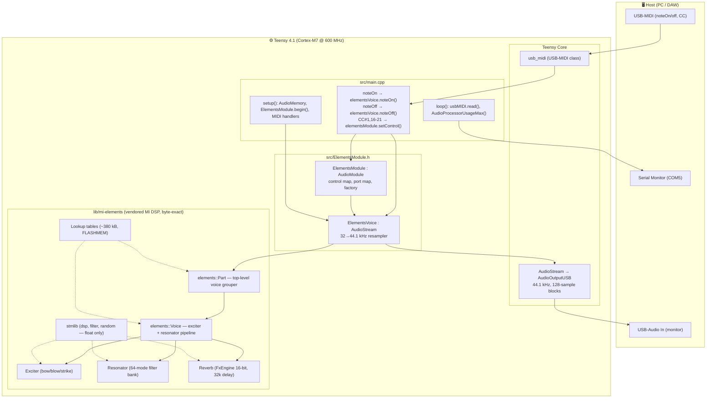
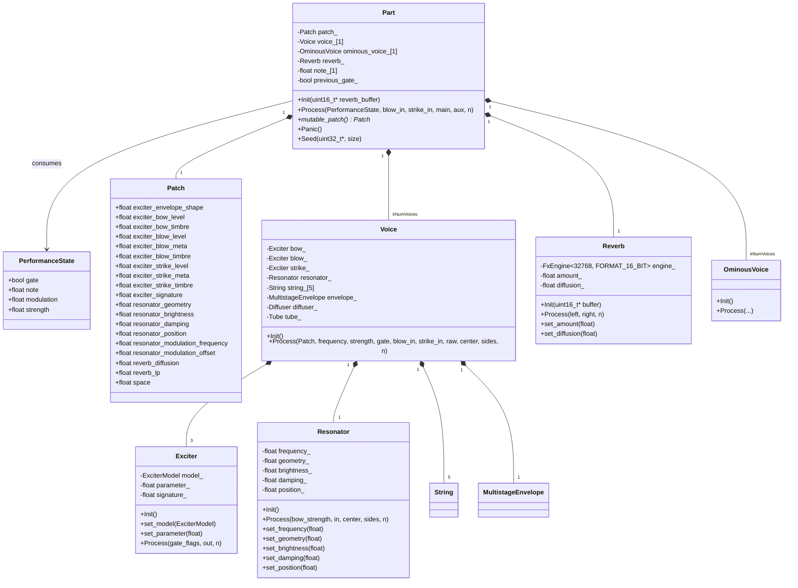
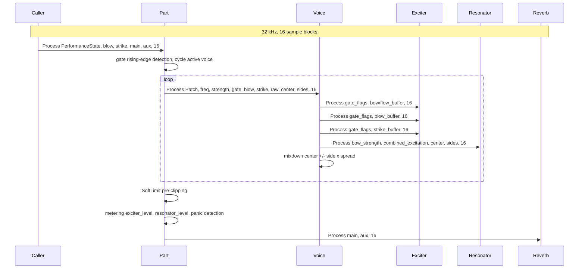
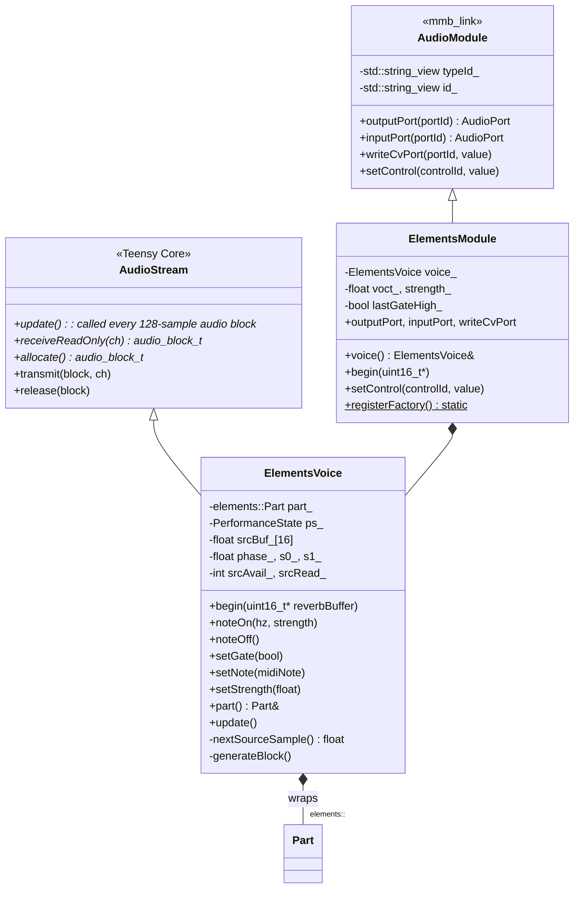
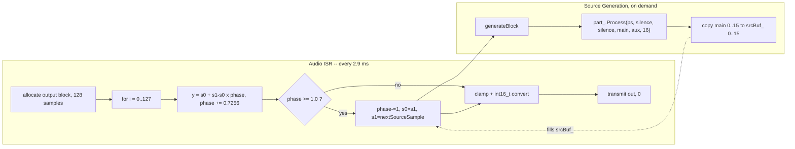
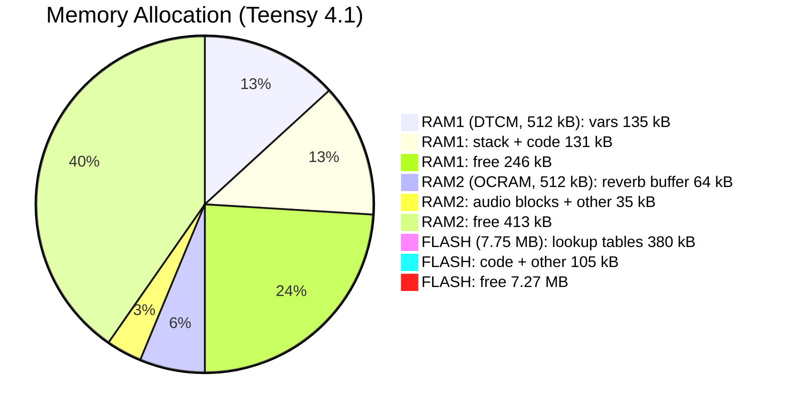

# Elements Spike Architecture

A port of the Mutable Instruments **Elements** (MIT, © Emilie Gillet) modal /
physical-modelling synth voice to the **Teensy 4.1** (Cortex-M7 @ 600 MHz + FPU),
wrapped as a MusicBrain `tp_mmb_elements` AudioModule.

---

## Layer Diagram



---

## Original Elements DSP (vendored)

All files live under `lib/mi-elements/`. Only the subset reachable from
`elements::Part` was copied; the STM32 HAL/CMSIS `third_party/` tree was
excluded. See `VENDORED.md` for provenance and licensing.

### DSP Class Diagram



### Native Sample Rate & Block Size

The upstream DSP renders **32 kHz** in blocks of **16 samples** (`kMaxBlockSize`).
All timing, envelope rates, LFO frequencies, and filter coefficients are expressed
in terms of `elements::kSampleRate = 32000.0f`.



---

## Wrapper Layer (Teensy Audio Adapter)

Our integration layer lives in `src/ElementsModule.h`.



### Resampler: 32 kHz → 44.1 kHz

`ElementsVoice::update()` performs **linear interpolation** between consecutive
32 kHz source samples to produce 44.1 kHz output. The resampler is fully
contained in the `update()` loop:



The source block (16 samples @ 32 kHz) lasts **0.5 ms**. At 44.1 kHz output, the
resampler calls `generateBlock()` roughly every **23 output samples**
($128 \times 0.7256 \approx 93$ source samples consumed per `update()`, or
$\lfloor 93/16 \rfloor = 5$–$6$ Part calls per block).

---

## Memory Map



| Region | Used | Free | Notes |
|--------|------|------|-------|
| **RAM1 (DTCM)** | ~267 kB | ~245 kB | Fast core-coupled RAM. Audio processing, stack. |
| **RAM2 (OCRAM)** | ~99 kB | ~425 kB | Slower. Reverb buffer (`DMAMEM uint16_t[32768]`), audio block pool. |
| **FLASH** | ~485 kB | ~7.6 MB | Code + `FLASHMEM` lookup tables (~380 kB). |

**The reverb delay line (64 kB) is too large for DTCM.** It lives in OCRAM,
initialised via `Part::Init(reverbBuffer)` in `setup()`. The ~380 kB lookup
tables (`resources.cc`) are tagged `FLASHMEM` so they stay in flash instead of
being copied to DTCM.

---

## Control Flow (MIDI → DSP)

```mermaid
sequenceDiagram
    participant KSP as Keystep Pro / DAW
    participant USB as USB-MIDI Host
    participant Loop as loop
    participant EM as ElementsModule
    participant EV as ElementsVoice
    participant Part as Part
    participant Voice as Voice
    participant Resonator as Resonator
    participant Exciter as Exciter

    Note over KSP, Voice: Note + gate
    KSP->>USB: NoteOn
    Loop->>EM: handleNoteOn
    EM->>EV: noteOn
    EV->>EV: set note, strength, gate
    Note over EV: next genBlock triggers Part.Process

    Note over KSP, Voice: Parameter change
    KSP->>USB: ControlChange
    Loop->>EM: handleControlChange
    EM->>Part: update patch values

    Note over Part, Voice: real-time vs next-note
    Part->>Resonator: set_brightness immediately
    Part->>Exciter: store geometry/position for next strike

```

### Parameter Categories

| Parameter | CC | Takes effect | Notes |
|-----------|----|-------------|-------|
| **envelope** | 1 | real-time | Exciter envelope shape (mod wheel) |
| **exciter** | 16 | next note | 0=bow, 1=blow, 2=strike |
| **geometry** | 17 | next note | Resonator shape → mode frequency ratios |
| **brightness** | 18 | real-time | Modal filter cutoff |
| **damping** | 19 | real-time | Mode decay time |
| **position** | 20 | next note | Excitation position on resonator |
| **space** | 21 | real-time | Reverb amount + stereo spread |

---

## Boot & Runtime Sequence

```mermaid
sequenceDiagram
    participant Setup as setup
    participant AM as AudioMemory 60
    participant EV as ElementsVoice
    participant Part as elements::Part
    participant Loop as loop

    Setup->>AM: allocate 60 x 128-sample blocks
    Setup->>EV: begin elementsReverbBuffer
    EV->>Part: Init reverbBuffer
    Note over Part: patch defaults, voice init, reverb init

    Setup->>Setup: usbMIDI.setHandleNoteOn/Off/CC
    Setup->>Setup: ElementsModule.registerFactory
    Note over Setup: Audio engine starts - ISR fires

    loop
        Note over EV: AudioStream.update called by ISR
        EV->>Part: genBlock - Part.Process ps, silence, silence, main, aux
        Part->>Part: gate rising-edge, cycle active voice
        Part->>Part: Voice.Process patch, freq, strength, gate
    end

    loop
        Loop->>Loop: while usbMIDI.read - drain MIDI events
    end

    loop
        Loop->>Loop: AudioProcessorUsageMax + AudioMemoryUsageMax
    end
```

---

## Files

| Path | Role |
|------|------|
| `src/main.cpp` | Entry point, MIDI handlers, CPU/audio monitoring |
| `src/ElementsModule.h` | `ElementsVoice` (Teensy AudioStream + resampler), `ElementsModule` (AudioModule + control map) |
| `src/FwVersion.h` | Firmware version (`0.1.0`) |
| `src/AudioModule.h` | Local copy of `mmb_link::AudioModule` mixin (delete when merged) |
| `lib/mi-elements/elements/dsp/part.{h,cc}` | Upstream: `elements::Part` — top-level voice grouper |
| `lib/mi-elements/elements/dsp/voice.{h,cc}` | Upstream: `elements::Voice` — exciter + resonator pipeline |
| `lib/mi-elements/elements/dsp/exciter.{h,cc}` | Upstream: bow / blow / strike physical models |
| `lib/mi-elements/elements/dsp/resonator.{h,cc}` | Upstream: modal filter bank (64 modes) |
| `lib/mi-elements/elements/dsp/string.{h,cc}` | Upstream: Karplus-Strong string model |
| `lib/mi-elements/elements/dsp/tube.{h,cc}` | Upstream: tube / wind model |
| `lib/mi-elements/elements/dsp/multistage_envelope.{h,cc}` | Upstream: DAHDSR envelope |
| `lib/mi-elements/elements/dsp/ominous_voice.{h,cc}` | Upstream: Easter egg voice |
| `lib/mi-elements/elements/dsp/fx/reverb.h` | Upstream: header-only reverb (Griesinger/Dattorro) |
| `lib/mi-elements/elements/dsp/fx/diffuser.h` | Upstream: all-pass diffuser |
| `lib/mi-elements/elements/dsp/fx/fx_engine.h` | Upstream: delay-line engine |
| `lib/mi-elements/elements/resources.{h,cc}` | Upstream: 380 kB lookup tables (FLASHMEM adapted) |
| `lib/mi-elements/stmlib/` | Upstream `stmlib` subset (dsp, filter, random — no STM HAL/CMSIS) |
| `lib/mi-elements/elements/drivers/debug_pin.h` | Stub: no-op TIC/TOC (replaces STM GPIO driver) |
| `lib/mi-elements/VENDORED.md` | Provenance, license, Teensy adaptations |
| `lib/mi-elements/library.json` | PlatformIO library manifest |
| `platformio.ini` | Build config (teensy41 target, `-I lib/mi-elements`) |
| `README.md` | Spike overview + flash instructions |

---

## Build

```powershell
.\.venv\Scripts\pio.exe run -d firmware\app-elements         # build
.\.venv\Scripts\pio.exe run -d firmware\app-elements -t upload  # flash
.\.venv\Scripts\pio.exe device monitor -p COM5 -b 115200     # serial log
```

### CPU Budget

One Elements voice consumes **~22%** of the 600 MHz Cortex-M7 budget at peak.
This suggests ~4 monophonic voices fit, or ~2 stereo.

---

## Future Integration (app-modular-brain)

When `tp_mmb_elements` is merged into `app-modular-brain`:

1. Delete the local `AudioModule.h` copy; use the shared `mmb_link::AudioModule`.
2. `ElementsVoice` audio inputs (`blow_in`, `strike_in`) need 44.1→32 kHz
   down-sampling (currently silence is fed).
3. The port map (`voct`, `gate`, `strength`, `blow_in`, `strike_in`, `out`)
   integrates with AudioGraph and CvGraph.
4. `setControl` integrates with the editor's module panel.
5. `ElementsModule::registerFactory()` is called from `registerAllRuntimeModules()`.
