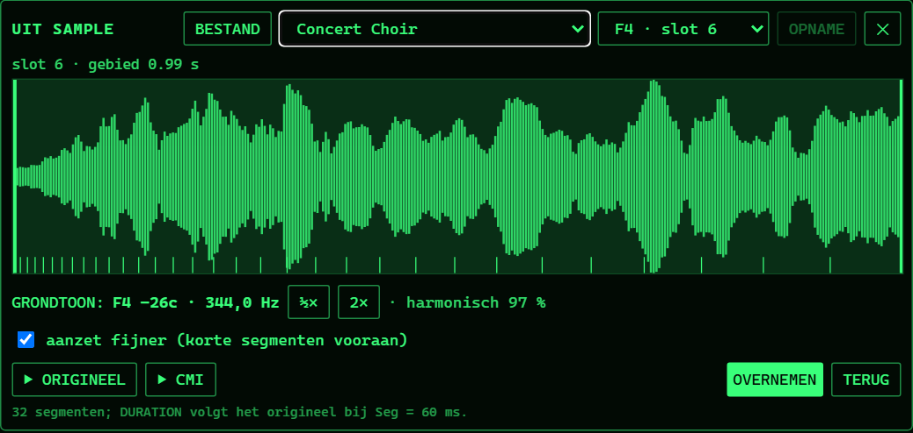

# Fairlight: de CMI in MusicBrain

> **Stand (2026-10-09):** besluiten 1–3 genomen (zie §5). Stap 1 (Era CMI op
> de sampler) en stap 2 (de stem `tp_mmb_cmi`) zijn gebouwd, getest en op de
> Teensy gemeten (fw 0.5.98: de stem ~2,4 % cpu totaal). Stap 3 (de editor:
> profiel → golfvormen, opslag in de patch, Page 4) is gebouwd (fw 0.5.99/0.5.100).
> **2026-10-10:** stap 4 (FFT uit een sample) gebouwd volgens §6: UIT SAMPLE op
> Page 4 met .wav, bankzone en laatste opname. Nog open: microfoon, CMI-bank,
> vaste filterstand, Era CMI met een bank op de Teensy meten.

Voorstel, 2026-10-09, ter review door Mark. Doel: vandaag bouwen.
Backlog: FW-AU-7 (Fourier-shaper, "Fairlight-achtig").

## 0. Nagekeken in de documentatie (2026-10-09)

Bronnen: Greg Holmes' pagina's over de CMI Series II
(<http://www.ghservices.com/gregh/fairligh/>, met
[Page 4](http://www.ghservices.com/gregh/fairligh/page_4.htm)), Wikipedia en
de Virtual Music-uitleg. Wat dat verandert of bevestigt:

- **Pagina's**: 4 = harmonische profielen tekenen (lichtpen), 5 = dezelfde
  gegevens als faders, **6 = golfvorm tekenen** (niet D; D is een 3D-weergave),
  7 = besturing (vibrato, loops), **8 = samplen**, R = Real-Time Composer.
  Onze wave-tekenaar is dus Page 6, de sampler Page 8.
- **Page 4, Mode 1**: tot 32 harmonischen × **32 segmenten van 128 samples**
  (4096 samples), precies onze stem. Erbij: een **DURATION**-profiel (hoe
  lang elk segment klinkt) en een **ENERGY**-profiel (de volumecurve over de
  segmenten). **INTERP** mengt elk segment met het volgende: onze Smooth.
  COMPUTE rekent de 32 golfvormen uit. (Mode 4, 128 segmenten, laten we
  liggen.)
- **Afspelen**: met een variabele rate per stem (toonhoogte), 8 bit; Series I
  samplede op 8–24 kHz, Series II tot ~32 kHz. Per audiokaart een eenvoudig
  laagdoorlaat, **met de hand** in 16 standen (0–15), niet toonvolgend. Onze
  Era CMI houdt het toonvolgende filter (handiger); een vaste stand kan er
  als optie bij.

Gevolg voor stap 3: het profiel krijgt naast de 32 × 32 harmonischen ook
een DURATION- en een ENERGY-curve; de stem krijgt die mee (32 duurfactoren
en 32 niveaus na de 4096 samples). Mark: Page 4 mag groen op zwart; het
tekenen per harmonische is gewenst; een getekende golf (Page 6) analyseren
naar harmonischen is een goede brug naar Page 4 (dezelfde rekensom als de
FFT uit een sample).

## 1. Wat de Fairlight CMI zijn klank gaf

Uit wat ik van het instrument weet (Series I/II, 1979–1983; de details
hieronder zijn op het oor te controleren, niet allemaal nagemeten):

1. **Sampling met een klok per stem** (Page 8). Elke stem had een eigen DAC en een
   eigen sampleklok: toonhoogte = sneller of langzamer uitlezen, **zonder
   interpolatie**, 8 bit. Daardoor schuiven de alias-spiegelingen mee met de
   toon, en klinkt hoog spelen korrelig en laag spelen dof. Een filter per
   stem dat de klok volgt haalt het ergste eraf. Dat is het geluid van ORCH5
   en de koren.
2. **Golfvormsynthese** (Page 4/5): tot 32 harmonischen, elk met een eigen
   verloop over 32 segmenten van de noot. De CMI rekende daar 32
   golfvormen van uit (één per segment) en speelde die na elkaar af: de
   klank beweegt door de noot heen. Feitelijk een wavetable-sweep,
   berekend uit harmonischen.
3. **Golfvorm tekenen** (Page 6, lichtpen): één periode tekenen.
4. **Page R**, de patroon-sequencer.

## 2. Wat er al is

| | in MusicBrain | dekt |
|---|---|---|
| Sampler + banken + streaming | `tp_mmb_sampler` | sampling, maar schoon (lineaire interpolatie, 16 bit) |
| Wave-tekenaar, .wav als wavetable | `WaveDrawModal`, `tp_mmb_draw_vco`, `tp_mmb_morph_wt` (8 frames) | Page D, maar niet bewaard in de patch |
| Sporen, arp, sequencers | overdub, `tp_mmb_arp`, … | Page R hoeft niet |

## 3. Voorstel: twee stukken

### A. CMI-stand op de sampler (klein, eerst)

Een schakelaar **Era** op SAMPLER: *Clean* (zoals nu) / *CMI*. In de
CMI-stand, per stem:

- **Geen interpolatie**: de dichtstbijzijnde sample (zero-order hold op de
  klok van de stem). Daarmee lopen de spiegelingen mee met de toon, zoals
  bij een klok per stem.
- **8 bit**: kwantiseren naar 256 niveaus (optioneel een knop *Bits* 6–12).
- **Klokvolgend laagdoorlaat**: een tweepolig filter op ~0,45 × de
  effectieve klok van de stem (bronrate × toonhoogteverhouding), begrensd op
  Nyquist. Hoog spelen laat meer door, laag spelen wordt dof.
- **Klok** (knop): de samplerate waarop de bank "opgenomen" was, 8–32 kHz,
  standaard 24 kHz: de bank wordt bij het laden (of bij het lezen, goedkoper)
  op die rate gelezen, zodat een moderne 48 kHz-bank ook die korrel krijgt.

Kosten: minder dan nu (geen interpolatie), plus één filter per stem. Alle
bestaande banken klinken er meteen naar 1982.

Seeds: **"Fairlight koor"** en **"ORCH5-stoot"** als dat met een bestaande
bank kan; anders een *CMI*-variant van de Mellotron-patches.

### B. FAIRLIGHT-stem: golfvormsynthese (de grotere)

Een nieuwe module **`tp_mmb_cmi`**:

- **32 golfvormen × 128 samples, 8 bit** (4 KB), na elkaar afgespeeld over
  de noot: segment *n* duurt `seg` ms (knop), tussen segmenten een korte
  overvloeiing (knop *Smooth*, 0 = hard zoals de CMI). Loop-stand: na het
  laatste segment blijft hij op segment `loop` … 32 rondgaan zolang de toets
  vastgehouden wordt (sustain), bij loslaten door naar het eind.
- Afspelen zoals in A: zero-order hold, 8 bit, klokvolgend filter.
- Poorten: `voct`, `gate`, `vel`, `out`, `seg_cv` (schuift de positie).
  Poly via een PolyGroup (de CMI had 8 stemmen; ~1–2 % per stem verwacht).

**De editor** maakt de golfvormen, niet de firmware:

- Een **Harmonischen-venster** (zoals Page 4): 32 harmonischen als rijen,
  32 segmenten als kolommen; per harmonische een curve tekenen met vinger of
  muis (ook op de telefoon). Snelknoppen: *zaag*, *vierkant*, *koor*,
  *klok*, *orgel* als startpunt.
- **Uit een sample** (FFT, optie): een stuk audio (bank, take of een
  .wav) → per segment een FFT → de harmonischen → de curves. Dat is de
  "Fourier-shaper" uit de backlog.
- De editor rekent de 32 golfvormen uit (additief, met de harmonischen
  boven Nyquist van de doelklok weggelaten) en stuurt ze naar de
  simulator (wasm-blob, zoals Morph-WT) en de Teensy (een frame
  zoals `wavetable`, 32 × 128 bytes).

**Bewaren in de patch** (nieuw, besluit nodig): het harmonischenprofiel
(32 × 32 niveaus, 1 byte elk = 1 KB, base64 ±1,4 KB) als data van de module
in de patch, zodat de klank bij het laden terugkomt. Voorstel: een veld
`patch.moduleData[moduleId] = { cmi: '<base64>' }`, mee in export en pool,
niet in de config-payload (die krijgt de berekende golfvormen als apart
frame na de config).

## 4. Volgorde voor vandaag

1. **A, CMI-stand op de sampler**: kern (`sample_player.h`), firmware,
   wasm, paneel, test (geen interpolatie: spiegelingen aanwezig; 8 bit:
   kwantisatieruis; filter volgt de toon), seed. Flashen en meten.
2. **B, de stem**: kern `mmb_dsp/cmi.h` (afspelen van 32 frames), module,
   wasm met blob, contract, paneel, test met een vast profiel.
3. **B, de editor**: rekenen profiel → golfvormen (getest), versturen naar
   sim en Teensy, opslag in de patch, het Harmonischen-venster met de
   snelknoppen, twee seeds.
4. **B, FFT uit een sample**: als de tijd het toelaat; anders morgen.

Release-notes, catalogus, Engelse teksten en een stap in de rondleiding
zoals gewoonlijk.

## 5. Vragen voor de review

Besluiten (Mark, 2026-10-09): 1 ja, A eerst; 2 ja, een schakelaar *Era* op
SAMPLER; 3 ja, een dataveld in de patch (`patch.moduleData`), als
"edit buffer"; een bank met CMI-stemmen (zoals de DX7: 32 per bank,
"bewaar in bank" / "laad uit bank") kan er later naast komen.

1. **Volgorde**: eerst A (klein, meteen hoorbaar op alles), dan B. Akkoord?
2. **CMI-stand als schakelaar op SAMPLER**, of liever een aparte module
   `CMI SAMPLER`?
3. **Opslag van het profiel** in `patch.moduleData` (nieuw veld): akkoord, of
   liever ergens anders?
4. **Het Harmonischen-venster**: tekenen per harmonische (zoals Page 4), of
   eerst alleen de snelknoppen + FFT en het tekenen later?
5. **Page R** laten we liggen (sporen en arp dekken het). Akkoord?

## 6. Stap 4: een sample analyseren naar Page 4 (2026-10-10)

Doel: een stuk geluid wordt een gewoon Page 4-profiel (32 harmonischen ×
32 segmenten, DURATION, ENERGY) dat je daarna tekent, bewaart en morpht.
Zuiver rekenwerk in `cmiAnalyse.ts` (geen React, getest); de bediening is
een knop **UIT SAMPLE** in Page 4. Niets op het front of in de werkbalk
(de UI-herziening loopt daar).

### 6.1 Bronnen

| Bron | Hoe | Grondtoon als hint |
|---|---|---|
| **.wav** (of ander audiobestand) | kiezen of slepen; `decodeAudioData`, naar mono | geen |
| **Samplebank** | lijst van de server (`banks/index.json`), `parseBank`, kies een zone | `root` van de zone |
| **Laatste opname** | de wav van de laatste take van deze patch (`lastTakeStore`) | geen |

Microfoon kan later (zelfde pad als AUDIO IN).

### 6.2 De analyse

1. **Gebied**: begin en eind in de golfvorm, standaard het eerste geluid tot
   max. 4 s.
2. **Grondtoon**: YIN (genormaliseerd verschil) op het stabiele midden van
   het gebied, 40–2000 Hz, met de zonegrondtoon als hint tegen
   octaaffouten. Te corrigeren met ½× en 2× of een notenkeuze.
3. **Indeling in 32 segmenten**: gelijk, of **aanzet fijner** (standaard):
   grenzen meetkundig oplopend, het laatste segment ~11× zo lang als het
   eerste, zodat de aanzet niet in één segment verdwijnt. De duur van elk
   segment wordt DURATION, gedeeld door de Seg-knop van de stem (geklemd op
   1/16..16), zodat het profiel even lang klinkt als het origineel.
4. **Per segment**: de grondtoon opnieuw meten binnen ±6 % (vibrato smeert
   dan niet uit); een Hann-venster van vier perioden rond het midden; de
   sterkte van harmonische *k* = de DFT op precies *k* × f0. Harmonischen
   boven Nyquist van de bron zijn 0. Fasen vervallen, zoals op Page 4.
5. **Schaal**: niveaus per segment op de sterkste harmonische = 1 (de klank);
   ENERGY = RMS van het segment ten opzichte van het luidste (de
   volumecurve). Zo teken je klank en volume los, zoals op de CMI.
6. **Harmonisch gehalte**: het deel van de energie dat op de harmonischen
   valt. Onder ~60 % een waarschuwing: klokken, drums en ruis klinken anders
   na (dat is de CMI-klank, geen fout).

### 6.3 Het venster (in Page 4, groen op zwart)

Zo ziet het eruit (gebouwd 2026-10-10, Concert Choir uit de bank, zone F4):



Het blok staat onder het tekenvlak van Page 4 en opent met de knop
**UIT SAMPLE** in de rij met startpunten. Van boven naar onder, in de
volgorde waarin je het gebruikt:

```
 ① BRON      [BESTAND]  [Concert Choir ▾]  [F4 · slot 6 ▾]  [OPNAME]  [✕]
              .wav e.d.   samplebank         zone van de bank  laatste take

 ② GEBIED    slot 6 · gebied 0,99 s
             ┃▁▂▃▅▆▇█▇▆▅▅▆▇▆▅▄▄▅▆▅▄▃▃▃▂▂▂▁┃   ← golfvorm van het hele geluid;
             ┃                             ┃     het lichte vlak is het gebied,
             ╵╵╵╵╵ ╵ ╵ ╵  ╵  ╵   ╵    ╵    ╵     de twee dikke strepen versleep je
             └ 32 segmentgrenzen: vooraan dicht op elkaar (aanzet fijner)

 ③ TOON      GRONDTOON: F4 −26c · 344,0 Hz   [½×] [2×]   · harmonisch 97 %
             [x] aanzet fijner (korte segmenten vooraan)

 ④ KIEZEN    [▶ ORIGINEEL]  [▶ CMI]                 [OVERNEMEN]  [TERUG]
```

1. **Bron**: een bestand, een bank (dan verschijnt de zonekeuze ernaast)
   of de laatste opname van de patch (grijs zolang die er niet is).
2. **Gebied**: de golfvorm van het hele geluid; het lichte vlak is wat
   geanalyseerd wordt. Tik of sleep: de dichtstbijzijnde rand verschuift.
   De streepjes onderaan zijn de 32 segmenten.
3. **Toon**: de gevonden grondtoon als noot en Hz; ½× en 2× bij een
   octaaffout, AUTO zet hem terug. *Harmonisch* zegt hoeveel van het geluid
   op de harmonischen valt; onder 60 % verschijnt een waarschuwing.
4. **Kiezen**: ▶ ORIGINEEL speelt het gebied; ▶ CMI zet het resultaat
   tijdelijk op de stemmen en speelt de noot van de grondtoon. OVERNEMEN
   zet het profiel op Page 4 (en in de patch); TERUG of ✕ laat alles zoals
   het was, ook na ▶ CMI.

### 6.4 Tests (`cmiAnalyse.test.ts`)

- Zaag van 220 Hz: f0 binnen 0,5 %, niveaus ≈ 1/k.
- Vierkant: even harmonischen onder −30 dB.
- Klank die verloopt (hoge harmonischen sterven sneller): h5/h1 daalt over
  de segmenten; ENERGY daalt.
- Vibrato ±1 %: niveaus blijven schoon.
- Ruis: harmonisch gehalte laag.
- DURATION: som × Seg ≈ lengte van het gebied; met *aanzet fijner* is het
  eerste segment korter dan het laatste.
- Rondreis: profiel → `computeTable` → afspelen op f0 → analyse ≈ het
  oorspronkelijke profiel.

### 6.5 Volgorde

1. `cmiAnalyse.ts` + tests.
2. Bronnen laden (.wav, bank, laatste opname) naar mono Float32 + rate.
3. Het venster in Page 4 met A/B.
4. Release-log, Fairlight-uitleg in `editor/README.md`, Engelse teksten.


## 7. Voorstel: PAGE D, de 3D-weergave (2026-10-10, ter review)

**Op de echte CMI** (Series II/IIx) was Page D de *Voice Waveform Display*:
de golfvormen van de segmenten achter elkaar, als een berglandschap in
pseudo-3D. Per lijn één segment (128 samples, links → rechts de golf,
omhoog de uitslag), het voorste segment is het begin van de klank en bij
een toets loopt de CMI van voor naar achter. Twee formaten (A en B), met
een stapgrootte (elk 1e, 2e, 4e segment). Bronnen: de artikelserie "The
Fairlight Explained" (Electronics & Music Maker, op muzines.co.uk), de
IIx Command Summary (`D`, `D,n`, `D,van,tot`, `D,*`), Greg Holmes' pagina's.

**Marks variant**: de harmonischen in de diepte. Tijd (segment 1–32) naar
rechts, niveau omhoog, harmonische 1 vooraan en 32 achteraan. Dat is het
profiel van Page 4 in één beeld in plaats van rij voor rij.

Voorstel: één weergave met twee standen, dezelfde tekenaar:

| Stand | x (→) | y (↑) | z (naar achter) | Data |
|---|---|---|---|---|
| **GOLF** (de echte Page D) | positie in de golf, 128 samples | uitslag | segment 1 … 32 | `computeTable` |
| **HARMONISCH** (Marks variant) | segment 1 … 32 (tijd) | niveau | harmonische 1 … 32 | het profiel |

- **Tekenen**: schuine projectie, elke rij iets naar rechtsboven verschoven;
  van achter naar voor als zwart gevuld vlak met een groene lijn erop, zodat
  de voorste rijen de achterste afdekken (verborgen lijnen, zoals op de
  CMI). 32 × 128 punten is licht genoeg voor SVG, ook op een telefoon.
- **Bediening**: [4] [D] bovenin het Page 4-venster om te wisselen;
  GOLF/HARMONISCH; stap 1/2/4. In HARMONISCH kiest een tik op een rij die
  harmonische en springt naar Page 4 om hem te tekenen. Kantelen met slepen
  kan later.
- **Bij UIT SAMPLE**: ook het resultaat van de analyse vóór OVERNEMEN als
  Page D tonen, zodat je ziet wat je krijgt.
- **Tests**: de projectie (zuivere functie: punten en volgorde van achter
  naar voor) en dat beide standen 32 rijen geven.
