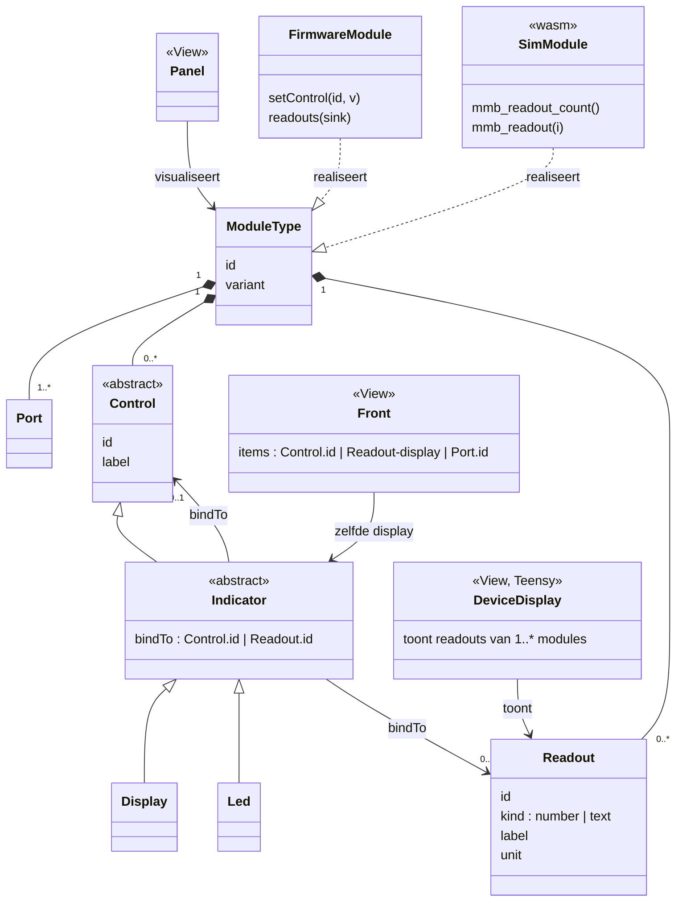
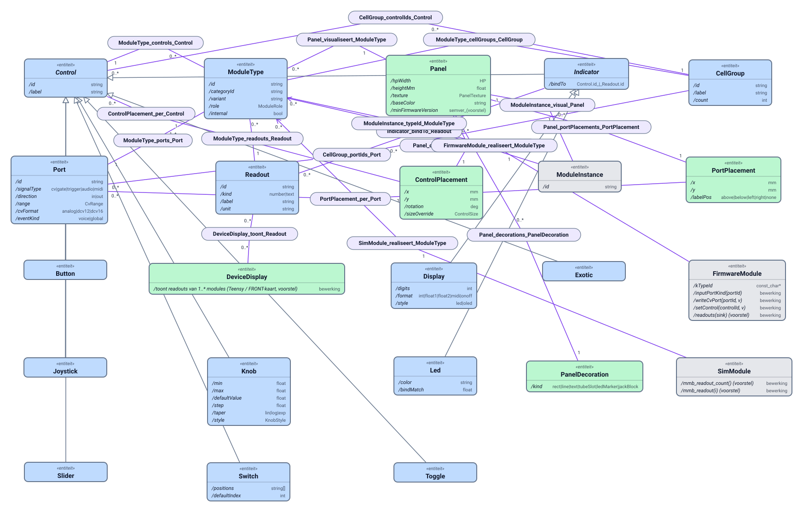

# Meldwaarden van een module (readouts)

**Datum:** 2026-10-06. **Status:** voorstel, nog niet gebouwd.
**Aanleiding:** het gesprek over de bankstrip van de sampler (2026-10-06): waarom is dat geen display, zoals de voicenaam van de DX7? Antwoord: omdat de naam van de bank niet bij de module zit maar bij degene die de bank laadde. Dat is een afwijking van de architectuur, en dit plan zet hem recht.
**Model:** [architecture/mmb-moduletype-panel.puml](../architecture/mmb-moduletype-panel.puml) (bron), de XMI ernaast, en hetzelfde model als Omnium V3 ([mmb-moduletype-panel.v3.json](../architecture/mmb-moduletype-panel.v3.json)) met de SVG uit de Omnium-render-API ([mmb-moduletype-panel.svg](../architecture/mmb-moduletype-panel.svg)); de wijziging staat in §3.

## 1. Het principe

Een module is een object dat zijn eigen toestand kent. In de architectuur heet dat:

- **Model**: de toestand van de module. Een deel daarvan zet de gebruiker (*controls*: knoppen, schakelaars, en wat er via poorten binnenkomt). Een ander deel ontstaat in de module zelf: de stap waar de sequencer staat, de naam van de bank die de sampler geladen heeft, de klank die de DX7 speelt, de CPU-last van Elements. Dat tweede deel noemen we **meldwaarden** (*readouts*).
- **Controller**: een poort of control verandert de toestand.
- **View**: een display of LED toont iets uit de toestand. Nu alleen een control (`bindTo`); straks ook een meldwaarde.

De Teensy, de wasm-module in de simulator en een eventuele echte hardwaremodule verschillen hierin niet: alle drie kennen hun toestand en melden hem als daarom gevraagd wordt. De firmware is leidend voor wát een module meldt, net als voor poorten en controls (contractketen).

Een display op het paneel, een display op een front en een display op de Teensy zelf zijn dan drie views op dezelfde meldwaarden, van één of meer modules.

## 2. Wat er nu staat

| Toestand | Waar de kennis nu zit | Hoe het paneel eraan komt |
|---|---|---|
| Stap van de sequencer | in de wasm (`mmb_telemetry()`), in de firmware in `Seq16` | de engine zet hem als `__currentStep` in `liveControls`; display en LED's binden daaraan. Met de hand ingebouwd in `AudioEngine.ts` voor dit ene type. |
| Lettergreep van ZANG | idem (`__currentSyl`) | idem, tweede uitzondering met de hand |
| Naam van de samplerbank | **niet in de module.** Editor: `sim/bankAutoLoad.ts` (de lader) en `teensyStorage.bankTitle`. Teensy: `SampleBank` (opslag), gemeld als `sdBankNames[]` in de status | een losse tekening per moduletype (`SamplerBankStrip`, `ZangBankStrip` in `ModulePanel.tsx`), geen display. Komt daardoor niet op een front. |
| Naam van de DX7-klank | firmware weet hem (`Dx7Module::bankVoiceName`), ook uit een eigen .syx. Editor: vaste tabel `dx7BankNames.ts`, bank 8 toont "USER nn" | display met `lookup`; de echte naam uit een eigen bank is onzichtbaar, ook na hernoemen in de DX7-editor |
| CPU, piek, "ready" van Elements, Rings, Plaits | in de module | ad-hoc velden in de statusframe (`elementsCpu`, `ringsPeak`, …), alleen voor de eerste instantie, nergens op een paneel |
| Piek van OUT | in de module (`takeMasterPeak`) | `outPeak` in de status; VU-meter als tekening per type |

Het patroon is steeds hetzelfde: de module weet het, maar er is geen algemene weg van module naar paneel. Elke keer is er een eigen gat geboord.

## 3. Het model, bijgewerkt

Nieuw in het contract: **Readout**. Een `Indicator` (display, LED) bindt aan een control óf aan een readout. De realisaties (firmware, wasm) leveren de waarden. Een display op het apparaat is een derde view.



Toegevoegd aan de puml en de XMI-generator: `Readout` (Contract), `Indicator.bindTo` verruimd, `readouts(sink)` op `FirmwareModule`, `mmb_readout*` op `SimModule`, en `DeviceDisplay` (View). `Front` staat in [patch-front.md](patch-front.md) en is hier alleen als view genoemd.

Het hele model, getekend door Omnium uit de V3 (`python tools/mmb_model_v3.py`; de sidecar `render-svc` moet draaien):



V3 is het registermetamodel van Omnium: elke relatie is daar een eigen knoop (de paarse hubs), en velden horen bij gegevenselementen, niet bij de entiteit. De attributen van de klassen staan daarom alleen in de puml en de mermaid hierboven, niet in de SVG.

Wat **niet** verandert: een readout is geen control. Je kunt er niet aan draaien, hij staat niet in `controlState` en hij gaat niet mee in de patch. Hij is er alleen zolang de module draait (simulator of Teensy). Staat alles stil, dan toont een display zijn `text` of, bij de DX7, de vaste tabel als terugval.

## 4. Ontwerp

### 4.1 Contract

`module-types.json` krijgt per type een lijst `readouts: [{ id, kind, label?, unit? }]`. De firmware is de bron: elke module declareert zijn readouts op één plek, en `tools/contract_dump.py` leest ze zoals hij nu `controlId == "…"` leest. Voorstel voor de declaratie in C++:

```cpp
static constexpr mb::ReadoutDef kReadouts[] = {
    {"bankName", mb::ReadoutKind::Text,   "Bank"},
    {"step",     mb::ReadoutKind::Number, "Stap"},
};
```

Readout-id's en control-id's van één type mogen elkaar niet overlappen; de contracttest bewaakt dat, en dat elke `bindTo` van een display naar een bestaande control of readout wijst. De `__`-conventie (`__currentStep`) vervalt: de sequencer krijgt readout `step`, ZANG `syl`.

### 4.2 Firmware

- `Module` krijgt `virtual void readouts(ReadoutSink&) const {}`. Een sink neemt `(id, number)` of `(id, text)` aan.
- De statusframe krijgt `"ro": { "<moduleId>": { "step": 3, "bankName": "Flute" } }` voor de modules van de lopende patch. Getallen elke poll; tekst alleen als hij veranderd is (de frame blijft klein). Een module zonder readouts kost niets.
- Sampler, tape strip, Percuter: `bankName` uit `SampleBank` (die kent de kop van de bank al); de module vraagt het aan de bank in plaats van dat de status het apart meldt. `sdBankNames` blijft nog een versie voor de bankbalk in de editor en vervalt daarna.
- DX7: `voiceName` (bestaat al als `bankVoiceName`), `bank`, `program` zijn controls en blijven dat.
- Seq16: `step`. ZANG: `syl`. MIDI-IN: `voicesInUse`. OUT: `peak`. Elements, Rings, Plaits: `cpu`, `peak`; de ad-hoc velden `elementsCpu` enz. vervallen zodra de editor ze niet meer leest.

### 4.3 Wasm

- Elke module-wasm exporteert `mmb_readout_count()`, `mmb_readout_id(i)`, `mmb_readout_kind(i)`, `mmb_readout_number(i)` en `mmb_readout_text(i, buf, n)`. `mmb_telemetry()` vervalt (sequencer en ZANG gaan over).
- De sampler-wasm krijgt de banknaam bij het laden van de bank mee (`setBankName`), zodat hij hem zelf kan melden; de lader onthoudt hem niet meer.
- De engine vraagt readouts op per animatieframe, alleen voor modules waarvan een paneel of front in beeld is, en zet ze in `status.readouts[moduleId][id]`. De twee uitzonderingen in `AudioEngine.ts` verdwijnen.

### 4.4 Editor

- `LiveValue = ControlValue | string`. `liveControls` blijft voor controls; `readouts` komt ernaast, en de Teensy-koppeling vult hetzelfde object uit `"ro"`.
- `DisplayControl.bindTo` mag naar een readout wijzen. Het panel kijkt eerst in `readouts`, dan in `controlState`. Een tekst-readout toont de tekst direct; `lookup` blijft bestaan voor controls met een vaste tabel.
- De tekeningen `SamplerBankStrip` en `ZangBankStrip` worden displays `bankName` op de panelen van sampler, tape strip, Percuter en ZANG. De VU-meter van OUT wordt een display `peak` (stijl `meter`, nieuw). Daarmee komen ze ook op een front: dat werkt al voor elk display ([patch-front-handover.md](patch-front-handover.md)).
- De DX7 krijgt readout `voiceName` op zijn naamdisplay, met de vaste tabel als terugval als er niets draait. Hernoemen in de DX7-editor wordt dan zichtbaar op het paneel.
- `frontControls.ts` en `withNameDisplays` hoeven niet te veranderen: een display is een display.

### 4.5 Display op de Teensy (later)

De FRONT-kaart of een OLED op de brain toont een pagina met readouts van gekozen modules: banknaam, klanknaam, stap, piek. Welke, bepaalt de patch, net als een front (stap 7 in patch-front: front naar de Teensy). De gegevens komen uit dezelfde `readouts(sink)`; er is geen tweede weg nodig.

## 5. Stappen

| # | Wat | Raakt | Omvang |
|---|---|---|---|
| 0 | Dit plan, het model (puml + XMI), een rij in de backlog | doc | klaar met dit document |
| 1 | Contract: `ReadoutDef`, declaraties in Seq16, ZANG, sampler, tape strip, Percuter, DX7, OUT; `contract_dump.py` leest ze; contracttest bewaakt id's en `bindTo` | firmware (declaraties), tools, editor-test | klein |
| 2 | Editor: `readouts` in de enginestatus, tekst als live waarde, display leest readouts; wasm-exports `mmb_readout*` voor sequencer en ZANG, `mmb_telemetry` weg | editor, wasm | middel |
| 3 | Sampler-familie: banknaam in de wasm en als display op de panelen; bankstrips weg. ZANG idem | editor, wasm | middel |
| 4 | Firmware: `Module::readouts`, `"ro"` in de status, Teensy-koppeling vult `readouts`; `sdBankNames` en de ad-hoc velden vervallen | firmware, editor | middel |
| 5 | DX7 `voiceName`, OUT `peak` als meterdisplay | firmware, wasm, editor | klein |
| 6 | Display op de Teensy | firmware, hardware | later, eigen plan |

Stap 1 t/m 3 kunnen zonder flashen; stap 4 vraagt een firmwarerelease (contractversie omhoog) en een test aan de Teensy.

## 6. Besluiten die hierbij horen

1. **De module meldt, de gastheer geeft door.** Engine, firmware-runtime en Teensy-koppeling zijn doorgeefluiken; zij kennen geen moduletypes. Wat er nu per type in `AudioEngine.ts` en `main.cpp` staat, gaat weg.
2. **Een readout is geen control** en komt niet in de patch. Een front kan er wel een display van tonen.
3. **Tekst mag.** Een readout is een getal of een korte tekst (hoogstens 32 tekens), geen structuur.
4. **Firmware leidend**, ook hier: de declaratie staat in de module-header, het contract volgt.

## 7. Open vragen

- Pollfrequentie en omvang van `"ro"` op de seriële lijn bij patches met veel modules; vermoedelijk alleen modules met een readout die ook echt op een paneel of front staat.
- Of de bankbalk in de Simulatie-tab blijft als de module zijn naam zelf meldt (vermoedelijk ja: daar kies je een andere bank; de strip toont alleen).
- Of `lookup` op displays nog nodig is als de DX7 zijn naam meldt. Voorlopig ja, als terugval zonder draaiende module en voor de ritmebox, waarvan de namen echt vast zijn.
