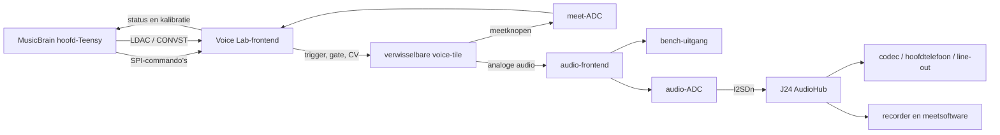
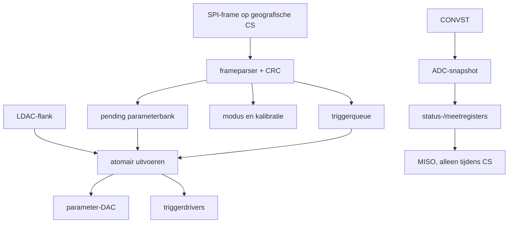
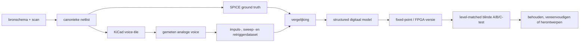
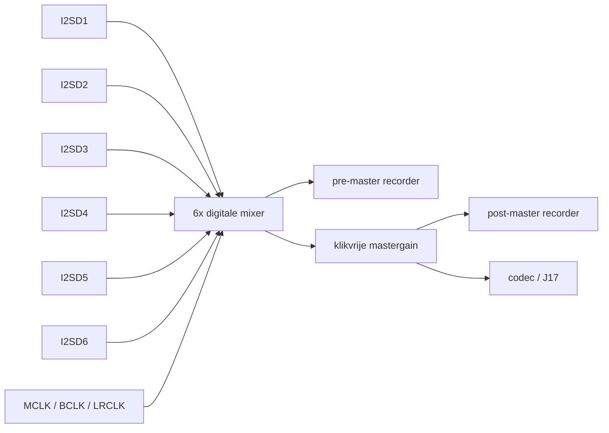
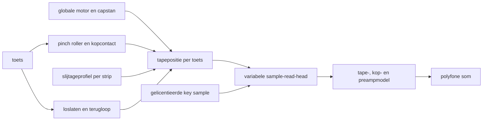

# MusicBrain Instrument Lab

**Status:** voorstel / architectuurverkenning

**Datum:** 2026-08-31

**Doel:** één herbruikbare infrastructuur voor het reconstrueren, meten,
digitaliseren en muzikaal toepassen van analoge en hybride stemcircuits.

## Aanleiding

De 808-, CR-78-, CS-80-achtige, vocoder- en freestyle-onderzoeken lopen tegen
dezelfde systeemvragen aan:

- hoe ontvangt één kaart triggers en meerdere parameters via één geografische
  `CS`;
- hoe worden pending waarden en triggers synchroon uitgevoerd;
- hoe worden analoge knopen gemeten en automatisch gekalibreerd;
- waar komen slotaudio, master-DROP en de recorder samen;
- hoe wordt een historisch circuit eerlijk vergeleken met een digitaal model;
- wanneer is een transcriptie voldoende bewezen om naar een compacte PCB te
  gaan?

De afzonderlijke reviews onderbouwen deze overlap:

- [808-review](../../spinoffs/drum-808/REVIEW-2026-08-31.md)
- [CR-78-review](../../spinoffs/drum-cr78/REVIEW-2026-08-31.md)
- [freestyle-review](../../spinoffs/freestyle-machine/REVIEW-2026-08-31.md)
- [vocoderreview](../../spinoffs/vocoder/REVIEW-2026-08-31.md)
- [CS-80-achtige verkenning](../../spinoffs/cs-80-ish/cs-80-ish.md)

De voorgestelde oplossing is geen nieuwe productlijnkaart per historische
machine, maar een **Instrument Lab** met drie gedeelde bouwstenen:

1. een ruime **Voice Lab-baseboard** met busfrontend, converters en meetpunten;
2. verwisselbare **voice-tiles** met het eigenlijke analoge circuit;
3. een latere **J24 AudioHub** die kaartstreams centraal mixt, meet en opneemt.

## Ontwerpprincipe

Gebruik de MusicBrain-bus voor commando's en grove control-rateparameters, maar
laat de experimenteerkaart lokaal tijdkritische handelingen uitvoeren. De
hoofd-Teensy stuurt abstracte voicecommando's; een lokale controller zet die om
in synchrone triggers, DAC-updates, ADC-metingen en kalibratiecycli.

De eerste kaart is bewust een benchinstrument:

- ruim genoeg voor meetpunten en wijzigingen;
- via een riser of kabel op het gen-2-slot, niet begrensd tot een
  productiekaart van 45 mm hoog;
- één of twee voices tegelijk, niet meteen acht of veertien;
- analoge uitgang én optionele digitale audio-return;
- geen claim van drop-in historische getrouwheid zonder metingen.

## Systeembeeld



De AudioHub is geen voorwaarde voor de eerste voiceproef. De analoge
bench-uitgang houdt het onderzoek bruikbaar terwijl J24 nog niet is ingevuld.

## Waarom een baseboard plus voice-tile

Een volledig universeel analoog gebied op dezelfde PCB wordt snel een wirwar
van jumpers. Een tweedelige opzet scheidt stabiele infrastructuur van het
veranderlijke klankcircuit.

### Voice Lab-baseboard

Herbruikbare delen:

- 2x12 MusicBrain-slotconnector of riserheader;
- lokale kaartcontroller;
- lokale SPI-framing en registerbank;
- DAC's voor triggers en parameters;
- ADC voor langzame meetknopen;
- programmeerbare triggerdrivers;
- voedingsmeting en configureerbare hulprails;
- stereo-audio-ADC en analoge outputbuffer;
- logic-analyzer-, scope- en stroommeetpunten;
- twee identieke tileconnectors.

### Voice-tile

Circuitafhankelijke delen:

- historische of nieuwe stemtopologie;
- transistoren, OTA's, resonatoren en spoelen;
- lokale bias- en filtercomponenten;
- expliciete sense-knopen;
- experimentele digitale regelpunten;
- eigen bron- en bewijsstatus in de documentatie.

Een tile moet passief kunnen blijven. De baseboard mag niet afdwingen dat elk
circuit een MCU, audio-ADC of eigen voeding bevat.

## Ruwe fysieke visualisatie

Eerste ontwerpwaarde voor de baseboard: ongeveer **120 x 100 mm**, vier lagen,
bedoeld voor horizontaal benchgebruik. Dit is geen vastgesteld productieformaat.

```text
  120 mm
  <------------------------------------------------------------------>
  +------------------------------------------------------------------+
  | SLOT/RISER   BUS + MCU       DAC / TRIGGER         ADC / SENSE    |
  | +--------+  +------------+  +------------------+  +-------------+|
  | | 2x12   |  | protocol   |  | 8x parameter-CV |  | 8x langzame ||
  | | IRQ    |  | timing     |  | 8x trig/gate    |  | meetknopen  ||
  | | LDAC   |  | kaart-ID   |  | clamps/drivers  |  | CONVST/IRQ  ||
  | +--------+  +------------+  +------------------+  +-------------+|
  |                                                                  | 100 mm
  | +-------------------------+  +-------------------------+         |
  | | VOICE-TILE A            |  | VOICE-TILE B            |         |
  | | audio in/out            |  | audio in/out            |         |
  | | 8 CV / 4 trigger        |  | 8 CV / 4 trigger        |         |
  | | 8 sense / rails / GND   |  | 8 sense / rails / GND   |         |
  | +-------------------------+  +-------------------------+         |
  |                                                                  |
  | POWER ZONE       AUDIO AFE / ADC       JACKS & MEETHEADERS        |
  | +12 -12 +5 +15   gain / anti-alias     OUT L/R, scope, current    |
  +------------------------------------------------------------------+
```

Plaatsingsregels voor een eerste PCB:

- bus, MCU en digitale converters langs één rand;
- schakelende hulpvoeding in een afgeschermde hoek;
- voice-tiles in het midden met ononderbroken analoge massa eronder;
- audio-ADC en uitgangsbuffer aan de tegenoverliggende rustige rand;
- geen MCLK/SCLK onder twin-T-netwerken, spoelen of ruisbron;
- iedere rail via meetbare jumper of kleine shunt naar elke tile;
- minimaal één groundpunt naast ieder scopepunt;
- connector-keying zodat een omgekeerde tile geen rail op een signaalpin zet.

## Voorlopig tilecontract

Gebruik twee compacte, keyed board-to-boardconnectoren of één ruimere
mezzanineconnector. Onderstaande functies zijn een budget, nog geen pinout.

| Groep | Budget per tile | Opmerking |
|---|---:|---|
| Parameter-CV | 8 | gebufferd, bereik per tile configureerbaar |
| Trigger/gate | 4 | polariteit, rustniveau en pulsduur programmeerbaar |
| Langzame sense | 8 | bias, envelope, tuning en kalibratie |
| Audio naar tile | 2 | testexciter of externe bron |
| Audio van tile | 2 | differentieel gewenst, mono toegestaan |
| Digitale GPIO | 4 | switches, range of diagnose; 3V3 |
| Voeding | +12, -12, +5, +15 | niet iedere rail hoeft geplaatst te worden |
| Referenties | 2 | bijvoorbeeld 2V5/4V096; functie per tile vastleggen |
| Massa | meerdere | analoog, digitaal en afscherming bewust verdelen |
| Identificatie | 1-wire/I2C | tiletype en kalibratie, optioneel |

Een tile mag uitsluitend rails gebruiken die zijn ontwerp expliciet vermeldt.
De eerste connectorreview moet creepage, foutplaatsing, retourstromen en
verkrijgbaarheid behandelen, niet alleen pinaantal.

## Intelligente kaartfrontend

### Verantwoordelijkheden

De lokale controller ontvangt één kaartframe via de geografische `CS` en biedt
intern meerdere functies zonder meerdere ruwe SPI-slaves aan dezelfde `CS` te
hangen.



Minimale eigenschappen:

- MISO werkelijk tri-state buiten de kaartselectie;
- versieerbaar frame met lengte en kaarttype;
- pending versus active registers;
- geen flashwrites in de realtime triggerroute;
- triggerpuls lokaal getimed, niet door twee losse hosttransacties;
- veilige outputs zolang firmware nog niet is gestart;
- watchdog die triggers en extreme CV's uitschakelt;
- kalibratiegegevens met schema- en tileversie.

### MCU of CPLD

Een CPLD is aantrekkelijk voor zeer precieze timing en eenvoudige registers.
Een MCU is waarschijnlijk geschikter voor de eerste Voice Lab-versie door:

- ADC-uitlezing en kalibratie;
- verschillende triggercontracten;
- snelle protocolwijzigingen;
- USB/UART-diagnostiek op de werkbank;
- opslag van tilemetadata.

Kies een MCU pas na een worst-case timingbudget. Als SPI-parser, LDAC-reactie
en triggerjitter niet aantoonbaar binnen de eis passen, kan een kleine CPLD
later de tijdkritische outputlaag overnemen.

## Converter- en kanaalbudget

Een werkbaar eerste budget:

| Functie | Kanalen | Eerste eis |
|---|---:|---|
| Parameter-DAC | 8 | 14–16 bit, gezamenlijke update |
| Trigger-DAC/driver | 8 | programmeerbare 0–12/15 V of bipolaire puls |
| Langzame ADC | 8 | minimaal 16 bit voor bias en envelopes |
| Audio-ADC | 2 | 24 bit, 48 kHz, busklokken als slave |
| Stroommeting | 4 rails | rust, hitpiek en gemiddelde logging |
| Temperatuur | 2–4 | omgeving plus kritieke transistor/OTA |

De triggeruitgangen hoeven niet noodzakelijk uit een dure precisie-DAC te
komen. Een goedkope DAC voor amplitude plus analoge switches/drivers voor de
flank kan beter zijn. De ontwerpkeuze volgt uit drie te meten eisen:

- benodigde spanning en polariteit;
- flank- en jittereis;
- invloed van bronimpedantie op het historische circuit.

## Configureerbare voeding

De bus levert +12 V, -12 V en 3V3; geen +5 V of +15 V op het slot. Historische
circuits vragen onder andere +5 V en +15 V. De labkaart moet daarom meten vóór
zij converteert.

Voorgesteld:

- +12 V en -12 V rechtstreeks, ieder via stroommeetshunt en uitschakelbaar;
- rustige lokale +5 V lineair uit +12 V voor kleine belastingen;
- optionele +15 V-boostmodule als verwisselbaar voedingsblok;
- instelbare stroomlimiet of elektronische zekering per tile;
- afzonderlijke meting van converterrimpel aan de audio-uitgang;
- jumpers waarmee een tile geen ongebruikte rail ontvangt.

Een +15 V-module is niet automatisch nodig. Test eerst of een gekozen stem op
+12 V met aangepaste bias zijn doelwaarden en karakter behoudt.

## Meet- en modelleerlus



De canonieke netlist is belangrijk: de CR-78-review toont hoe een handmatig
Pythonmatrixmodel ongemerkt van de SPICE- en KiCad-topologie kan afwijken.
Idealiter worden SPICE, verbindingscontroles en KiCad uit één gestructureerde
bron gegenereerd. Visuele plaatsing blijft daarna bewust handwerk of een
afzonderlijke generatorlaag.

## Standaard meetprogramma per voice

1. **Statische controle:** rails, biaspunten, ruststroom en uitgangsoffset.
2. **Triggermatrix:** polariteit, amplitude en pulsduur systematisch variëren.
3. **Retrigger-sweep:** intervallen van 10 ms tot 2 s, met fase en piekniveau.
4. **Parametergrid:** tune, decay, timbre, level en accent over het bereik.
5. **Temperatuur:** koude start, opgewarmd en gecontroleerde lokale verwarming.
6. **Gelijktijdigheid:** stemmen apart en tegelijk voor voeding en gedeelde bus.
7. **Audioanalyse:** spectrum, decaycurve, ruisvloer, THD en transient.
8. **Luistertest:** level-matched analoog, SPICE/render en realtime model.

Bewaar ruwe WAV/CSV-data, fixtureversie, componentlot en kalibratie naast de
voice-definitie. Alleen grafieken bewaren maakt latere heranalyse onmogelijk.

## Coil Lab als deelproject

De CR-78 gebruikt spoelen waarvan niet alleen de nominale inductantie telt.
Maak daarom een kleine losse fixture voor:

- inductantie versus frequentie;
- DCR en effectieve serieweerstand;
- $Q$ en zelfresonantiefrequentie;
- decay na een bekende puls;
- invloed van DC-bias en signaalniveau;
- vergelijking tussen origineel, moderne inductor en actieve gyrator.

Een eenvoudige meetopstelling:

```text
  DAC/exciter -- R_known --+-- coil under test -- GND
                           |
                         ADC/scope

  tweede ADC-kanaal meet de bron vóór R_known
  -> spanning en stroom reconstrueren
  -> complexe impedantie, L(f), ESR(f) en Q(f) berekenen
```

Dit kan als aparte tile worden uitgevoerd en later ook transformatoren,
resonatoren en onbekende historische spoelen karakteriseren.

## J24 AudioHub

De AudioHub is het volgende systeembrede platformstuk, niet een onderdeel dat
de eerste Voice Lab-PCB moet blokkeren.

Eerste functionele versie:

- zes I2S-data-ingangen op één gedeeld klokdomein;
- controle dat precies één klokmaster actief is;
- per slot gain, mute, peak en clipstatus;
- stereosom naar codec/J17;
- benoemd pre-master- en post-masteropnametappunt;
- klikvrije mastergain voor freestyle-DROP;
- USB- of debugstream voor automatische meetopnamen.



## `VoiceDefinition` als gedeeld contract

Leg eigenschappen niet alleen in prose, firmware en schema afzonderlijk vast.
Een machineleesbare definitie kan editorcontrols, protocolregisters,
testtabellen en documentatie voeden.

```json
{
  "schemaVersion": 1,
  "type": "cr78.bd.prototype1",
  "tileRevision": "0.1",
  "trigger": {
    "polarity": "negative",
    "idleV": 10.0,
    "activeV": 0.0,
    "widthUs": 1000
  },
  "parameters": ["tune", "decay", "level", "accent"],
  "sharedResources": ["accentBus"],
  "rails": ["+15V", "+5V"],
  "measurements": ["frequencyHz", "decayMs", "outputVpp"],
  "evidence": {
    "transcribed": true,
    "simulated": false,
    "measured": false
  }
}
```

Waarden in dit voorbeeld zijn illustratief. Vooral triggerniveau en rails mogen
niet uit het voorbeeld naar een PCB worden gekopieerd zonder broncontrole.

## Langetermijnlijn: compacte historische klaviermachines

String Ensemble, toonwielorgel en Mellotron passen als langere-termijnlijn bij
het Instrument Lab. Ze vragen geen volledige mechanische replica, maar een
expliciet model van de gedeelde bron of aandrijving en de toestand per toets.
Dat is wezenlijk anders dan onafhankelijke synthesizerstemmen met willekeurige
`vintage drift`.

| Instrument | Gedeelde toestand | Toestand per toets | Kansrijk hybride blok |
|---|---|---|---|
| String Ensemble | top-octavefase en ensemblemodulatie | paraphone keying/envelope | echt BBD-ensemble |
| Toonwielorgel | toonwielfasen, leakage en scanner | timing van toetscontacten | preamp of Leslie-interface |
| Mellotron | motor- en capstansnelheid | tape, kopcontact en terugloop | tape/head-EQ of saturatie |

### ARP/Solina-achtig String Ensemble

Met String Ensemble wordt hier het ARP/Solina-achtige snaarinstrument bedoeld,
niet een volledig Solina-orgel. De compacte route bestaat uit:

1. een continu lopende digitale top-octavegenerator met divide-downketens;
2. paraphone registers, keying en envelopes;
3. een digitaal of analoog meervoudig ensemble-effect.

De bestaande divide-down/string-machinebouwstenen in de firmware maken een
eerste digitale bron aannemelijk. Een FPGA wordt pas nodig als aantallen,
fasenauwkeurigheid of CPU-budget dat aantonen. Oscillatoren mogen niet bij
`note-on` herstarten: een toets opent een al lopend signaal met de faseverbanden
van top-octave en delers.

Voor het ensemble zijn drie vergelijkbare uitvoeringen interessant:

- volledig digitaal met meerdere gemoduleerde fractional delays;
- hybride met een echte BBD-keten;
- een A/B-fixture die dezelfde droge bron gelijktijdig door beide routes voert.

Een bruikbaar BBD-model omvat naast delaymodulatie ook klokafhankelijke
bandbreedte, companding, ruis, klokdoorlek, verzadiging en onderlinge
modulatiefasen. Behringers reconstructie maakt een betaalbare analoge replica
op zichzelf minder onderscheidend; MusicBrain kan juist analyse, patchbaarheid
en een controleerbare analoog/digitaalvergelijking bieden.

### Toonwielorgel

Een fysiek toonwielgeneratorblok is groot, zwaar en onderhoudsgevoelig. Een
FPGA kan daarentegen één bank continu lopende toonwielfasen genereren die alle
toetsen delen. Keying selecteert harmonischen uit die bank en drawbars bepalen
de som. Dit bewaart de globale samenhang die verloren gaat bij negen nieuw
gestarte sinusoscillatoren per noot.

Een geloofwaardige engine modelleert afzonderlijk:

- toonwielmapping, foldback en vaste fase-/snelheidsrelaties;
- amplitude- en stemafwijkingen van generator en pickups;
- stabiele leakage/crosstalk tussen wielen;
- asynchroon schakelende toetscontacten en het resulterende key click;
- drawbars en percussion met hun onderlinge beperkingen;
- scanner-vibrato/chorus;
- preampvervorming en Leslie als latere, afzonderlijke trappen.

Een logische verdeling is FPGA voor de permanent draaiende bronbank en Teensy
voor contacten, drawbars, scanner, modulatie en besturing. Mogelijke fysieke
toevoegingen zijn een drawbarfront, analoge preamp, echte scannerreferentie of
Leslie-motorinterface; de toonwielen zelf hoeven niet te worden nagebouwd.

### Mellotron met gemodelleerd mechanisch gedrag

Een Mellotron blijft samplegebaseerd: de opgenomen bron is onderdeel van het
instrument. Veel emulaties gebruiken multisamples met daarna één globale
wow/flutter-LFO. Een beter model behandelt iedere toets als een eigen
tape-transport, gekoppeld aan één gedeelde motor en capstan.



Het model splitst afwijkingen in twee categorieën:

- **globaal gecorreleerd:** motorsnelheid, voeding, capstanexcentriciteit en
  langzame wow beïnvloeden alle actieve noten tegelijk;
- **lokaal per toets:** striprek, pinch roller, tapegeleiding, snelle flutter,
  head-azimuth, niveau, EQ, crosstalk, slijtage en dropouts.

Iedere toets bewaart minstens afspeelpositie, contactsituatie, lokale snelheid,
stripconditie en terugloopstatus. Daardoor kan het instrument gedrag tonen dat
een gewone sampleplayer mist:

- aanval en een korte snelheidsdip bij mechanisch aangrijpen;
- positiegebonden beschadigingen die op dezelfde tapeplek terugkeren;
- eind-van-tape na de beschikbare striplengte;
- loslaat-, afrem- en terugloopgedrag;
- een snel herhaalde toets die nog niet volledig is teruggekeerd;
- globale wow met daarboven lokale flutter, in plaats van één LFO per stem;
- reproduceerbare conditieprofielen voor onderhouden, versleten en beschadigde
  virtuele instrumenten.

De intensiteit moet niet standaard karikaturaal zijn. Scheid een gemeten
mechanisch basismodel van creatieve `age`, `service` en `damage`-macro's. Zo kan
een goed onderhouden exemplaar subtiel blijven en kan extreme slijtage bewust
worden gekozen.

Een compacte realisatie streamt per actieve toets mono-opnamen van SD naar
RAM/PSRAM en gebruikt een variabele read-head of fractional delay. Bereken de
globale motormodulatie één keer per audioblok, maar bewaar transport en lokale
afwijkingen per toets. Bepaal polyfonie met worst-case SD-seeks en gemeten
bandbreedte, niet alleen met gemiddelde doorvoer.

Bronopnamen vormen een afzonderlijk rechten- en kwaliteitsvraagstuk. Gebruik
eigen opgenomen, aantoonbaar gelicentieerde of publiek beschikbare tapesets;
een commerciële VST-samplebibliotheek mag niet worden overgenomen. Het
mechanische model moet onafhankelijk van een specifieke tapeset blijven.

### Validatie en volgorde

Begin niet meteen met een compleet product. De goedkoopste onderscheidende
proeven zijn:

1. String Ensemble: één digitale divide-downbron level-matched vergelijken met
  digitaal ensemble en een echte BBD-route.
2. Toonwiel: één gedeelde generatorbank vergelijken met onafhankelijke
  oscillatorstemmen, eerst op fase, foldback, leakage en toetscontacten.
3. Mellotron: 8 tot 12 toetsen met drie modi bouwen: `clean sample`, alleen
  globale tapeaandrijving en volledig transport per toets.
4. Mellotron-akkoorden gebruiken om gecorreleerde en lokale pitchvariatie te
  meten; daarnaast retriggers, lange noten tot tape-einde en terugloop testen.
5. Pas na blinde vergelijking met goede referenties bepalen welke analoge
  blokken een fysieke tile rechtvaardigen.

Deze lijn volgt dus na de eerste Voice Lab-metingen en kan de AudioHub en
performancecontrollers hergebruiken. Ze hoeft de analoge historische
drumreconstructie niet te vertragen.

## Langetermijnlijn: nieuwe bespeelbare materialen

Naast reconstructie kan dezelfde infrastructuur nieuwe instrumentmodellen
onderzoeken. [State-Graph Synthesis](state-graph-synthesis.md) beschrijft een
netwerk waarin knopen energie bewaren, verbindingen materiaalgedrag vertonen en
de speler tijdens een noot de topologie kan veranderen. Hysterese geeft het
virtuele materiaal geheugen: eerdere belasting beïnvloedt de volgende aanslag.

Het voorstel omvat ook Resource-Coupled, Excitable-Media,
Negotiated-Resonance, Observer-Coupled en Morphogenetic Synthesis. Dit zijn
onderzoekshypothesen, geen claims dat alle onderliggende technieken nieuw zijn.
Een klein softwareprototype moet eerst aantonen dat gedeelde energie en
materiaalgeheugen voorspelbaar bespeelbaar zijn.

## Productfamilies

Het Instrument Lab maakt zes MusicBrain-lijnen duidelijker:

| Lijn | Functie |
|---|---|
| Cortex / Modular Brain | externe analoge systemen sturen met CV, gate en relais |
| Historical Voice Lab | historische stemmen reconstrueren, meten en modelleren |
| Performance Instruments | trackpad en freestyle-machine als zelfstandige instrumenten |
| Hybrid Poly Instruments | FPGA-voices, CS-achtige filters en vocoder |
| Historical Keyboard Models | compacte String Ensemble-, toonwiel- en tapemodellen |
| Experimental Synthesis | state graphs, materiaalgeheugen en gedeelde resources |

Niet iedere lijn hoeft de oorspronkelijke belofte "audio blijft volledig
analoog" te voeren. Het gedeelde fundament is patching, timing, kalibratie en
een controleerbaar verband tussen editor, firmware en hardware.

## Gefaseerde uitvoering

### Fase 0: bewijs op papier en breadboard

1. Maak de CR-78-reconstructie reproduceerbaar en kies één canonieke netlist.
2. Leg het kaartframe en voorlopige tilecontract vast.
3. Bouw één triggerdriver en één DAC-/ADC-lus op breadboard.
4. Meet één CR-78-guiro of bassdrum met analoge bench-uitgang.

### Fase 1: Voice Lab rev 0.1

1. Eén baseboard, één tileconnector en ruime headers.
2. Vier parameter-CV's, vier triggers en vier sensekanalen mogen voor rev 0.1
   voldoende zijn; reserveer connectorruimte voor acht.
3. Geen verplichte audio-ADC als analoge AFE en benchjack de eerste risico's
   sneller toetsen.
4. Log alle commando's en metingen via USB/UART-debug.

### Fase 2: geautomatiseerde karakterisatie

1. Python-meetprogramma voor sweeps en WAV/CSV-opslag.
2. Automatische fit van frequentie, decay en parametermapping.
3. Vergelijking met SPICE en eerste realtime structured model.
4. Coil Lab-fixture toevoegen.

### Fase 3: AudioHub en productieafleiding

1. J24 AudioHub met één of twee actieve slotstreams bewijzen.
2. Uitbreiden naar zes streams en recorder-/DROP-taps.
3. Op basis van meetdata een compacte historische karakterkaart kiezen.
4. Pas dan achtstemmige of multivoice-productiehardware ontwerpen.

### Fase 4: gedeelde klaviermechanismen modelleren

1. Digitale String Ensemble-bron en digitaal/BBD A/B-experiment.
2. FPGA-proef met continu lopende toonwielbank en contactmodel.
3. Mellotron-proef met globale capstan en toestand per toets.
4. Dezelfde editor- en meetinfrastructuur voor alle drie engines gebruiken.
5. Alleen gemeten onderscheidende analoge trappen naar tiles vertalen.

### Fase 5: State-Graph-onderzoeksinstrument

1. Softwareprototype met 8 tot 16 knopen, twee exciters en twee pickups.
2. Eén hysteretische brug en één klikvrije topologiemutatie bewijzen.
3. Testen of spelers gedeelde toestand en herstel kunnen voorspellen.
4. Alleen na een positieve A/B-test een editor- en FPGA-uitvoering ontwerpen.

## Go/no-go voor het eerste baseboard

Teken Voice Lab rev 0.1 pas wanneer:

- één slotframe meerdere lokale functies adresseert zonder ruwe CS-conflicten;
- triggerpolariteit, bereik en veilige rusttoestand als elektrisch contract
  zijn vastgelegd;
- DAC- en ADC-keuze aan resolutie, updategedrag en railbereik zijn getoetst;
- tileconnector en foutplaatsingsanalyse zijn afgerond;
- het voedingsbudget per rail inclusief +5/+15 V-opties bestaat;
- een ruwe placementstudie digitale zone, tiles en audiozone zonder overlap
  laat zien;
- één breadboardstem door dezelfde trigger- en meetketen werkt.

## Go/no-go voor een productievoicekaart

Leid pas een compacte kaart af wanneer:

- schema, SPICE en gemeten hardware dezelfde canonieke connectiviteit volgen;
- frequentie, decay, amplitude en retriggergedrag reproduceerbaar zijn;
- component- en temperatuurspreiding bekend is;
- digitaal regelbare punten hoorbaar en elektrisch zijn gevalideerd;
- gedeelde toestand tussen stemmen bewust behouden of bewust losgelaten is;
- audio-return, protocol, kalibratie en veilige opstart zijn bewezen;
- een footprintplacement het werkelijke kaartoppervlak aantoont.

## Eerste concrete keuze

De eerste voice-tile moet maximale informatie geven met zo weinig mogelijk
onbekende onderdelen. Twee kandidaten:

1. **CR-78-guiro:** geen onbekende spoel, twee bekende fabriekssnelheden,
   vrijlopende analoge toestand en duidelijke oscillator-/gatevragen.
2. **CR-78-bassdrum:** muzikaal belangrijk en geschikt voor retrigger- en
   resonatoronderzoek, maar eerst moet de bestaande netlist/eigenwaardemismatch
   worden hersteld.

Daarom is de guiro de beste eerste complete tile. De bassdrum is de beste
tweede tile zodra haar canonieke topologie opnieuw is gevalideerd.

Het Instrument Lab slaagt wanneer een historisch circuit, zijn SPICE-model en
zijn realtime digitale model met dezelfde meetprocedure vergelijkbaar zijn.
Een grote verzameling ongevalideerde voice-PCB's is nadrukkelijk niet het doel.