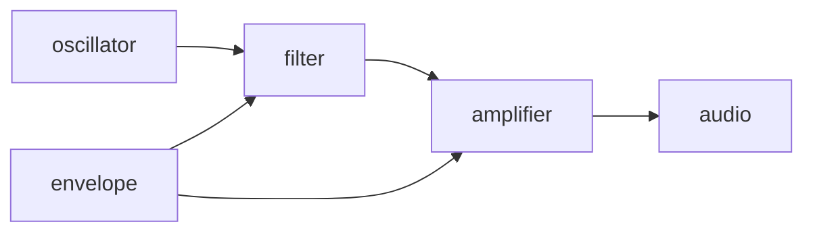
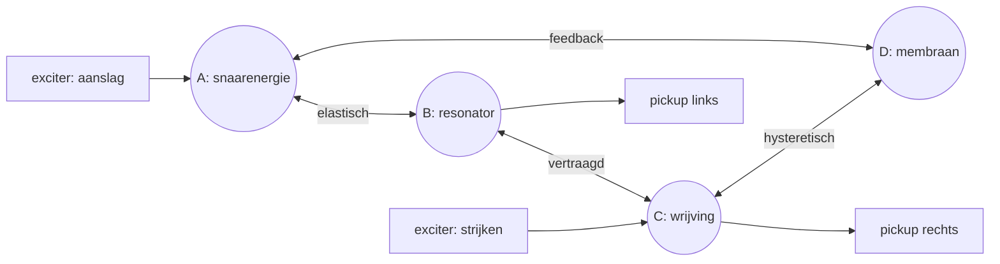
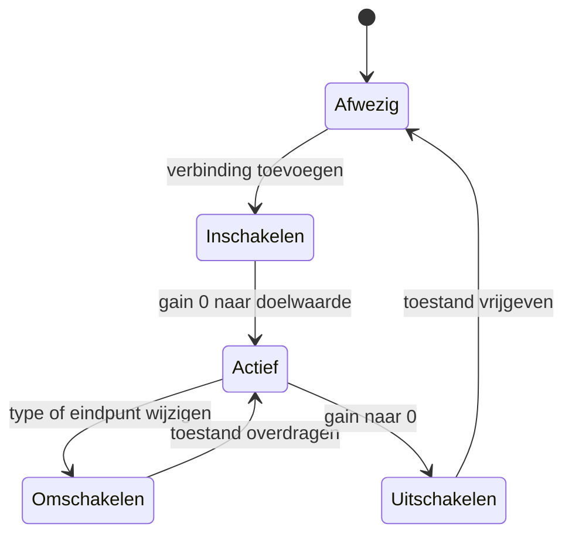
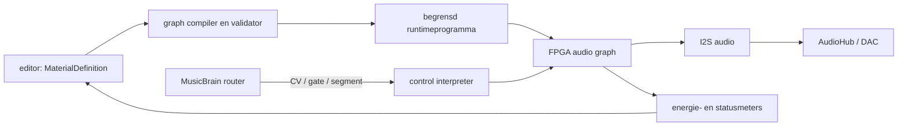

# State-Graph Synthesis

**Status:** concept / onderzoeksvoorstel

**Datum:** 2026-09-01

**Doel:** onderzoeken of een live herconfigureerbaar netwerk van energie,
resonantie en materiaalgeheugen een herkenbaar nieuwe klasse bespeelbare
digitale instrumenten kan opleveren.

## Samenvatting

State-Graph Synthesis begint niet met een oscillator-filter-amplifierketen en
ook niet met een vooraf vastgelegd fysiek object. Het instrument is een graaf:

- **knopen** bewaren energie en toestand;
- **verbindingen** dragen energie over, vertragen, dempen of vervormen;
- **exciters** injecteren energie;
- **pickups** lezen het netwerk op één of meer plaatsen;
- **hysterese** laat materiaalgedrag afhangen van zijn voorgeschiedenis;
- **topologiemutaties** verbinden, splitsen of verplaatsen onderdelen tijdens
  het spelen.

De voorlopige naam is bewust beschrijvend en geen nieuwheidsclaim. Digitale
waveguides, modale synthese, wave digital filters, mass-springnetwerken,
cellulaire automaten en dynamische systemen leveren belangrijke prior art.
De onderzoeksvraag is smaller:

> Levert de combinatie van energiegedragen interactie, live veranderlijke
> topologie, hysteretisch materiaal en meerdere exciters/pickups een eigen,
> leerbaar instrumentaal gedrag op?

## Van signaalketen naar bespeelbaar materiaal

Een klassieke subtractieve stem heeft hoofdzakelijk een voorwaartse route:



Een state graph heeft geen verplichte bron of vaste uitgangsroute:



Een noot start dan niet noodzakelijk een nieuwe, zelfstandige stem. Hij kan
energie toevoegen aan een netwerk dat nog beweegt en dat door eerdere noten is
veranderd. Polyfonie ontstaat uit meerdere gelijktijdige excitatieplaatsen en
niet uitsluitend uit het dupliceren van een voice.

## Minimaal formeel model

Laat $G(t) = (V, E(t))$ de graaf zijn. Iedere knoop $i$ heeft een toestand
$x_i$, opgeslagen energie $H_i(x_i)$ en eventueel een langzame
materiaaltoestand $h_i$. Een verbinding $e=(i,j)$ berekent een energiestroom
uit het lokale verschil en haar eigen toestand:

$$
\dot{x}_i = f_i(x_i, h_i, u_i)
            + \sum_{e \rightarrow i} \phi_e
            - \sum_{e \leftarrow i} \phi_e
$$

$$
\dot{h}_i = g_i(x_i, h_i, T_i)
$$

Daarin zijn:

- $u_i$ een externe excitatie;
- $\phi_e$ de energiestroom over verbinding $e$;
- $h_i$ geheugen zoals spanning, magnetisatie, slijtage of temperatuur;
- $T_i$ een langzame context zoals tijd of thermische toestand.

De totale opgeslagen energie is:

$$
H = \sum_i H_i + \sum_e H_e
$$

Voor een passief netwerk moet per sample of tijdstap gelden:

$$
\Delta H \leq E_{\mathrm{in}} - E_{\mathrm{dissipatie}}
$$

Dat is geen volledige implementatiemethode, maar wel een belangrijke
ontwerptest. Een verbinding die zonder expliciete exciter blijvend energie
toevoegt, is actief en moet als feedback/gain-element worden begrensd.

## Wat hysterese hier betekent

Een geheugenloze component geeft voor dezelfde invoer steeds dezelfde uitvoer:

$$
y(t) = f(x(t))
$$

Een hysteretische component reageert ook op interne geschiedenis:

$$
y(t) = f(x(t), h(t))
$$

Dezelfde kracht, spanning of vervorming kan daardoor twee verschillende
uitkomsten hebben, afhankelijk van de richting en eerdere belasting.

### Eenvoudigste digitale vorm: twee drempels

```text
uit -- invoer > 0,60 --> aan
aan -- invoer < 0,40 --> uit

tussen 0,40 en 0,60 blijft de vorige toestand behouden
```

Dit is bruikbaar voor contact, stick-slip en het vast- of losslaan van een
koppeling. Het is nog geen rijk materiaalmodel.

### Continue materiaaltoestand

Een eenvoudige virtuele `stress` kan bij belasting oplopen en langzaam
herstellen:

$$
h[n+1] = \operatorname{clamp}
\left(h[n] + \alpha |x[n]| - \beta h[n], 0, 1\right)
$$

Die toestand kan vervolgens stijfheid, demping en vervorming beïnvloeden:

$$
k_{\mathrm{eff}} = k_0 (1 + a h), \qquad
d_{\mathrm{eff}} = d_0 (1 + b h)
$$

Hiermee klinkt een tweede harde aanslag anders wanneer het materiaal nog niet
is hersteld. Belangrijk is dat `stress` niet simpelweg een willekeurige
modulator is: zij wordt causaal opgebouwd door de energie in het netwerk.

### Mogelijke hysteretische verbindingen

| Type | Geheugen | Muzikaal gedrag |
|---|---|---|
| stick-slip | vast/glijdend en vorige snelheid | strijkstok, piep, schrapen |
| magnetisch | eerdere veldsterkte/magnetisatie | asymmetrische verzadiging, remanentie |
| elastisch | eerdere rek en herstel | tijdelijke ontstemming of stijfheid |
| thermisch | gedissipeerd vermogen | langzaam veranderende drive/demping |
| contact | open/dicht plus contactdruk | klik, chatter, niet-synchrone keying |
| vermoeiing | cumulatieve belasting | klank wordt tijdelijk doffer of instabieler |

`Wear` moet voor een muziekinstrument meestal omkeerbaar, begrensd en
reproduceerbaar zijn. Een aparte destructieve modus kan permanente verandering
simuleren, maar mag geen onbedoelde presetvernietiging opleveren.

## Bouwblokken

### Knopen

Een eerste bibliotheek hoeft klein te zijn:

| Knoop | Toestand | Voorbeeld |
|---|---|---|
| oscillator/resonator | positie en snelheid, of quadratuurpaar | snaar, membraan, LC-resonator |
| delay junction | samples en voortplantingsrichting | buis, snaarsegment, ruimte |
| integrator | lading, druk of impuls | condensator, luchtkamer, massa |
| modal bank | amplitudes/fasen van enkele modi | plaat, body, klankkast |
| reservoir | energie plus langzaam herstel | balg, voeding, spanning |
| excitable node | rust, actief en refractair | klikkend of pulserend materiaal |

### Verbindingen

- lineaire veer, weerstand of conductantie;
- dispersieve of frequentieafhankelijke koppeling;
- fractional delay;
- diode-/softclipverbinding;
- eenrichtingsklep;
- stick-slipcontact;
- magnetische of elastische hysterese;
- schakelbare en soepel in-/uitfadebare verbinding;
- actieve feedbackverbinding met expliciet energiebudget.

### Exciters

- impuls of hamer met snelheid en hardheid;
- noise burst;
- periodieke druk, strijken of blazen;
- externe audio;
- gate/CV die een verbinding beweegt in plaats van audio injecteert;
- terugkoppeling van een echte analoge sensor of voice-tile.

### Pickups

Een pickup is een waarnemer en geen eigenschap van de bron. Hij kan positie,
snelheid, druk, energiestroom of een gewogen combinatie uitlezen. Meerdere
pickups uit hetzelfde netwerk leveren coherent meerkanaals geluid. Het live
verplaatsen van een pickup verandert de waarneming zonder het materiaal zelf
te veranderen.

## Topologie als speelparameter

Een abrupte graafwijziging kan klikken of numerieke energie creëren. Live
mutaties moeten daarom een expliciete overgang hebben:



Mogelijke mutaties zijn:

- twee resonatoren koppelen of losmaken;
- een knoop splitsen en de bestaande energie verdelen;
- twee knopen samenvoegen met behoud van impuls of lading;
- een verbinding langs een snaar of plaat verplaatsen;
- een pickup verplaatsen;
- een lineaire koppeling door belasting geleidelijk hysteretisch maken.

Bij splitsen en samenvoegen moet worden vastgelegd welke grootheid behouden
blijft. Zonder zo'n regel is een topologiemutatie alleen een crossfade tussen
algoritmen en niet werkelijk onderdeel van het materiaalmodel.

## Bespeling

De meest interessante controls beschrijven handelingen:

| Spelhandeling | Graafactie |
|---|---|
| toets/noot | energie op een gekozen knoop injecteren |
| velocity | impuls, contacthardheid of initiële druk |
| poly pressure | exciterdruk of lokale demping |
| pitchbend | spanning of geometrie wijzigen |
| modwheel | pickup bewegen of verbinding openen |
| trackpadpositie | exciter- en pickupplaats in twee dimensies |
| trackpaddruk | contactkracht/stick-slipregime |
| pedaal | knopen aan een gedeelde resonator koppelen |
| sequencer | periodiek topologie bouwen en afbreken |

Noten hoeven niet één-op-één aan voices te zijn gekoppeld. Een akkoord kan drie
plaatsen in hetzelfde membraan aanslaan; een volgende noot kan een brug tussen
twee nog klinkende gebieden maken. Dat is een belangrijk onderscheid met een
gebruikelijke polyfone physical-modelingstem.

## Editorconcept

De editor toont een werkvlak en geen verborgen modulatielijst:

```text
+---------------- MATERIAL CANVAS ----------------+  +-- INSPECTOR --------+
|                                                  |  | selected: edge E4   |
| [hammer] -> (string A) === E4 === (plate B)      |  | type: stick-slip    |
|                |                    |             |  | coupling: 0.63      |
|             [pickup L]          (reservoir)      |  | stress: 0.28        |
|                |                    |             |  | recovery: 1.8 s     |
|             audio L             [pickup R]       |  | passive: yes        |
|                                                  |  | energy: 0.014 J*    |
+--------------------------------------------------+  +---------------------+
| energy | topology | material memory | pickups | scope | safe edit | perform |
+--------------------------------------------------------------------------+

* genormaliseerde modeleenergie, niet noodzakelijk fysieke joules
```

Noodzakelijke editorfuncties:

- live energieweergave per knoop en verbinding;
- zichtbare richting van energiestroom;
- inspectie en reset van hysteretische toestand;
- `freeze`, `release` en veilige `clear energy`;
- vergelijking tussen twee materiaaltoestanden;
- opname van een gebaar als topologie-automatisering;
- waarschuwing voor actieve lussen en geschatte stabiliteitsmarge;
- begrensde performancemacro's bovenop de technische parameters.

De complete graaf past niet in het bestaande vaste `patch.synth.v1`-blobje.
Gebruik een aparte, versieerbare `MaterialDefinition` die offline of bij laden
naar een begrensd runtimeprogramma wordt gecompileerd. Realtimebesturing blijft
via de bestaande CV-, gate- en segmentcommando's lopen.

## Voorlopige `MaterialDefinition`

```json
{
  "schemaVersion": 1,
  "sampleRate": 48000,
  "energyLimit": 1.0,
  "nodes": [
    {"id": "stringA", "type": "modal", "modes": 8, "decay": 0.992},
    {"id": "body", "type": "resonator", "frequencyHz": 184.0}
  ],
  "edges": [
    {
      "id": "bridge",
      "from": "stringA",
      "to": "body",
      "type": "elasticHysteresis",
      "coupling": 0.4,
      "recoveryMs": 1200,
      "passive": true
    }
  ],
  "exciters": [
    {"id": "hammer", "node": "stringA", "type": "impulse"}
  ],
  "pickups": [
    {"id": "left", "node": "stringA", "quantity": "velocity"},
    {"id": "right", "node": "body", "quantity": "position"}
  ]
}
```

Getallen zijn illustratief. Het uiteindelijke schema moet eenheden,
parameterbereiken, toestandsoverdracht bij mutaties en een resourcebudget
expliciet vastleggen.

## Uitvoering op MusicBrain



### FPGA

Geschikt voor:

- veel gelijktijdige knopen en verbindingen;
- vaste sampleplanning zonder jitter;
- korte delaylijnen in BRAM;
- parallelle of time-multiplexed multiply-accumulatebewerkingen;
- saturerende fixed-pointrekenkunde;
- energie- en overflowmeters.

De bestaande FPGA-synth-ADR laat al zien hoe zo'n kaart een gewone SPI-slave
kan blijven. State-Graph Synthesis verandert die systeembeslissing niet.

### Teensy

Geschikt voor:

- MIDI/CV-mapping en performancegebaren;
- langzame materiaaltoestand;
- topologiemutaties voorbereiden en valideren;
- presets, logging en editorcommunicatie;
- een kleine volledig softwarematige referentie-engine.

Voor het eerste prototype is Teensy-only waarschijnlijk sneller. Een engine
gaat pas naar FPGA als profiling aantoont welke rekeneenheden, BRAM-layout en
fixed-pointbereiken werkelijk nodig zijn.

## Numerieke veiligheid

Een dynamische feedbackgraaf kan zeer snel onstabiel worden. Minimumeisen:

- ieder knoop- en verbindingstype heeft bekende energie- of gain-grenzen;
- passieve elementen mogen samen geen energie genereren;
- actieve verbindingen declareren maximale gain en energietoevoer;
- topologiemutaties gebruiken crossfades of toestandsoverdracht;
- alle accumulators gebruiken saturatie, geen wraparound;
- denormals, NaN en oneindigheid kunnen de audioloop niet besmetten;
- een snelle limiter is alleen de laatste bescherming, niet het stabiliteitsmodel;
- `clear energy` en watchdogmute werken zonder editor;
- compile-timevalidatie weigert algebraïsche lussen die niet oplosbaar zijn.

Voor fixed point moeten per knoop headroom en worst-case som worden bewezen.
Een globale schaalfactor alleen is waarschijnlijk te grof voor grafen met
sterk verschillende lokale energieniveaus.

## Eerste prototype

### Begrenzing

- 8 tot 16 knopen;
- maximaal 24 verbindingen;
- twee exciters en twee pickups;
- resonator, delay, dissipatieve koppeling en één hysteretisch contact;
- één veilige mutatie: verbinding toevoegen/verwijderen;
- 48 kHz stereo;
- software-engine vóór FPGA-port;
- geen automatische groei of machine learning.

### Drie proeven

1. **Gedeeld membraan:** drie toetsen slaan verschillende punten aan; noten
   beïnvloeden aantoonbaar elkaars decay en spectrum.
2. **Vermoeide brug:** herhaalde harde aanslagen veranderen tijdelijk koppeling
   en demping; herstel is hoorbaar en meetbaar.
3. **Bouwbaar akkoord:** iedere nieuwe noot voegt een verbinding toe; loslaten
   verwijdert haar gecontroleerd zonder klik of energietoename.

### Go/no-go

Ga alleen door wanneer:

- spelers het effect van gedeelde toestand leren voorspellen en inzetten;
- hysterese in een blinde A/B-test meer oplevert dan een gewone envelope/LFO;
- topology edits klikvrij en begrensd blijven;
- CPU-belasting en geheugen lineair en voorspelbaar schalen;
- dezelfde patch deterministisch kan worden opgeslagen en teruggeroepen;
- de engine klanken en speelgedrag oplevert die niet eenvoudiger met bestaande
  subtractieve, FM- of standaard physical-modelingblokken ontstaan.

## Verwante nieuwe onderzoeksrichtingen

Deze ideeën zijn geen bewezen nieuwe synthesevormen. Ze zijn kandidaten die
dezelfde infrastructuur kunnen benutten en tegen bestaande technieken moeten
worden getoetst.

### 1. Resource-Coupled Synthesis

Veel stemmen delen een eindige virtuele bron: lucht, snaarspanning, elektrische
lading, warmte of motorvermogen. Een harde noot laat tijdelijk minder resource
voor andere noten over; de bron herstelt geleidelijk.

```text
                 +--> voice A
[drukreservoir] -+--> voice B
                 +--> voice C
        ^
        +--- langzaam herstel
```

Dit is sterker dan sidechaincompressie wanneer de resource de toonhoogte,
aanval, koppeling en vervorming causaal beïnvloedt. Het kan zelfstandig worden
onderzocht, maar past ook als reservoirknoop in een state graph.

### 2. Excitable-Media Synthesis

Een raster of graaf bestaat uit cellen met rust-, actieve en refractaire
toestand. Een aanslag start golven die botsen, uitdoven, rond obstakels lopen of
gesloten banen vormen. Pickups luisteren naar lokale activiteit.

Het muzikale materiaal is dan geen periodieke oscillator maar voortplantende
gebeurtenis. Dit raakt cellulaire automaten en reaction-diffusiononderzoek;
nieuwheid zou vooral zitten in energiebegrenzing, audio-rate koppeling en een
bespeelbare interface.

### 3. Negotiated Resonance

Stemmen bezitten geen vaste resonatoren, maar concurreren om een gedeelde bank
modi. Een nieuwe excitatie kan een bestaande mode aantrekken, verstemmen,
splitsen of verdringen. Akkoorden onderhandelen daardoor over hun gezamenlijke
spectrum.

Dit kan interessante harmonie-afhankelijke klank opleveren zonder akkoorden
expliciet te herkennen. Het risico is onvoorspelbare intonatie; behoud van een
duidelijke tonale ankerlaag is waarschijnlijk nodig.

### 4. Observer-Coupled Synthesis

Het geluidsveld bestaat onafhankelijk, maar pickups beïnvloeden door hun
virtuele massa, impedantie of feedback ook wat zij waarnemen. Luisteren wordt
dus een fysieke handeling. Een pickup dichter bij een knoop plaatsen kan het
materiaal lokaal dempen of juist terugkoppelen.

Dit principe is bekend uit echte meet- en versterkersystemen, maar zelden de
centrale speelmetafoor van een synthesizer. Meerdere beweegbare pickups en
coherente meerkanaalsuitgangen passen goed bij trackpad en AudioHub.

### 5. Morphogenetic Synthesis

De graaf groeit, snoeit of verstevigt verbindingen door speelgeschiedenis.
Vaak gebruikte paden worden sterker; ongebruikte paden herstellen of verdwijnen.
In tegenstelling tot een generatief AI-model blijft iedere verandering lokaal,
causaal en inspecteerbaar.

Dit is de meest experimentele richting. Begin pas nadat handmatige
topologiemutaties muzikaal werken. Anders automatiseert het systeem gedrag dat
nog niet goed begrepen of bestuurbaar is.

## Prioriteit

| Richting | Eigen speelgedrag | Technisch risico | Eerste prioriteit |
|---|---:|---:|---:|
| State-Graph + hysterese | hoog | hoog maar begrensbaar | 1 |
| Resource-Coupled | hoog | laag/middel | 2 |
| Observer-Coupled | middel/hoog | middel | 3 |
| Excitable Media | middel/hoog | middel/hoog | 4 |
| Negotiated Resonance | onzeker maar interessant | hoog | 5 |
| Morphogenetic | potentieel hoog | zeer hoog | pas later |

Resource-Coupled Synthesis is de beste tweede proef: klein genoeg om snel te
bouwen en direct bruikbaar om te testen of gedeelde fysieke toestand werkelijk
anders speelt dan onafhankelijke voices. Morphogenetic Synthesis is pas zinvol
wanneer de onderliggende handmatige state graph stabiel en muzikaal begrijpelijk
is.

## Relatie tot bestaande MusicBrain-documenten

- [Instrument Lab](musicbrain-instrument-lab.md) levert meetinfrastructuur,
  AudioHub en mogelijke analoge referentietiles.
- [ADR 0013](../adr/0013-fpga-synth-instrument.md) beschrijft de FPGA-kaart als
  gewone SPI-slave met onafhankelijk I2S-audio.
- [patch.synth.v1](../protocols/schemas/patch.synth.v1.md) blijft het compacte
  bestaande voicecontract; de state graph krijgt een afzonderlijke definitie.

## Beslispunt

State-Graph Synthesis verdient voorlopig de status **onderzoeksinstrument**, niet
productarchitectuur. De eerstvolgende concrete stap is een softwareprototype
met één gedeelde resonator, één hysteretische brug en twee pickups. Alleen als
spelers het geheugen en de onderlinge beïnvloeding hoorbaar kunnen voorspellen,
is een editor- en FPGA-traject gerechtvaardigd.