# Core Library — Class Diagram

```mermaid
classDiagram

    %% ─── Value types ────────────────────────────────────────────────────────
    class CvValue {
        +float v
    }
    class CvSegment {
        +CvValue target
        +Millis duration
        +CurveId curve
    }
    class VoiceState {
        +bool held
        +uint8_t note
        +uint32_t age
    }
    class AllocResult {
        +uint8_t voiceIdx
        +bool stole
        +uint8_t prevNote
    }

    %% ─── Patch model ────────────────────────────────────────────────────────
    class Patch {
        +ProgramId id
        +uint16_t schemaVersion
        +char name[24]
        +uint16_t blobSize
        +uint8_t blob[512]
        +nameView() string_view
        +setName(s: string_view) void
    }
    class PatchBank {
        -Patch patches_[128]
        -size_t count_
        -optional~ProgramId~ active_
        +insert(p: Patch) bool
        +find(id: ProgramId) Patch*
        +at(idx: size_t) Patch*
        +indexOf(id: ProgramId) size_t
        +setActive(id: ProgramId) bool
        +activeId() optional~ProgramId~
        +active() Patch*
        +size() size_t
    }
    class PatchCodec {
        +toJson(p: Patch)$ string
        +fromJson(s: string_view)$ optional~Patch~
        +toCbor(p: Patch)$ vector~uint8_t~
        +fromCbor(data, size)$ optional~Patch~
    }

    %% ─── Patch blob schemata ────────────────────────────────────────────────
    class SynthPatchV1 {
        +uint8_t voiceCount
        +uint8_t caseId
        +uint8_t firstSlot
        +uint8_t pitchBits
        +pitchChannel(voiceIdx) ChannelId
        +gateChannel(voiceIdx) ChannelId
    }
    class SwitcherPatchV1 {
        +uint8_t relayCount
        +uint16_t relayMask
        +uint8_t flags
        +isRelayOn(i: uint8_t) bool
    }
    note for SynthPatchV1 "namespace mb::synth\nblob: 8 bytes, CRC-16/CCITT\nversion=1"
    note for SwitcherPatchV1 "namespace mb::switcher\nblob: 8 bytes, CRC-16/CCITT\nversion=1"

    %% ─── Router model ───────────────────────────────────────────────────────
    class InputEvent {
        +InputKind kind
        +uint16_t channel
        +uint16_t payload
        +int32_t data
    }
    class OutputCommand {
        +OutputKind kind
        +uint16_t channel
        +uint16_t payload
        +int32_t data
    }
    class RouterResult {
        +OutputCommand commands[24]
        +size_t count
    }
    class Router {
        <<abstract>>
        +handle(ev: InputEvent, active: Patch*)* RouterResult
    }
    class NullRouter {
        +handle(ev, active) RouterResult
    }
    class MatrixRouter {
        -VoiceAllocator alloc_
        -uint8_t configuredFor_
        +midiNoteToCvCode(note)$ int16_t
        +handle(ev, active) RouterResult
    }
    class SwitcherRouter {
        -PatchBank bank_
        +handle(ev, active) RouterResult
        -selectProgram(id) RouterResult
    }

    %% ─── Voice allocator ────────────────────────────────────────────────────
    class VoiceAllocator {
        -VoiceState voices_[16]
        -uint8_t voiceCount_
        -uint32_t tick_
        +configure(voiceCount: uint8_t) void
        +noteOn(note: uint8_t) AllocResult
        +noteOff(note: uint8_t) uint8_t
        +allOff() void
        +voiceCount() uint8_t
        +state(i) VoiceState
    }

    %% ─── SPI protocol layer ─────────────────────────────────────────────────
    class SpiFrame {
        <<utility namespace mb::proto>>
        +crc16Ccitt(data, len)$ uint16_t
        +encode(op, payload, payloadLen, out, outCap)$ size_t
        +decode(in, inLen, outOp, outPayload, outLen, outConsumed)$ bool
    }

    %% ─── HAL interfaces ─────────────────────────────────────────────────────
    class IStore {
        <<interface>>
        +read(key, out, cap, outLen)* bool
        +write(key, data, len)* bool
        +erase(key)* bool
    }
    class ITransport {
        <<interface>>
        +send(data, len)* size_t
        +recv(out, cap)* size_t
    }
    class IRelayBoard {
        <<interface>>
        +relayCount()* size_t
        +setRelay(id, on)* void
        +setMask(mask: uint16_t)* void
    }
    class IDisplay {
        <<interface>>
        +showPatch(id: uint8_t, name: string_view)* void
        +clear()* void
    }

    %% ─── Relationships ──────────────────────────────────────────────────────
    Router <|-- NullRouter
    Router <|-- MatrixRouter
    Router <|-- SwitcherRouter

    MatrixRouter *-- VoiceAllocator
    SwitcherRouter --> PatchBank
    PatchBank "1" *-- "0..128" Patch

    VoiceAllocator "1" *-- "0..16" VoiceState
    RouterResult "1" *-- "0..24" OutputCommand

    SynthPatchV1 ..> Patch : writeBlob / readBlob
    SwitcherPatchV1 ..> Patch : writeBlob / readBlob
    PatchCodec ..> Patch : encodes / decodes
```

## Toelichting

### Naamruimten
| Naamruimte | Inhoud |
|------------|--------|
| `mb` | Kernentiteiten: Patch, PatchBank, Router-hiërarchie, HAL-interfaces |
| `mb::synth` | SynthPatchV1 + writeBlob/readBlob (project 3) |
| `mb::switcher` | SwitcherPatchV1 + writeBlob/readBlob (project 1) |
| `mb::proto` | SPI-framedefinitie, Opcode enum, CRC-helper |

### Blob-structuur
Zowel `SynthPatchV1` als `SwitcherPatchV1` worden als 8-byte blob in `Patch::blob` opgeslagen. De laatste 2 bytes zijn altijd CRC-16/CCITT over bytes 0–5. De router leest het blob via `readBlob()` en krijgt een geparste struct terug — de router zelf heeft geen kennis van het binaire formaat.

### `kMaxOutputsPerEvent = 24`
Groot genoeg voor 16 relays + DisplayDirty + spare. De array zit op de stack; geen heap-allocatie.

### InputKind (enum)
`None`, `MidiNoteOn`, `MidiNoteOff`, `MidiCc`, `MidiProgramChange`, `Footswitch`, `Encoder`, `PotChange`, `CvInSample`

### OutputKind (enum)
`None`, `RelaySet`, `CvSet`, `CvSegment`, `GateSet`, `TriggerPulse`, `MidiOut`, `DisplayDirty`
