# Sim-laag + HAL — Class Diagram

```mermaid
classDiagram

    %% ─── Sim: tijdinfrastructuur ────────────────────────────────────────────
    class Clock {
        -uint64_t us_
        +now() uint64_t
        +advance(deltaUs: uint64_t) void
        +set(us: uint64_t) void
    }
    class Trace {
        -ostream out_
        -stringstream line_
        +begin(tUs, kind) Trace&
        +field(name, v) Trace&
        +fieldStr(name, v) Trace&
        +fieldBool(name, v) Trace&
        +end() void
    }

    %% ─── Sim: SPI-bus ───────────────────────────────────────────────────────
    class VirtualSpiBus {
        -Clock clock_
        -Trace trace_
        -vector~SpiListener~ listeners_
        -size_t framesSent_
        +attach(listener: SpiListener) void
        +sendCvSet(channel, value) bool
        +sendGateSet(channel, on) bool
        +sendRaw(frame, len) bool
        +framesSent() size_t
    }
    class RouterBridge {
        -VirtualSpiBus bus_
        +dispatch(r: RouterResult) void
    }
    note for VirtualSpiBus "SpiListener = function~void(Opcode,uint8_t*,size_t)~"

    %% ─── Sim: chip-modellen ─────────────────────────────────────────────────
    class Dac8568 {
        -Clock clock_
        -Trace trace_
        -uint16_t channelBase_
        -float vref_
        -int16_t codes_[8]
        -bool seen_[8]
        +voltage(channel) float
        +code(channel) int16_t
        -onSpi(op, payload, len) void
    }
    class GateBoard {
        -Clock clock_
        -Trace trace_
        -uint16_t channelBase_
        -bool states_[8]
        -bool seen_[8]
        +state(channel) bool
        -onSpi(op, payload, len) void
    }
    note for Dac8568 "8 kanalen, 16-bit\nTI DAC8568 behaviouraal model\npitch-CV: (MIDI-60)/60 → int16"
    note for GateBoard "8 poorten, odd-slot adressering\ngate-state wijzigingen als trace-event"

    %% ─── HAL: interfaces (in core) ──────────────────────────────────────────
    class IStore {
        <<interface>>
        +read(key, out, cap, outLen)* bool
        +write(key, data, len)* bool
        +erase(key)* bool
    }
    class ITransport {
        <<interface>>
        +send(data, len)* size_t
        +recv(out, cap)* size_t
    }
    class IRelayBoard {
        <<interface>>
        +relayCount()* size_t
        +setRelay(id, on)* void
        +setMask(mask: uint16_t)* void
    }
    class IDisplay {
        <<interface>>
        +showPatch(id, name)* void
        +clear()* void
    }

    %% ─── HAL: host-implementaties ───────────────────────────────────────────
    class HostStore {
        -unordered_map~uint32_t, vector~uint8_t~~ map_
        +read(key, out, cap, outLen) bool
        +write(key, data, len) bool
        +erase(key) bool
    }
    class HostLoopback {
        -deque~uint8_t~ buf_
        +send(data, len) size_t
        +recv(out, cap) size_t
    }
    class HostRelayBoard {
        -size_t count_
        -bool states_[16]
        -size_t setRelayCalls_
        -size_t setMaskCalls_
        +relayCount() size_t
        +setRelay(id, on) void
        +setMask(mask) void
        +state(id) bool
        +mask() uint16_t
        +setRelayCalls() size_t
        +setMaskCalls() size_t
    }
    class HostDisplay {
        -uint8_t lastId_
        -string lastName_
        -size_t showCalls_
        -size_t clearCalls_
        +showPatch(id, name) void
        +clear() void
        +lastId() uint8_t
        +lastName() string
        +showCalls() size_t
        +clearCalls() size_t
    }

    %% ─── Toekomstige RP2040 HAL (nog niet geïmplementeerd) ─────────────────
    class Rp2040RelayBoard {
        <<planned>>
        +relayCount() size_t
        +setRelay(id, on) void
        +setMask(mask) void
    }
    class Rp2040Display {
        <<planned>>
        +showPatch(id, name) void
        +clear() void
    }
    note for Rp2040RelayBoard "GPIO + 74HC595 chain\nNog te implementeren in hal/rp2040/"
    note for Rp2040Display "SSD1306 OLED, I²C\nNog te implementeren in hal/rp2040/"

    %% ─── Relaties ───────────────────────────────────────────────────────────
    IStore <|.. HostStore
    ITransport <|.. HostLoopback
    IRelayBoard <|.. HostRelayBoard
    IRelayBoard <|.. Rp2040RelayBoard
    IDisplay <|.. HostDisplay
    IDisplay <|.. Rp2040Display

    VirtualSpiBus --> Clock
    VirtualSpiBus --> Trace
    RouterBridge --> VirtualSpiBus
    Dac8568 --> Clock
    Dac8568 --> Trace
    Dac8568 --> VirtualSpiBus : attach (SpiListener)
    GateBoard --> Clock
    GateBoard --> Trace
    GateBoard --> VirtualSpiBus : attach (SpiListener)
```



## Toelichting

### Naamruimten
| Naamruimte | Inhoud |
|------------|--------|
| `mb::sim` | Clock, Trace, VirtualSpiBus, RouterBridge, Dac8568, GateBoard |
| `mb::host` | HostStore, HostLoopback, HostRelayBoard, HostDisplay |
| `mb` (core) | IStore, ITransport, IRelayBoard, IDisplay (interfaces) |

### Chip-kanaal adressering
```
ChannelId = (caseId << 8) | slotId

caseId  = breakout-boardnummer (0 = eerste DAC8568-breakout)
slotId  = voice × 2      → pitch (CvSet)
         voice × 2 + 1  → gate  (GateSet)
```

Dac8568 reageert op even slotIds, GateBoard op oneven slotIds binnen hetzelfde `channelBase`.

### SpiListener
`std::function<void(Opcode, const uint8_t*, size_t)>` — VirtualSpiBus roept alle geattachte listeners aan bij elk frame. De chip-modellen registreren zichzelf via `bus.attach(...)` in hun constructor.

### RouterBridge
De seam tussen core (Router, RouterResult) en sim (VirtualSpiBus). Op echte hardware neemt een HAL-driver deze rol over: `OutputCommand::CvSet` → SPI-frame naar DAC, `OutputCommand::GateSet` → SPI-frame naar GateBoard, `OutputCommand::RelaySet` → GPIO + 74HC595.
