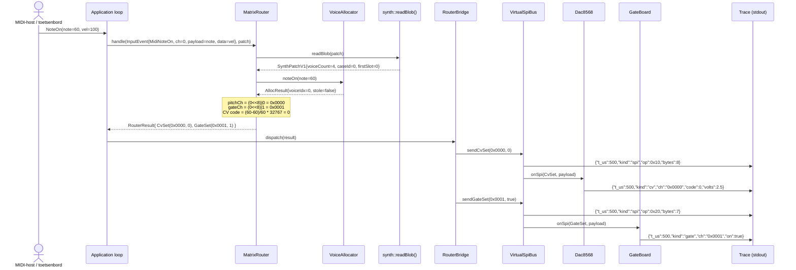
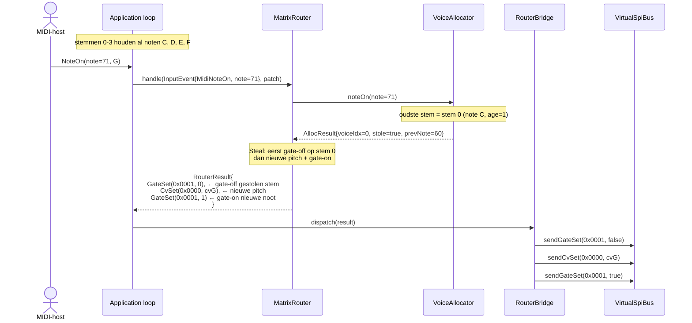
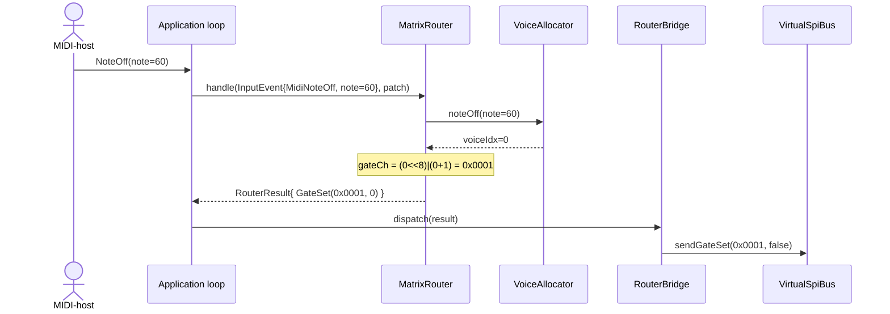

# Sequence Diagram — MatrixRouter: NoteOn / NoteOff

Toont wat er intern gebeurt wanneer een MIDI NoteOn binnenkomt op project 3 (de modulaire synthesizer) en uitloopt in CV- en gate-signalen op de echte breakout-boards c.q. in de simulator.

## NoteOn — vrije stem



## NoteOn — stem stelen (4 stemmen vol)



## NoteOff



## CV-waarde berekening

```
midiNoteToCvCode(note):
    float norm = (note - 60) / 60.0f   // 1V/oct, MIDI 60 = 0V
    norm = clamp(norm, -1.0f, 1.0f)
    return (int16_t)(norm * 32767)

Voorbeelden:
    MIDI 60 (C4)  → 0       → 2.5V (op een 5V DAC)
    MIDI 72 (C5)  → 21845   → +1V
    MIDI 48 (C3)  → -21845  → -1V
    MIDI 120      → 32767   → +5V (clipped)
```
