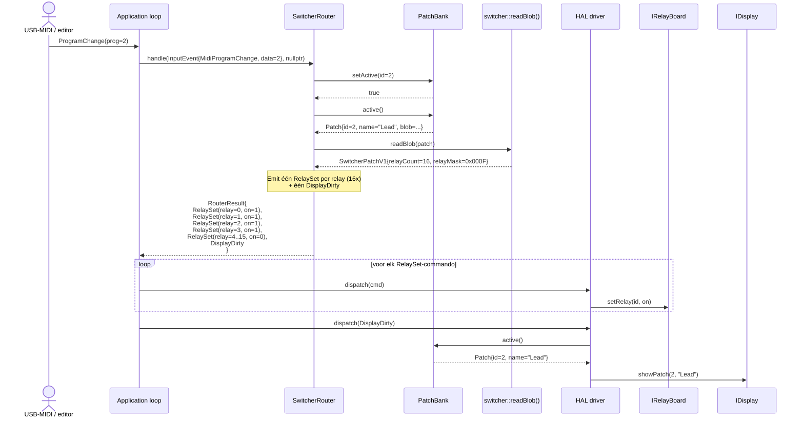
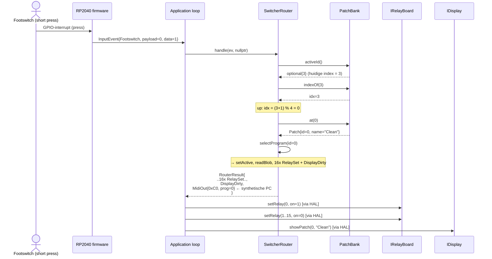
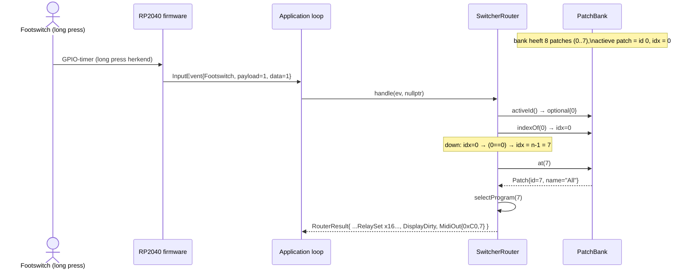
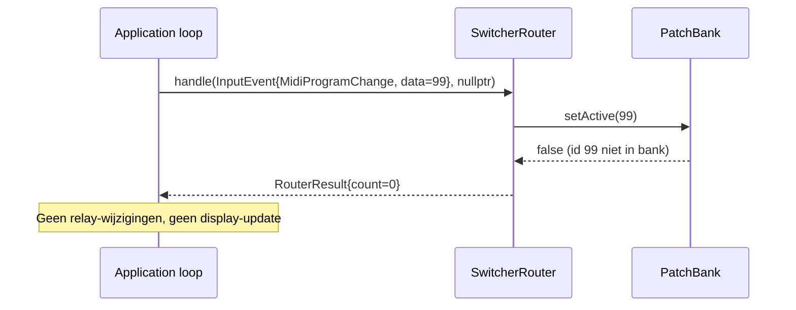

# Sequence Diagram — SwitcherRouter: ProgramChange & Footswitch

Toont het flow voor project 1 (het relais-pedalboard). De applicatie-loop en de host-harness (`mb_switcher`) werken identiek; op de RP2040 vervangen echte HAL-drivers de host-mocks.

## MIDI Program Change (direct selectie)



## Footswitch omhoog (short-press → volgende patch)



## Footswitch omlaag (long-press → vorige patch, wrap-around)



## Onbekend program number (geen match in bank)



## Footswitch release — genegeerd

```mermaid
sequenceDiagram
    actor FS as Footswitch (release)
    participant App as Application loop
    participant SR as SwitcherRouter

    FS->>App: InputEvent{Footswitch, payload=0, data=0}
    App->>SR: handle(ev, nullptr)
    SR-->>App: RouterResult{count=0}
    note over SR: data==0 (release) wordt genegeerd;\nalleen presses (data==1) wisselen patches.
```
