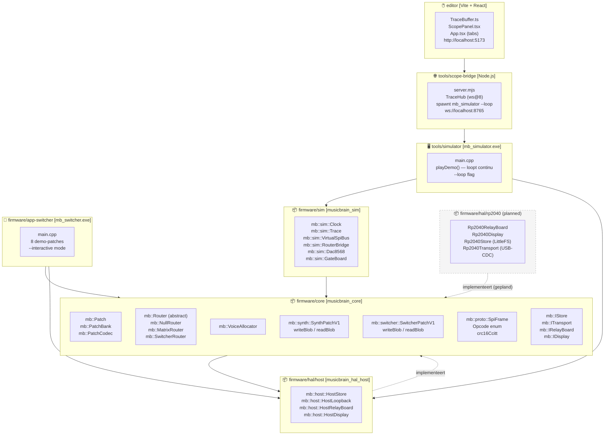
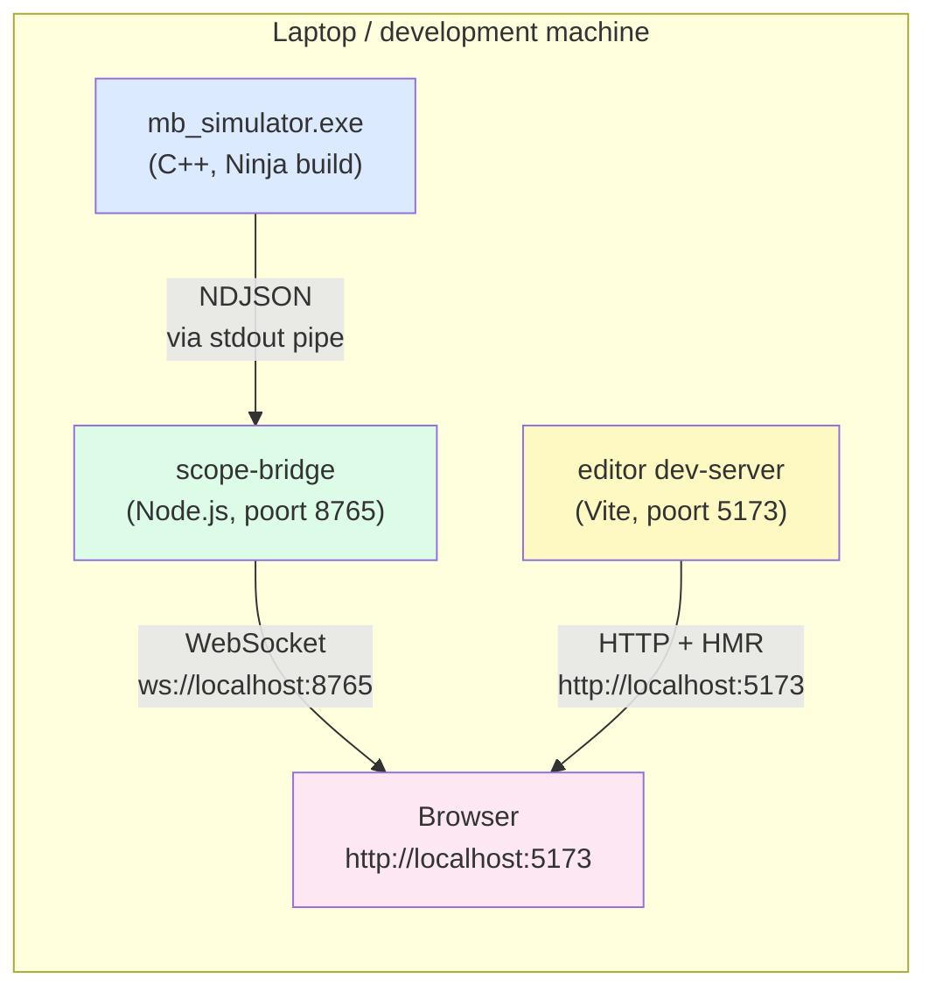
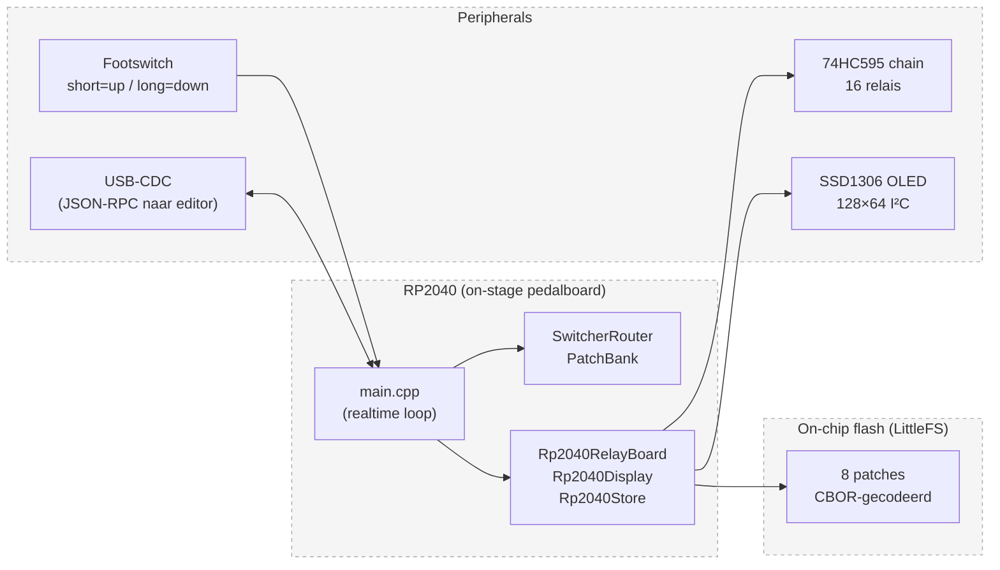

# Component & Package Diagram

## Pakketstructuur (C++ namespaces / CMake targets)

```mermaid
graph TD
    subgraph firmware/core ["📦 firmware/core  [musicbrain_core]"]
        direction TB
        MB["mb::Patch\nmb::PatchBank\nmb::PatchCodec"]
        ROUTER["mb::Router (abstract)\nmb::NullRouter\nmb::MatrixRouter\nmb::SwitcherRouter"]
        VA["mb::VoiceAllocator"]
        SYNTH["mb::synth::SynthPatchV1\nwriteBlob / readBlob"]
        SWITCH["mb::switcher::SwitcherPatchV1\nwriteBlob / readBlob"]
        PROTO["mb::proto::SpiFrame\nOpcode enum\ncrc16Ccitt"]
        IFACE["mb::IStore\nmb::ITransport\nmb::IRelayBoard\nmb::IDisplay"]
    end

    subgraph firmware/hal/host ["📦 firmware/hal/host  [musicbrain_hal_host]"]
        HOST["mb::host::HostStore\nmb::host::HostLoopback\nmb::host::HostRelayBoard\nmb::host::HostDisplay"]
    end

    subgraph firmware/hal/rp2040 ["📦 firmware/hal/rp2040  (planned)"]
        RP["Rp2040RelayBoard\nRp2040Display\nRp2040Store (LittleFS)\nRp2040Transport (USB-CDC)"]
    end

    subgraph firmware/sim ["📦 firmware/sim  [musicbrain_sim]"]
        SIM["mb::sim::Clock\nmb::sim::Trace\nmb::sim::VirtualSpiBus\nmb::sim::RouterBridge\nmb::sim::Dac8568\nmb::sim::GateBoard"]
    end

    subgraph tools/simulator ["🖥️ tools/simulator  [mb_simulator.exe]"]
        SIMAPP["main.cpp\nplayDemo() — loopt continu\n--loop flag"]
    end

    subgraph firmware/app-switcher ["🎸 firmware/app-switcher  [mb_switcher.exe]"]
        SWAPP["main.cpp\n8 demo-patches\n--interactive mode"]
    end

    subgraph tools/scope-bridge ["🌐 tools/scope-bridge  [Node.js]"]
        BRIDGE["server.mjs\nTraceHub (ws@8)\nspawnt mb_simulator --loop\nws://localhost:8765"]
    end

    subgraph editor ["🖱️ editor  [Vite + React]"]
        EDITOR["TraceBuffer.ts\nScopePanel.tsx\nApp.tsx (tabs)\nhttp://localhost:5173"]
    end

    %% Afhankelijkheden
    firmware/core --> firmware/hal/host
    firmware/sim --> firmware/core
    tools/simulator --> firmware/sim
    tools/simulator --> firmware/hal/host
    firmware/app-switcher --> firmware/core
    firmware/app-switcher --> firmware/hal/host
    tools/scope-bridge --> tools/simulator
    editor --> tools/scope-bridge

    firmware/hal/host -.->|"implementeert"| firmware/core
    firmware/hal/rp2040 -.->|"implementeert (gepland)"| firmware/core

    classDef planned fill:#f5f5f5,stroke:#aaa,stroke-dasharray: 4 4
    class firmware/hal/rp2040 planned
```

## Runtime-architectuur (drie processen)

```mermaid
graph LR
    subgraph host["Laptop / development machine"]
        SIM_P["mb_simulator.exe\n(C++, Ninja build)"]
        BRG_P["scope-bridge\n(Node.js, poort 8765)"]
        EDI_P["editor dev-server\n(Vite, poort 5173)"]
        BROWSER["Browser\nhttp://localhost:5173"]
    end

    SIM_P -- "NDJSON\nvia stdout pipe" --> BRG_P
    BRG_P -- "WebSocket\nws://localhost:8765" --> BROWSER
    EDI_P -- "HTTP + HMR\nhttp://localhost:5173" --> BROWSER

    style SIM_P fill:#dbeafe
    style BRG_P fill:#dcfce7
    style EDI_P fill:#fef9c3
    style BROWSER fill:#fce7f3
```

## Toekomstige on-device architectuur (project 1)

```mermaid
graph LR
    subgraph rp2040["RP2040 (on-stage pedalboard)"]
        CORE2["SwitcherRouter\nPatchBank"]
        HAL2["Rp2040RelayBoard\nRp2040Display\nRp2040Store"]
        MAIN2["main.cpp\n(realtime loop)"]
    end

    subgraph flash["On-chip flash (LittleFS)"]
        FS["8 patches\nCBOR-gecodeerd"]
    end

    subgraph peripherals["Peripherals"]
        RELAY["74HC595 chain\n16 relais"]
        OLED["SSD1306 OLED\n128×64 I²C"]
        FS_BTN["Footswitch\nshort=up / long=down"]
        USB["USB-CDC\n(JSON-RPC naar editor)"]
    end

    MAIN2 --> CORE2
    MAIN2 --> HAL2
    HAL2 --> RELAY
    HAL2 --> OLED
    HAL2 --> FS
    FS_BTN --> MAIN2
    USB <--> MAIN2

    classDef planned fill:#f5f5f5,stroke:#aaa,stroke-dasharray: 4 4
    class rp2040,flash,peripherals planned
```
