# Use Case Diagram & Analyse

## Is een use-case diagram zinvol?

Ja — maar het beantwoordt een andere vraag dan de class- en sequentiediagrammen. Het geeft antwoord op: **wie wil wat bereiken?** De class-diagrammen tonen *hoe* het geïmplementeerd is; use cases tonen *waarom*.

Nuttig voor:
- Scoping (wat hoort bij welk project, wat is toekomstwerk)
- Communicatie met niet-technische stakeholders
- Als aanknopingspunt voor testscenario's

---

## Actors

| Actor | Beschrijving |
|-------|-------------|
| **Muzikant** | Gebruikt het systeem live op het podium |
| **Engineer** | Configureert patches, ontwerpt routings |
| **Editor (browser-app)** | De web-UI die de engineer gebruikt |
| **MIDI-host** | DAW, keyboard, of andere MIDI-bron |

---

## Use case diagram

```mermaid
graph TD
    subgraph project1 ["Project 1 — Effect-switcher"]
        UC1["Wissel patch\nvia footswitch"]
        UC2["Wissel patch\nvia MIDI PC"]
        UC3["Bekijk actieve patch\nop display"]
        UC4["Bewerk patches\nin editor"]
        UC5["Upload patches\nnaar apparaat"]
    end

    subgraph project3 ["Project 3 — Modulaire synthesizer (toekomstig)"]
        UC6["Speel noten\n(NoteOn/NoteOff)"]
        UC7["Wissel synth-patch\n(PC)"]
        UC8["Bekijk CV-signalen\nin scope-panel"]
        UC9["Bewerk synth-patch\n(voice count, routing)"]
    end

    subgraph dev ["Ontwikkelaar"]
        UC10["Draai simulator\nmet demo-loop"]
        UC11["Voer unit tests uit"]
        UC12["Bekijk trace\nals NDJSON"]
    end

    Muzikant --> UC1
    Muzikant --> UC2
    Muzikant --> UC3
    Muzikant --> UC6

    MIDI["MIDI-host\n(DAW / keyboard)"] --> UC2
    MIDI --> UC6
    MIDI --> UC7

    Engineer["Engineer"] --> UC4
    Engineer --> UC5
    Engineer --> UC8
    Engineer --> UC9

    Editor["Editor\n(browser-app)"] --> UC4
    Editor --> UC5
    Editor --> UC8
    Editor --> UC9

    Dev["Ontwikkelaar"] --> UC10
    Dev --> UC11
    Dev --> UC12
```

---

## Use cases uitgewerkt (korte beschrijving)

### UC1 — Wissel patch via footswitch
**Actor**: Muzikant  
**Precondities**: Apparaat aan, patches geladen, footswitch aangesloten  
**Stappen**:
1. Muzikant drukt kort op de footswitch (short press = omhoog)  
2. RP2040 herkent GPIO-interrupt → stuurt `InputEvent{Footswitch, payload=0, data=1}`  
3. `SwitcherRouter` berekent volgende patch-index (circulair)  
4. Router emits 16× `RelaySet` + `DisplayDirty`  
5. HAL-driver zet bits in 74HC595-registers → relais schakelen  
6. Display toont nieuwe patch-naam  
**Postcondities**: Actieve patch veranderd, relais in nieuwe stand, display bijgewerkt

### UC2 — Wissel patch via MIDI PC
**Actor**: MIDI-host, Muzikant  
**Precondities**: USB-CDC verbonden met MIDI-host  
**Stappen**: gelijk aan UC1 maar trigger is `MidiProgramChange(prog)` via USB

### UC4 — Bewerk patches in editor
**Actor**: Engineer  
**Precondities**: Editor draait op `http://localhost:5173`  
**Stappen**:
1. Engineer opent Patches-tab  
2. Selecteert een patch, wijzigt relay-masker of naam  
3. Editor valideert tegen JSON-schema (toekomstig: Stage 7)  
4. Editor stuurt patch als CBOR via WebSerial naar apparaat (Stage 7)  
**Postcondities**: Gewijzigde patch opgeslagen in LittleFS op apparaat

### UC8 — Bekijk CV-signalen in scope-panel
**Actor**: Engineer  
**Precondities**: `scope-bridge` en `editor` draaien, `mb_simulator` actief  
**Stappen**:
1. Engineer opent Scope-tab in browser  
2. Scope-panel verbindt met `ws://localhost:8765`  
3. Bridge streamt NDJSON van simulator  
4. TraceBuffer parseert cv/gate-events  
5. Canvas toont step-lijn per kanaal, autoscale op y-as  
**Postcondities**: Live visualisatie van CV-waarden

### UC10 — Draai simulator met demo-loop
**Actor**: Ontwikkelaar  
**Stappen**:
1. `node server.mjs` in `tools/scope-bridge`  
2. Bridge spawnt `mb_simulator.exe --loop`  
3. Simulator speelt C-majeur arpeggio, herhaalt elke 2s  
4. Elk SPI/CV/gate-event → NDJSON-regel op stdout → WebSocket-broadcast

---

## Wat is nu nog niet gebouwd? (scope-gap)

| Use case | Status |
|----------|--------|
| UC1, UC2, UC3 — live op podium | Core ✅, RP2040 HAL + echt apparaat ❌ |
| UC4 — patches bewerken | Core + Patches-tab ✅, schema-validatie + WebSerial upload ❌ |
| UC5 — upload naar apparaat | ❌ (Stage 7) |
| UC6 — noten spelen op echte hardware | Core + sim ✅, modulaire breakouts ❌ |
| UC7 — synth-patch wisselen | Core ✅, echt apparaat ❌ |
| UC8 — scope-panel | ✅ volledig werkend (Stage 5) |
| UC9 — synth-patch bewerken in editor | Patches-tab ✅, patch.synth.v1 specifiek UI ❌ |
| UC10-UC12 — developer tools | ✅ volledig werkend |
