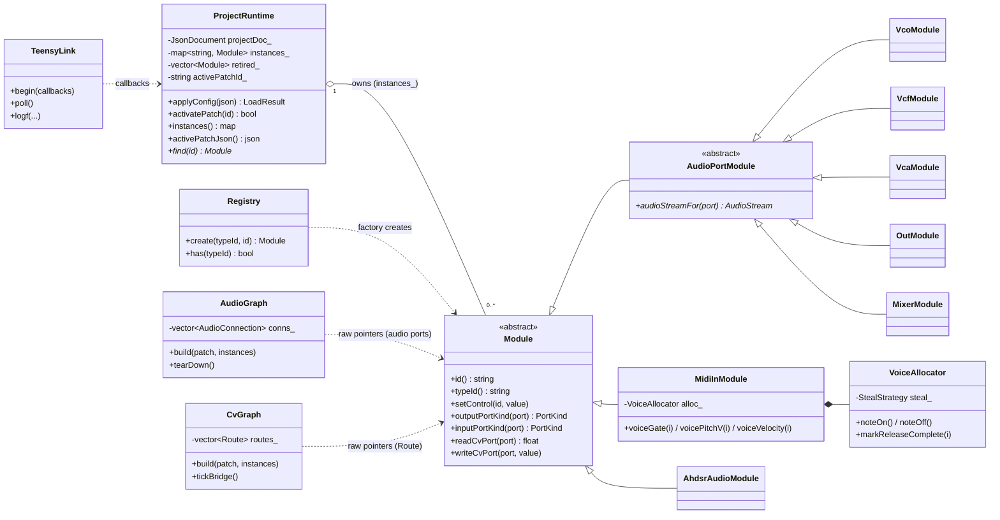
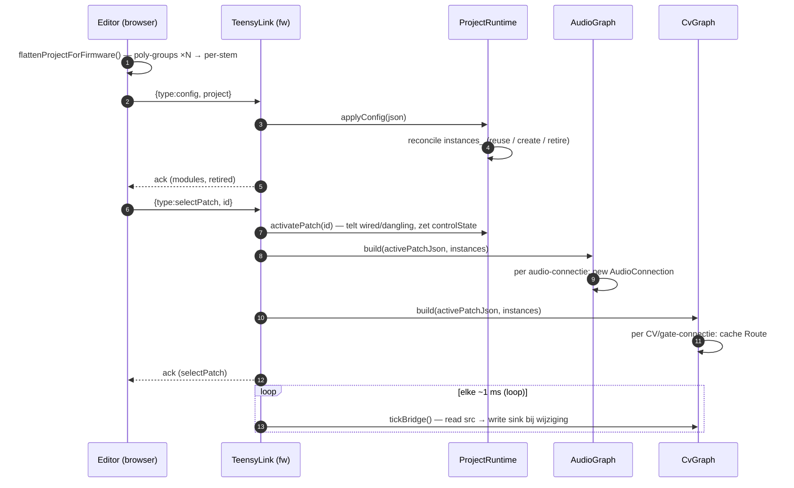

# Modular-brain runtime — architectuuroverzicht

> Geldt voor de **modular-brain** (`firmware/app-modular-brain/` + `editor/src/modular-mb/`),
> niet voor het oudere effect-switcher/core-domein in `01-core-classes.md`.
> Bijgewerkt: mei 2026 (fw 0.5.3).

Een gekozen **patch** bepaalt drie dingen:
1. het **aantal stemmen** (`voiceCount`),
2. **welke modules** klaargezet worden,
3. **welke connecties** gelegd worden — twee domeinen: **audio** en **CV/gate**.

---

## 1. Firmware-runtime — wie houdt wat vast bij het uitvoeren van een patch

Er is geen `Patch`-klasse op de Teensy. De "draaiende patch" leeft verspreid over
drie houders. `ProjectRuntime` is de centrale eigenaar van de module-objecten;
`AudioGraph` en `CvGraph` materialiseren de connecties.



**Belangrijk — AudioStream-levensduur.** `AudioGraph`/`CvGraph` houden *rauwe*
pointers naar de modules in `ProjectRuntime`. Teensy's `AudioStream` schrijft
zichzelf in een globale update-lijst zonder zich in de destructor uit te
schrijven, dus een module mag **nooit** vernietigd worden terwijl de engine
draait. Daarom **reconciliëert** `applyConfig()` (hergebruik + retire) i.p.v.
clear+recreate. Zie DEVLOG 2026-05-30 (fw 0.5.3).

---

## 2. Editor-config — het datamodel (racks + alle patches)

Aan de editor-kant is alles **platte TypeScript-interfaces** (pure data, geen
gedrag). `ModularProject` is de wortel; het wordt geserialiseerd naar JSON,
geëxpandeerd door `flattenProjectForFirmware()` (poly-groups → per-stem) en als
config naar de Teensy gestuurd.

```mermaid
classDiagram
    direction LR

    class ModularProject {
        version
        name
        activePatchId
    }
    class ModuleType {
        id
        categoryId
        ports: Port[]
        controls: Control[]
        role
    }
    class ModuleInstance {
        id
        typeId
        internal
        visual
    }
    class Rack {
        id
        name
        slots: RackSlot[]
        polyGroups: PolyGroup[]
    }
    class Patch {
        id
        name
        voiceCount
        rackIds
        connections: PatchConnection[]
        controlState
    }
    class PatchConnection {
        from {moduleId, portId}
        to   {moduleId, portId}
        attenuation?
    }
    class PolyGroup {
        id
        label
        voiceCount
        members: PolyGroupMember[]
    }
    class Port {
        id
        direction
        signal
        eventKind?
    }

    ModularProject "1" o-- "*" ModuleType
    ModularProject "1" o-- "*" ModuleInstance
    ModularProject "1" o-- "*" Rack
    ModularProject "1" o-- "*" Patch
    ModuleType "1" o-- "*" Port
    ModuleInstance ..> ModuleType : typeId
    Rack "1" o-- "*" PolyGroup
    Patch "1" o-- "*" PatchConnection
    PatchConnection ..> ModuleInstance : moduleId
    PolyGroup ..> ModuleInstance : members
```

---

## 3. Levensloop — van push tot klinkende patch



---

## Openstaand: voiceCount volgt de patch nog niet

`main.cpp` initialiseert `MidiInModule` hard met `kVoices = 4`. De patch stuurt
wél `voiceCount: 2` mee in `controlState`, maar dat zet alleen de waarde op de
module — de allocator-staat in de firmware blijft 4 stemmen uitdelen. Gevolg:
noten worden over 4 stemmen verdeeld terwijl maar 2 stemmen audio-bedraad zijn.
Fix: `voiceCount` uit de actieve patch lezen en op de allocator zetten bij
`selectPatch`.
