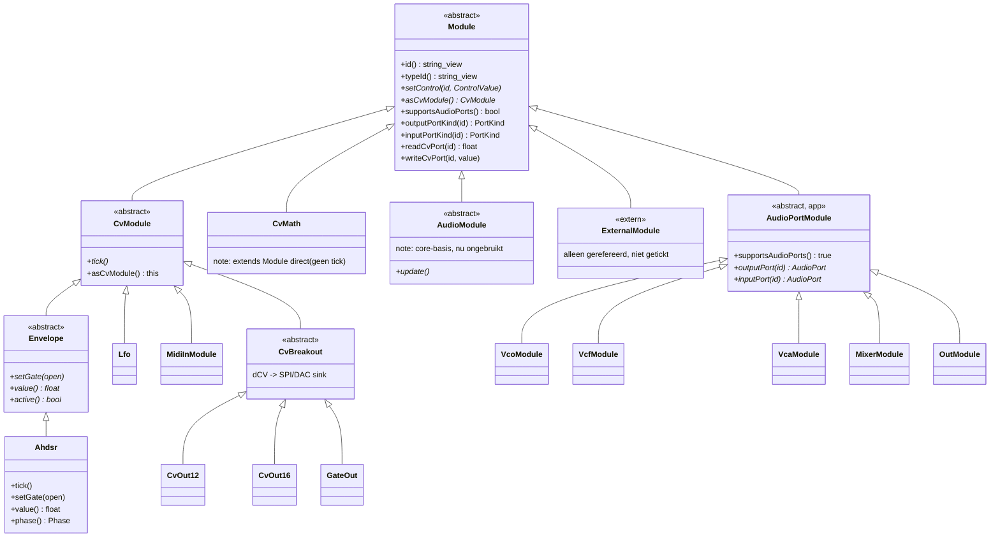
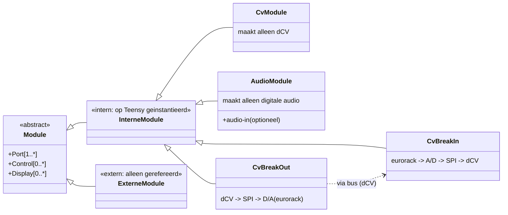
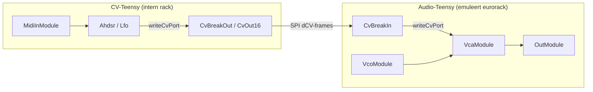

# 08 — Core runtime module-hiërarchie

Generated: May 2026 (na de AhdsrAudioModule-opschoning, fw 0.5.4).

Dit document beschrijft de klasse-hiërarchie in `firmware/core/include/mb/runtime/`
(+ `firmware/core/src/runtime/`) en de audio-wrappers in
`firmware/app-modular-brain/src/`. Het toont de relatie tussen `Module`,
`CvModule`, `Envelope` en `Ahdsr`, en legt vast waarom `AhdsrAudioModule` is
verwijderd.

---

## 1. Geïmplementeerde C++ hiërarchie (zoals in de code)

Eén abstracte basis (`Module`) met twee domein-takken: **CV** (1 kHz `tick()`)
en **audio** (44.1 kHz `update()` / Teensy `AudioConnection`). Een module hoort
bij precies één domein.

### Hoe de twee domeinen worden gescheiden

| Domein | Basis | Tick/Update | Routing | Bridge-methoden |
|--------|-------|-------------|---------|-----------------|
| CV (dCV) | `CvModule` | `tick()` @ 1 kHz | `CvGraph` | `readCvPort()` / `writeCvPort()` |
| Audio | `AudioPortModule` | `update()` @ 44.1 kHz (Teensy ISR) | `AudioGraph` | `outputPort()` / `inputPort()` |

* Een **interne** module wordt op de Teensy geïnstantieerd (factory in `Registry`).
* Een **externe** module (`ExternalModule`) wordt alleen gerefereerd voor de
  patch-weergave; de Teensy hoeft hem niet uit te voeren.
* Beide domeinen worden **gestuurd via dCV** (`writeCvPort`), maar produceren elk
  maar één soort signaal.

---

## 2. Waarom `AhdsrAudioModule` is verwijderd

`AhdsrAudioModule` was een dunne wrapper (`AudioPortModule`) die door compositie
een `mb::runtime::Ahdsr env_` bezat en *alle* logica daaraan delegeerde
(`setControl`, `setGate`, `tick`, `value`, `readCvPort`, `writeCvPort`,
`outputPortKind`, `inputPortKind`). Sinds de audio-DC-proxy is verwijderd,
gaf `outputPort()` / `inputPort()` **altijd een ongeldige poort terug** — de
module had dus geen enkele audio-poort meer.

Daarmee was de klasse 100% dubbelop: `Ahdsr` is zélf al een volwaardige
`CvModule` met gate-in (`gate`/`trig` → `setGate`) en CV-out (`cv_out`), en wordt
volledig door `CvGraph` gerouteerd. De wrapper voegde niets toe behalve een
registry-factory die de echte `Ahdsr`-factory overschreef.

**Opschoning (fw 0.5.4):**

* `Ahdsr` wordt nu direct geregistreerd in `registerAllRuntimeModules()`.
* `AhdsrAudioModule.h` is verwijderd.
* De CV-tick-dispatch in `main.cpp` is van een `typeId`-switch
  (`if (tid == AhdsrAudioModule::kTypeId) …`) vervangen door een polymorfe
  aanroep: `for (mod) if (auto* cv = mod->asCvModule()) cv->tick();`.
  Nieuwe `CvModule`-types tikken nu automatisch mee, zonder de loop aan te raken.

`Module::asCvModule()` is toegevoegd als RTTI-vrije, getypeerde view (zelfde
idioom als `supportsAudioPorts()`); `CvModule` overschrijft hem naar `this`.

---

## 3. Conceptueel doelmodel (whiteboard) en de dCV-bus

Dit is het model uit de hand-tekening: een **intern rack** met interne modules
(op de Teensy) en een **extern rack** met externe modules (eurorack-hardware),
verbonden via de **dCV-bus** met break-in / break-out.

### Enums (uit de tekening)

* **dCV-type**: `gate`, `trigger`, `12-bit CV`, `16-bit CV`
* **CV-range**: `0..5V`, `0..10V`, `0..12V`, `-12..12V`, `other`

In de code zijn deze nu impliciet: `PortKind { None, Audio, Cv, Gate }` dekt het
domein; de bit-breedte/CV-range leeft in `CvOut12` / `CvOut16` (frame-formaat).
Bij het uitbouwen van de echte hardware-bus worden dit expliciete enum-velden op
de poort-definitie.

---

## 4. Gemengde modules (audio **én** cv)?

De ontwerpregel "één module = één domein" wordt bewust aangehouden. Een interne
module die zowel audio als CV *produceert* is niet nodig en is zelfs onwenselijk,
omdat het de CV-/audio-Teensy-split (zie §5) zou breken.

De enige plekken waar de domeinen elkaar raken zijn **converters**, en die
modelleren we als een eigen, expliciete categorie — niet als een "gemengde"
module:

* **MIDI-to-CV** / **CV-to-MIDI** (al aanwezig als `MidiInModule`).
* **Envelope follower** of **pitch/gate-detector**: audio-in → CV-out. Dit is
  geen generator maar een *converter* die in het CV-domein hoort, met een
  audio-analyse-ingang.
* **break-in / break-out**: de dCV ↔ eurorack-grens.

Conclusie: houd generatoren strikt single-domain; vang elke domeinovergang in een
expliciete converter/bridge. Dat houdt het model simpel én splitsbaar.

---

## 5. Voorbereid op de CV-/audio-Teensy split (SPI dCV-bus)

De strikte scheiding maakt een latere split over twee Teensy's mogelijk zonder de
modules te herschrijven. De naad is `CvGraph` + `writeCvPort()`:

* Vandaag draaien CV én audio op één Teensy; `CvGraph` levert envelope-waarden
  rechtstreeks aan `VcaModule.cv` via `writeCvPort`.
* Bij een split stuurt de CV-Teensy diezelfde waarden naar `CvOut12/16`
  (SPI out, dCV-frames). De audio-Teensy ontvangt ze via een `CvBreakIn` en
  schrijft ze met `writeCvPort` naar zijn `AudioPortModule`s.
* De breakouts zijn de dCV-ontvangers + D/A aan de eurorack-kant; voorlopig
  geëmuleerd door de audio-Teensy.

Omdat de routing al volledig via `readCvPort` / `writeCvPort` loopt en niet via
directe pointers tussen CV- en audio-objecten, verandert er voor de modules zelf
niets — alleen het transport (in-proces vs. SPI) wisselt.
