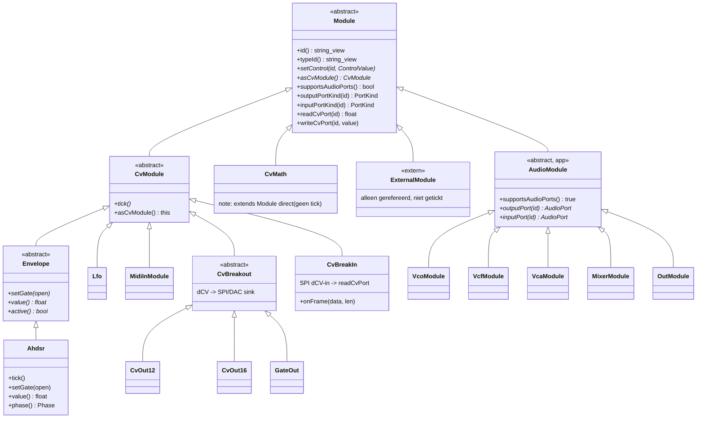
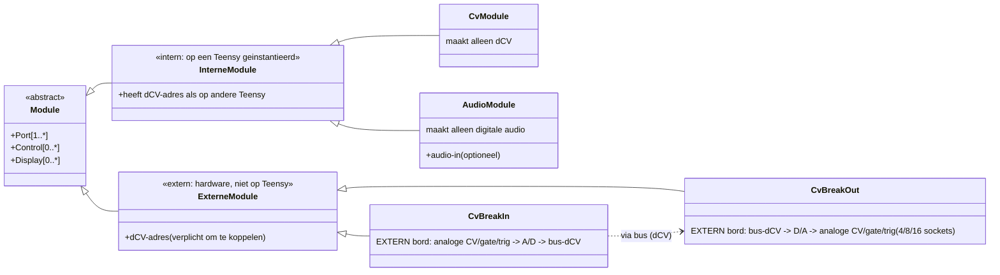
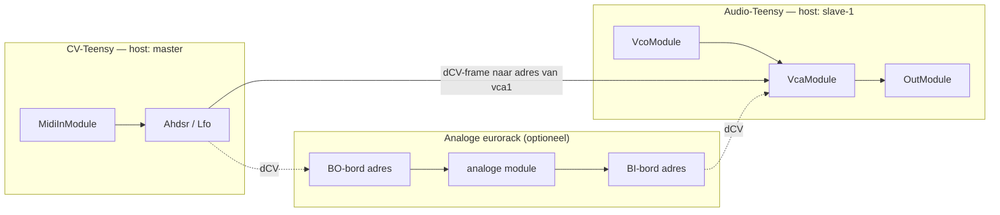

# 08 — Core runtime module-hiërarchie

Generated: May 2026 (na de AudioModule-opschoning, fw 0.5.5).

Dit document beschrijft de klasse-hiërarchie in `firmware/core/include/mb/runtime/`
(+ `firmware/core/src/runtime/`) en de audio-wrappers in
`firmware/app-modular-brain/src/`. Het toont de relatie tussen `Module`,
`CvModule`, `Envelope` en `Ahdsr`, en legt vast waarom `AhdsrAudioModule` is
verwijderd.

---

## 1. Geïmplementeerde C++ hiërarchie (zoals in de code)

Eén abstracte basis (`Module`) met twee domein-takken: **CV** (1 kHz `tick()`)
en **audio** (44.1 kHz `update()` / Teensy `AudioConnection`). Een module hoort
bij precies één domein.



### Hoe de twee domeinen worden gescheiden

| Domein | Basis | Tick/Update | Routing | Bridge-methoden |
|--------|-------|-------------|---------|-----------------|
| CV (dCV) | `CvModule` | `tick()` @ 1 kHz | `CvGraph` | `readCvPort()` / `writeCvPort()` |
| Audio | `AudioPortModule` | `update()` @ 44.1 kHz (Teensy ISR) | `AudioGraph` | `outputPort()` / `inputPort()` |

* Een **interne** module wordt op de Teensy geïnstantieerd (factory in `Registry`).
* Een **externe** module (`ExternalModule`) wordt alleen gerefereerd voor de
  patch-weergave; de Teensy hoeft hem niet uit te voeren.
* Beide domeinen worden **gestuurd via dCV** (`writeCvPort`), maar produceren elk
  maar één soort signaal.

> **Opgeruimd (fw 0.5.5).** De ongebruikte core-klasse `mb::runtime::AudioModule`
> (een `update()`-per-blok-basis waar nooit iets van overerfde) is verwijderd —
> net als eerder `AhdsrAudioModule`. Alle echte audio loopt via de app-klasse
> `AudioPortModule` + Teensy `AudioConnection`, niet via `update()`. Er is dus nog
> maar één audio-basis. Een latere hernoeming `AudioPortModule` → `AudioModule`
> kan, zodra er geen naam-clash meer is; voorlopig blijft de naam `AudioPortModule`.

---

## 2. Waarom `AhdsrAudioModule` is verwijderd

`AhdsrAudioModule` was een dunne wrapper (`AudioPortModule`) die door compositie
een `mb::runtime::Ahdsr env_` bezat en *alle* logica daaraan delegeerde
(`setControl`, `setGate`, `tick`, `value`, `readCvPort`, `writeCvPort`,
`outputPortKind`, `inputPortKind`). Sinds de audio-DC-proxy is verwijderd,
gaf `outputPort()` / `inputPort()` **altijd een ongeldige poort terug** — de
module had dus geen enkele audio-poort meer.

Daarmee was de klasse 100% dubbelop: `Ahdsr` is zélf al een volwaardige
`CvModule` met gate-in (`gate`/`trig` → `setGate`) en CV-out (`cv_out`), en wordt
volledig door `CvGraph` gerouteerd. De wrapper voegde niets toe behalve een
registry-factory die de echte `Ahdsr`-factory overschreef.

**Opschoning (fw 0.5.4):**

* `Ahdsr` wordt nu direct geregistreerd in `registerAllRuntimeModules()`.
* `AhdsrAudioModule.h` is verwijderd.
* De CV-tick-dispatch in `main.cpp` is van een `typeId`-switch
  (`if (tid == AhdsrAudioModule::kTypeId) …`) vervangen door een polymorfe
  aanroep: `for (mod) if (auto* cv = mod->asCvModule()) cv->tick();`.
  Nieuwe `CvModule`-types tikken nu automatisch mee, zonder de loop aan te raken.

`Module::asCvModule()` is toegevoegd als RTTI-vrije, getypeerde view (zelfde
idioom als `supportsAudioPorts()`); `CvModule` overschrijft hem naar `this`.

---

## 3. Conceptueel doelmodel (whiteboard) en de dCV-bus

Dit is het model uit de hand-tekening: een **intern rack** met interne modules
(op de Teensy) en een **extern rack** met externe modules (eurorack-hardware),
verbonden via de **dCV-bus** met break-in / break-out.



### Enums (uit de tekening)

* **dCV-type**: `gate`, `trigger`, `12-bit CV`, `16-bit CV`
* **CV-range**: `0..5V`, `0..10V`, `0..12V`, `-12..12V`, `other`

In de code zijn deze nu impliciet: `PortKind { None, Audio, Cv, Gate }` dekt het
domein; de bit-breedte/CV-range leeft in `CvOut12` / `CvOut16` (frame-formaat).
Bij het uitbouwen van de echte hardware-bus worden dit expliciete enum-velden op
de poort-definitie.

### Adres-model — wat heeft een dCV-adres? (gecorrigeerd)

> **Correctie t.o.v. een eerdere formulering.** BO- en BI-borden zitten **nooit
> ín een Teensy**. Het zijn **externe** hardware-modules — maar wél mét een
> dCV-busadres. Eerder stonden ze als interne modules getekend; dat klopt niet.

Het sleutelbegrip is het **dCV-adres**: een plek op de bus waar je waarden
naartoe kunt sturen of vandaan kunt lezen. Wie heeft er een nodig?

| Ding | dCV-adres? | Toelichting |
|------|-----------|-------------|
| Interne module op **dezelfde** Teensy als zijn bron | nee | in-proces `writeCvPort`, geen bus |
| Interne module op een **andere** Teensy | **ja** | bron-Teensy stuurt naar dat adres over SPI |
| **BO-bord** (bus-dCV → analoge out) | **ja** | extern; ontvangt op zijn adres en zet D/A om |
| **BI-bord** (analoge in → bus-dCV) | **ja** | extern; samplet en publiceert op zijn adres |
| Dedicated hardware-module met eigen dCV-connector | **ja** | extern; praat rechtstreeks op de bus |
| Puur-analoge module (bijv. MI Elements) | nee | **niet koppelbaar** in een patch tenzij er een BO/BI tussen zit |

* BO/BI zijn er dus **alleen voor het koppelen van bestaande analoge modules** die
  zelf geen bus-adres hebben. Tussen twee Teensy's is **geen** BO/BI nodig: elke
  interne module die door een andere Teensy bereikt moet worden, krijgt gewoon
  een eigen dCV-adres.
* Een dedicated dCV-module (en een dCV-controller met een bus-"uitgang") heeft van
  huis uit een adres en hoeft niet via jacksockets/kabels — alleen het
  plug-formaat van de bus-connector staat nog open.
* Omdat SPI vrijwel zeker **daisy-chained** is, heeft elke busdeelnemer feitelijk
  een in- én een uitgang (zie §6). Eén bord kan daardoor tegelijk BO én BI zijn.

#### `host`-veld op een patch-module

Om te weten of een patch op één Teensy draait of over meerdere verdeeld wordt,
volstaat één extra veld per module in de patch: **`host`**.

```jsonc
{ "id": "vca1", "type": "tp_mmb_vca", "host": "slave-1" }   // draait op slave-1
{ "id": "eg1",  "type": "tp_mmb_ahdsr" }                     // host afwezig = master
```

* `host` **afwezig** → de module draait op **deze** Teensy (de master). Geen SPI nodig.
* `host` = naam/id van een **andere** Teensy → die module draait op die slave; het
  module-adres op de bus is dan `host + module-id` (Teensy-naam + instance-id).
* `MidiInModule` kan **alleen op de master** draaien (USB-MIDI komt daar binnen).
* **Elke** Teensy mag een `OutModule` hebben (eigen audio-uitgang).
* De master **zoekt de slave(s) op** zodra ze in een patch voorkomen — als bron
  (lezen) en/of als bestemming (schrijven). Een verbinding tussen modules met
  verschillende `host` wordt automatisch een dCV-bus-route i.p.v. een in-proces
  `writeCvPort`; de routing-laag (`CvGraph`) kiest het transport op basis van de
  `host`-velden van bron en bestemming.

Dit `host`-veld is voldoende om de hele distributie data-gestuurd te maken: de
editor zet per module een host, en firmware + `CvGraph` leiden daaruit af welk
transport (in-proces of SPI-adres) elke verbinding krijgt.

---

## 4. Gemengde modules (audio **én** cv)?

De ontwerpregel "één module = één domein" wordt bewust aangehouden. Een interne
module die zowel audio als CV *produceert* is niet nodig en is zelfs onwenselijk,
omdat het de CV-/audio-Teensy-split (zie §5) zou breken.

De enige plekken waar de domeinen elkaar raken zijn **converters**, en die
modelleren we als een eigen, expliciete categorie — niet als een "gemengde"
module:

* **MIDI-to-CV** / **CV-to-MIDI** (al aanwezig als `MidiInModule`).
* **Envelope follower** of **pitch/gate-detector**: audio-in → CV-out. Dit is
  geen generator maar een *converter* die in het CV-domein hoort, met een
  audio-analyse-ingang.
* **break-in / break-out**: de dCV ↔ eurorack-grens.

Conclusie: houd generatoren strikt single-domain; vang elke domeinovergang in een
expliciete converter/bridge. Dat houdt het model simpel én splitsbaar.

---

## 5. Voorbereid op de CV-/audio-Teensy split (SPI dCV-bus)

De strikte scheiding maakt een latere split over twee (of meer) Teensy's mogelijk
zonder de modules te herschrijven. De naad is `CvGraph` + `writeCvPort()`.

> **Correctie t.o.v. de vorige versie van dit diagram.** BO/BI-borden zitten
> **niet** in een Teensy. Tussen twee Teensy's is er **geen** BO/BI nodig: een
> interne module op de audio-Teensy heeft gewoon zijn **eigen dCV-adres**, en de
> CV-Teensy schrijft daar rechtstreeks naartoe over SPI. BO/BI komen pas in beeld
> bij het koppelen van **analoge** eurorack-modules (zie §3).



* **Eén Teensy (nu):** `CvGraph` levert envelope-waarden rechtstreeks aan
  `VcaModule.cv` via in-proces `writeCvPort`. Geen SPI.
* **Twee Teensy's:** `vca1` draait met `host: "slave-1"`. Omdat bron (`eg1` op de
  master) en bestemming (`vca1` op de slave) een verschillende `host` hebben,
  wordt de verbinding een **dCV-bus-route**: de master encodeert de waarde in een
  `SpiFrame` en stuurt hem naar het **adres van `vca1`** (= `host + module-id`).
  De slave decodeert (`onFrame`) en doet `writeCvPort` naar zijn lokale `VcaModule`.
* **Analoge interfacing:** alleen hier verschijnen BO/BI. De CV-Teensy stuurt naar
  het adres van een **BO-bord** (dat D/A naar analoge CV doet); een **BI-bord**
  samplet analoge signalen en publiceert ze op zijn adres, waar de audio-Teensy ze
  weer kan lezen. BO/BI zijn externe modules mét adres — geen onderdeel van een
  Teensy.

De C++-klassen `CvBreakout` (encode/TX) en `CvBreakIn` (decode/RX) zijn de
**transport-eindpunten** van de bus. Ze worden zowel hergebruikt voor de
master↔slave-Teensy-koppeling als voor het praten met externe BO/BI-borden — de
klasse is het transport, het *bord* is het externe hardware-begrip.

Omdat de routing al volledig via `readCvPort` / `writeCvPort` loopt en niet via
directe pointers tussen CV- en audio-objecten, verandert er voor de modules zelf
niets — alleen het transport (in-proces vs. SPI) wisselt.

### Status (fw 0.5.5)

| Onderdeel | Status |
|-----------|--------|
| `SpiFrame` encode/decode + CRC (`mb::proto`) | ✅ gebouwd, host-getest |
| `CvBreakout` → `BreakoutSink` (encode/TX-kant) | ✅ gebouwd, host-getest |
| `CvBreakIn::onFrame()` (decode/RX-kant) | ✅ gebouwd, host-getest (fw 0.5.5) |
| Poly: `voiceCount` volgt patch | ✅ `onSelectPatch` → runtime `MidiInModule` |
| Teensy SPI-master `SpiBreakoutSink` (echte TX) | ⬜ hardware-gebonden |
| Teensy SPI-slave RX die `onFrame()` voedt | ⬜ hardware-gebonden |
| Config-schakelaar: CV → bus i.p.v. lokale audio | ⬜ volgende stap |

`CvBreakIn` is bewust transport-agnostisch: de host-test voedt frames via
`onFrame()` (round-trip met `CvOut12`), zodat de decode-laag volledig zonder
hardware te valideren is. Alleen de DMA-driver en het bus-bedradingsschema
blijven hardware-werk.

---

## 6. SPI-hardware: bedrading tussen Teensy 1, 2, 3, …

> Zie ook `doc/tech/spi.md` en `doc/tech/two-teensy-spi.md`. Dit is de
> architectuurkant; de elektrische details horen in die tech-briefs.

### Klopt het idee van daisy-chaining?

Deels — let op het onderscheid:

* **Klassieke SPI is geen ring.** Het is een **ster** rond één master: gedeelde
  `SCK`, `MOSI`, `MISO`, plus **één `CS` (chip-select) per slave**. De master
  kiest met `CS` wie er praat. Wil je N Teensy-slaves zo aansturen, dan heb je N
  CS-lijnen vanaf de master nodig. `MISO` is dan "wired-OR": alleen de
  geselecteerde slave mag de lijn drijven, de rest gaat hoog-impedant.
* **Echte "daisy-chain" SPI** bestaat ook: dan gaat `MOSI → device → device →
  MISO` als één lange schuifregister-ketting met **één gedeelde `CS`**. Dat werkt
  prima voor simpele DAC-/shift-register-borden, maar minder voor "slimme"
  Teensy-knopen die zelf willen kiezen wanneer ze data sturen.

Voor MusicBrain met **meerdere slimme Teensy-knopen** is een **ster met
per-knoop `CS`** het meest praktisch. "Daisy-chain" reserveren we dan voor de
dom-DAC BO-borden binnen één case-segment.

### Eén buslijn (cirkel) of twee?

SPI is **full-duplex met aparte data-richtingen**: `MOSI` (master→slave) en
`MISO` (slave→master) zijn al **twee fysieke draden**. Het is dus geen cirkel die
je in één lijn samenvat — heen en terug lopen over verschillende geleiders, met
een gedeelde klok `SCK` en gedeelde massa. Conclusie: je hebt **niet de keuze**
tussen 1 of 2 — SPI is inherent ≥ 2 datalijnen (MOSI + MISO) + SCK + per-slave CS.

Wat je wél kunt kiezen voor de **dCV-bus als geheel**:

| Optie | Vorm | Voor | Tegen |
|-------|------|------|-------|
| A. SPI-ster, master = CV-Teensy | MOSI/MISO/SCK gedeeld, CS per knoop | simpel, full-duplex, request/report (`CvInReport`) werkt | aantal slaves beperkt door CS-pinnen; bereik kort (binnen één case) |
| B. SPI alleen binnen een case, **CAN-FD tussen cases** | SPI lokaal, CAN als ruggengraat | schaalt over kabels/cases, robuuster bij lengte | extra brug-laag (zie `doc/tech/can-fd.md`) |

Aanbevolen richting: **SPI binnen een case** (Teensy ↔ BO/BI-borden en Teensy ↔
Teensy op korte afstand), en **CAN-FD als inter-case-ruggengraat** zodra je over
meerdere cases/kabels gaat. De dCV-frame (`SpiFrame`) blijft hetzelfde; alleen het
onderliggende transport wisselt — dezelfde abstractie als bij `CvBreakIn`.

### Kunnen we een SPI-monitor maken om te debuggen?

Ja, en dat is goed te doen op meerdere niveaus:

1. **Software-tap (nu al mogelijk, geen extra hardware).** Omdat alle frames door
   `mb::proto::encode` / `decode` gaan, kun je een `BreakoutSink`-decorator maken
   die elk frame logt (`opcode`, `channel = caseId<<8|slot`, waarde, CRC-OK) naar
   de bestaande `TeensyLink.logf`. Idem aan de RX-kant: log in `CvBreakIn::onFrame`
   vóór het decoderen. Dit is de snelste debugger en werkt volledig host-getest.
2. **Derde Teensy als passieve bus-sniffer.** Een extra Teensy als **SPI-slave**
   op dezelfde MOSI/SCK (zonder zelf MISO te drijven) kan elk frame meelezen en
   over USB-serial naar de pc dumpen — een "dCV-logic-analyzer" in software. Dit is
   een natuurlijke uitbreiding van `CvBreakIn`: dezelfde `onFrame()`, maar dan
   alleen loggen i.p.v. `writeCvPort`.
3. **Logic-analyzer / oscilloscoop.** Voor het echte hardware-niveau (timing,
   CS-randen, klok) een goedkope USB-logic-analyzer met SPI-decoder (bijv.
   sigrok/PulseView). Onmisbaar bij het eerste tot-leven-wekken van de bus.

Het software-pad (1) + een sniffer-Teensy (2) dekken vrijwel alle protocol-bugs;
de logic-analyzer (3) gebruik je alleen voor de elektrische/timing-laag.
