# 09 — Modular-brain audio modules (`AudioModule`-hiërarchie)

**Generated:** June 2026 (fw 0.6.x, alle geregistreerde audio-modules).

Dit document geeft een volledig overzicht van alle `AudioModule`-subklassen in
`firmware/app-modular-brain/src/` en `firmware/app-elements/src/`. Het toont de
overervingsboom, per module de audio-port-mapping en de relatie met het
CV-domein.

---

## 1. Hiërarchie

Alle audio-modules erven via `AudioModule` van `mb::runtime::Module`.
CV-only modules (`Ahdsr`, `Lfo`, `MidiInModule`, `CvMath`, `CvBreakout`, …)
staan in `08-core-runtime-hierarchy.md` en vallen buiten dit document.

```mermaid
classDiagram
    direction TB

    class Module {
        <<abstract, core>>
        +id() string_view
        +typeId() string_view
        +setControl(id, ControlValue)*
        +supportsAudioPorts() bool
        +outputPortKind(id) PortKind
        +inputPortKind(id) PortKind
        +readCvPort(id) float
        +writeCvPort(id, value)
        +setWaveformData(data)*
    }

    class AudioModule {
        <<abstract, app>>
        +supportsAudioPorts() true
        +from(Module*) AudioModule*
        +outputPort(id) AudioPort*
        +inputPort(id) AudioPort*
    }

    class AudioPort {
        <<struct>>
        +stream AudioStream*
        +channel uint8_t
        +valid bool
        +operator bool()
    }

    %% ── Oscillatoren ──────────────────────────────────────
    class VcoModule {
        <<tp_mmb_vco>>
        +out : AudioSynthWaveform ch0
    }
    class FmVcoModule {
        <<tp_mmb_fm_vco>>
        +out : AudioSynthWaveformModulated ch0
        +fm  : AudioSynthWaveformModulated ch0
    }
    class WtVcoModule {
        <<tp_mmb_wt_vco>>
        +out : AudioSynthWaveform ch0
    }
    class DrawVcoModule {
        <<tp_mmb_draw_vco>>
        +out : AudioSynthWaveform ch0
    }
    class OctaVcoModule {
        <<tp_mmb_octa_vco>>
        +out_1..out_8 : AudioSynthWaveform [8] ch0
    }
    class StringModule {
        <<tp_mmb_string>>
        +out : AudioAmplifier ch0
    }

    %% ── Filters ───────────────────────────────────────────
    class VcfModule {
        <<tp_mmb_vcf>>
        +in  : AudioFilterStateVariable ch0
        +out : AudioFilterStateVariable ch0/1/2
    }

    %% ── VCA's ─────────────────────────────────────────────
    class VcaModule {
        <<tp_mmb_vca>>
        +in  : AudioEffectMultiply ch0
        +out : AudioEffectMultiply ch0
    }
    class StereoVcaModule {
        <<tp_mmb_stereo_vca>>
        +in  : AudioAmplifier ch0
        +l   : AudioAmplifier ch0
        +r   : AudioAmplifier ch0
    }

    %% ── Effecten ──────────────────────────────────────────
    class EchoModule {
        <<tp_mmb_echo>>
        +in  : AudioAmplifier ch0
        +out : AudioMixer4 ch0
    }
    class CombModule {
        <<tp_mmb_comb>>
        +in  : AudioAmplifier ch0
        +out : AudioMixer4 ch0
    }
    class PhaserModule {
        <<tp_mmb_phaser>>
        +in  : AudioEffectPhaser ch0
        +out : AudioEffectPhaser ch0
    }
    class CompDriveModule {
        <<tp_mmb_comp>>
        +in  : AudioEffectCompDrive ch0
        +out : AudioEffectCompDrive ch0
    }

    %% ── Mixers ────────────────────────────────────────────
    class MixerModule {
        <<tp_mmb_mixer>>
        +in1..in4 : AudioAmplifier [4] ch0
        +out_l    : AudioMixer4 ch0
        +out_r    : AudioMixer4 ch0
    }
    class Mixer8Module {
        <<tp_mmb_mixer8>>
        +in1..in8 : AudioAmplifier [8] ch0
        +out_l    : AudioMixer4 ch0
        +out_r    : AudioMixer4 ch0
    }
    class Mixer16Module {
        <<tp_mmb_mixer16>>
        +in1..in16 : AudioAmplifier [16] ch0
        +out_l     : AudioMixer4 ch0
        +out_r     : AudioMixer4 ch0
    }

    %% ── Output ────────────────────────────────────────────
    class OutModule {
        <<tp_mmb_out>>
        +l  : AudioOutputUSB ch0
        +r  : AudioOutputUSB ch1
    }

    %% ── Elements (app-elements) ───────────────────────────
    class ElementsModule {
        <<tp_mmb_elements>>
        +out       : ElementsVoice ch0
        +blow_in   : ElementsVoice ch0
        +strike_in : ElementsVoice ch1
    }

    %% ── Relaties ──────────────────────────────────────────
    Module <|-- AudioModule : core → app

    AudioModule <|-- VcoModule
    AudioModule <|-- FmVcoModule
    AudioModule <|-- WtVcoModule
    AudioModule <|-- DrawVcoModule
    AudioModule <|-- OctaVcoModule
    AudioModule <|-- StringModule
    AudioModule <|-- VcfModule
    AudioModule <|-- VcaModule
    AudioModule <|-- StereoVcaModule
    AudioModule <|-- EchoModule
    AudioModule <|-- CombModule
    AudioModule <|-- PhaserModule
    AudioModule <|-- CompDriveModule
    AudioModule <|-- MixerModule
    AudioModule <|-- Mixer8Module
    AudioModule <|-- Mixer16Module
    AudioModule <|-- OutModule
    AudioModule <|-- ElementsModule

    AudioModule ..> AudioPort : retourneert
```

---

## 2. Volledige lijst van `AudioModule`-subklassen

| # | Klasse | `typeId` | Bestand | Categorie |
|---|--------|----------|---------|-----------|
| 1 | `VcoModule` | `tp_mmb_vco` | `VcoModule.h` | 🎵 Oscillator (basis) |
| 2 | `FmVcoModule` | `tp_mmb_fm_vco` | `FmVcoModule.h` | 🎵 FM-oscillator |
| 3 | `WtVcoModule` | `tp_mmb_wt_vco` | `WtVcoModule.h` | 🎵 Wavetable-oscillator |
| 4 | `DrawVcoModule` | `tp_mmb_draw_vco` | `DrawVcoModule.h` | 🎵 Draw-waveshape-oscillator |
| 5 | `OctaVcoModule` | `tp_mmb_octa_vco` | `OctaVcoModule.h` | 🎵 8-voice oscillator-bank |
| 6 | `StringModule` | `tp_mmb_string` | `StringModule.h` | 🎵 Karplus-Strong string |
| 7 | `VcfModule` | `tp_mmb_vcf` | `VcfModule.h` | 🔧 State-variable filter |
| 8 | `VcaModule` | `tp_mmb_vca` | `VcaModule.h` | ⚡ Mono VCA (multiply) |
| 9 | `StereoVcaModule` | `tp_mmb_stereo_vca` | `StereoVcaModule.h` | ⚡ Stereo VCA + panner |
| 10 | `EchoModule` | `tp_mmb_echo` | `EchoModule.h` | 🌊 Feedback delay |
| 11 | `CombModule` | `tp_mmb_comb` | `CombModule.h` | 🌊 Tuned comb-resonator |
| 12 | `PhaserModule` | `tp_mmb_phaser` | `PhaserModule.h` | 🌊 All-pass phaser |
| 13 | `CompDriveModule` | `tp_mmb_comp` | `CompDriveModule.h` | 🌊 Compressor + overdrive |
| 14 | `MixerModule` | `tp_mmb_mixer` | `MixerModule.h` | 🔀 4-kanaals stereo mixer |
| 15 | `Mixer8Module` | `tp_mmb_mixer8` | `Mixer8Module.h` | 🔀 8-kanaals stereo mixer |
| 16 | `Mixer16Module` | `tp_mmb_mixer16` | `Mixer16Module.h` | 🔀 16-kanaals stereo mixer |
| 17 | `OutModule` | `tp_mmb_out` | `OutModule.h` | 🔊 USB audio output |
| 18 | `ElementsModule` | `tp_mmb_elements` | *(app-elements)* `ElementsModule.h` | 🎹 Physical modelling |

---

## 3. Audio-port-mapping per module

### Oscillatoren — genereren audio, hebben (meestal) géén audio-ingang

| Module | Audio outputs | Audio inputs |
|--------|--------------|--------------|
| `VcoModule` | `out` ← `AudioSynthWaveform` ch0 | — |
| `FmVcoModule` | `out` ← `AudioSynthWaveformModulated` ch0 | `fm` → `AudioSynthWaveformModulated` ch0 |
| `WtVcoModule` | `out` ← `AudioSynthWaveform` ch0 | — |
| `DrawVcoModule` | `out` ← `AudioSynthWaveform` ch0 | — |
| `OctaVcoModule` | `out_1` … `out_8` ← 8× `AudioSynthWaveform` ch0 | — |
| `StringModule` | `out` ← `AudioAmplifier` ch0 | — |

### Filter

| Module | Audio outputs | Audio inputs |
|--------|--------------|--------------|
| `VcfModule` | `out` ← `AudioFilterStateVariable` ch0 (LP) / ch1 (BP) / ch2 (HP) o.b.v. `type`-control | `in` → `AudioFilterStateVariable` ch0 |

### VCA's

| Module | Audio outputs | Audio inputs |
|--------|--------------|--------------|
| `VcaModule` | `out` ← `AudioEffectMultiply` ch0 | `in` → `AudioEffectMultiply` ch0 |
| `StereoVcaModule` | `l` ← `AudioAmplifier` ch0, `r` ← `AudioAmplifier` ch0 | `in` → `AudioAmplifier` ch0 |

### Effecten

| Module | Audio outputs | Audio inputs |
|--------|--------------|--------------|
| `EchoModule` | `out` ← `AudioMixer4` ch0 | `in` → `AudioAmplifier` ch0 |
| `CombModule` | `out` ← `AudioMixer4` ch0 | `in` → `AudioAmplifier` ch0 |
| `PhaserModule` | `out` ← `AudioEffectPhaser` ch0 | `in` → `AudioEffectPhaser` ch0 |
| `CompDriveModule` | `out` ← `AudioEffectCompDrive` ch0 | `in` → `AudioEffectCompDrive` ch0 |

### Mixers

| Module | Audio outputs | Audio inputs |
|--------|--------------|--------------|
| `MixerModule` | `out_l` ← `AudioMixer4` ch0, `out_r` ← `AudioMixer4` ch0 | `in1` … `in4` → 4× `AudioAmplifier` ch0 |
| `Mixer8Module` | `out_l` ← `AudioMixer4` ch0, `out_r` ← `AudioMixer4` ch0 | `in1` … `in8` → 8× `AudioAmplifier` ch0 |
| `Mixer16Module` | `out_l` ← `AudioMixer4` ch0, `out_r` ← `AudioMixer4` ch0 | `in1` … `in16` → 16× `AudioAmplifier` ch0 |

### Output

| Module | Audio outputs | Audio inputs |
|--------|--------------|--------------|
| `OutModule` | — | `l` → `AudioOutputUSB` ch0, `r` → ch1 |

### Physical modelling (app-elements)

| Module | Audio outputs | Audio inputs |
|--------|--------------|--------------|
| `ElementsModule` | `out` ← `ElementsVoice` ch0 | `blow_in` → `ElementsVoice` ch0, `strike_in` → ch1 |

---

## 4. Domeinscheiding: audio vs. CV

Elke `AudioModule` kan naast audio-ports ook CV-ports hebben. Die worden **niet**
door `AudioGraph` bedraad, maar door `CvGraph`. Het onderscheid wordt gemaakt via
`inputPortKind()` / `outputPortKind()`.

| Module | CV-ports (`PortKind::Cv`) | Gate-ports (`PortKind::Gate`) |
|--------|--------------------------|------------------------------|
| `VcoModule` | `voct`, `fm`, `sync`, `tune` | — |
| `FmVcoModule` | `voct`, `tune` | — |
| `WtVcoModule` | `voct`, `tune` | — |
| `DrawVcoModule` | `voct`, `tune` | — |
| `OctaVcoModule` | `voct_1`…`voct_8`, `tune` | — |
| `StringModule` | `voct`, `pluck`, `level` | `gate` |
| `VcfModule` | `cv` | — |
| `VcaModule` | `cv` | — |
| `StereoVcaModule` | `vol`, `pan` | — |
| `EchoModule` | `time`, `fbk`, `mix` | — |
| `CombModule` | `freq`, `fbk`, `mix` | — |
| `PhaserModule` | `rate`, `depth` | — |
| `ElementsModule` | `voct`, `strength` | `gate` |

Mixers (`MixerModule`, `Mixer8Module`, `Mixer16Module`), `OutModule` en
`CompDriveModule` hebben uitsluitend audio-ports — geen CV of gate.

---

## 5. Registratie

Alle 17 `app-modular-brain`-modules worden geregistreerd in
`RegisterAllModules.h` via `registerAllRuntimeModules()`, aangeroepen vanuit
`main.cpp::setup()`.

`ElementsModule` (app-elements) is een aparte applicatie met een eigen
`AudioModule.h`-copy en een eigen main-loop — nog niet samengevoegd met
app-modular-brain.

---

## 6. Bijzonderheden per module

| Module | Opmerking |
|--------|-----------|
| `VcoModule` | Eenvoudigste osc: `AudioSynthWaveform` met golfvorm-selectie. Pitch via `updatePitch(volts)`. |
| `FmVcoModule` | Gebruikt `AudioSynthWaveformModulated`; de `fm`-audio-ingang moduleert de carrier-frequentie. Geen through-zero. |
| `WtVcoModule` | Zes additief gegenereerde banks (Saw, Square, Triangle, Organ, Pulse25, Vocal) in 256-sample tabellen. |
| `DrawVcoModule` | Ontvangt getekende waveform via `setWaveformData()`; default triangle totdat een draw binnenkomt. |
| `OctaVcoModule` | 8× `AudioSynthWaveform` met gedeelde controls (`wave`, `coarse`, `fine`, `level`, `detune`). Per-cell V/Oct via `voct_N`. |
| `StringModule` | Karplus-Strong via `AudioSynthKarplusStrong`; heeft een `gate`-port nodig om te plukken. |
| `VcfModule` | Gebruikt interne `AudioSynthWaveformDc cvDc_` als CV-proxy (niet als audio-port geëxposeerd). |
| `VcaModule` | `AudioEffectMultiply`; CV-proxy via interne `cvDc_` (niet geëxposeerd). |
| `StereoVcaModule` | Equal-power panning: `gainL = cos(θ)`, `gainR = sin(θ)` met `θ = (pan+1)·π/4`. |
| `EchoModule` | `AudioEffectDelay` max 500 ms; CV `time`, `fbk`, `mix`. |
| `CombModule` | Korte delay (0.2–50 ms) gestemd via `freq` V/Oct; CV `fbk`, `mix`. |
| `PhaserModule` | Eigen `AudioEffectPhaser` (6 all-pass stages + LFO) — geen stock Teensy-object. |
| `CompDriveModule` | Eigen `AudioEffectCompDrive` (feed-forward compressor + tanh soft-clip) — geen stock Teensy-object. |
| `MixerModule` | 4-in/2-out, per-channel `vol` + `pan` via equal-power law. |
| `Mixer8Module` | 8-in/2-out, twee `AudioMixer4`-banken per bus, gesommeerd door een vijfde mixer. |
| `Mixer16Module` | 16-in/2-out, vier banken per bus. |
| `OutModule` | Deelt één globaal `AudioOutputUSB` via `static sharedOutput`. |
| `ElementsModule` | Port van Mutable Instruments Elements; `blow_in` en `strike_in` als audio-excitatie-ingangen. |
