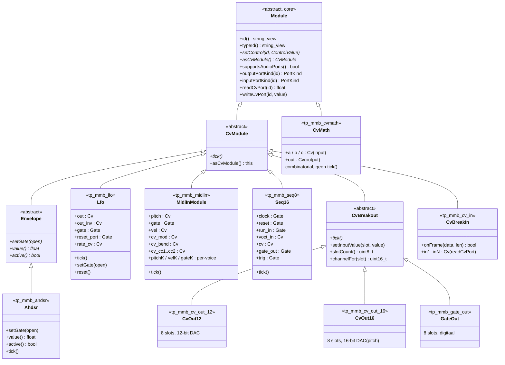

# 10 — Modular-brain CV-modules (`CvModule`-hiërarchie)

**Generated:** June 2026 (fw 0.6.x, alle geregistreerde CV-modules).

Dit document beschrijft alle klassen die overerven van `mb::runtime::CvModule`
— de **control-voltage**-tak van de module-hiërarchie. Waar `AudioModule` gaat
over 44.1 kHz audiostreams (zie `09-modular-brain-audiomodules.md`), produceren
en verwerken CV-modules laagfrequente stuursignalen: envelopes, LFO's,
sequencers, MIDI-naar-CV-conversie en dCV-bus-breakouts. Ze draaien op
**1 kHz** (`kCvTickRateHz`, 1 ms periode) in een timer-ISR.

---

## 1. Hiërarchie



> **Let op:** `CvMath` erft **niet** van `CvModule` maar direct van `Module` —
> hij is stateless/combinatorial en heeft geen `tick()` nodig. Toch wordt hij
> als CV-module beschouwd omdat al zijn ports `PortKind::Cv` zijn.

---

## 2. Volledige lijst

| # | Klasse | `typeId` | Bestand | Categorie |
|---|--------|----------|---------|-----------|
| 1 | `Ahdsr` | `tp_mmb_ahdsr` | `core/.../Ahdsr.h` | 📈 Envelope (AHDSR) |
| 2 | `Lfo` | `tp_mmb_lfo` | `core/.../Lfo.h` | 〰️ LFO |
| 3 | `MidiInModule` | `tp_mmb_midiin` | `core/.../MidiIn.h` | 🎹 MIDI-ingang |
| 4 | `Seq16` | `tp_mmb_seq8` | `core/.../Seq16.h` | 🔢 16-step sequencer |
| 5 | `CvOut12` | `tp_mmb_cv_out_12` | `core/.../CvOut12.h` | 🔌 dCV-breakout (12-bit) |
| 6 | `CvOut16` | `tp_mmb_cv_out_16` | `core/.../CvOut16.h` | 🔌 dCV-breakout (16-bit pitch) |
| 7 | `GateOut` | `tp_mmb_gate_out` | `core/.../GateOut.h` | 🔌 Gate-breakout (digitaal) |
| 8 | `CvBreakIn` | `tp_mmb_cv_in` | `core/.../CvBreakIn.h` | 🔌 dCV-breakin (SPI-ontvanger) |
| 9 | `CvMath` ⚠️ | `tp_mmb_cvmath` | `core/.../CvMath.h` | ➕ CV-math (direct van `Module`) |

⚠️ `CvMath` is geen `CvModule` (geen `tick()`), maar wordt hier meegeteld omdat
zijn ports uitsluitend CV-signalen zijn en hij door `CvGraph` wordt aangestuurd.

---

## 3. Abstracte tussenklassen

| Klasse | Bestand | Rol |
|--------|---------|-----|
| `Envelope` | `core/.../Envelope.h` | Abstracte tussenlaag: voegt `setGate()`, `value()`, `active()` toe. Voorbereid voor meerdere envelope-soorten (`Ahdsr`, toekomstige `MultiphaseEnvelope`, `SampledEnvelope`). |
| `CvBreakout` | `core/.../CvBreakout.h` | Abstracte breakout-basis: beheert `slotCount` input-slots, `setInputValue()`, `channelFor()`, een `BreakoutSink`-interface voor SPI-wegschrijving. Concrete subclasses kiezen het frame-opcode (`CvSet` vs. `GateSet`) en bit-diepte. |

---

## 4. Port-mapping per module

### Signaalgeneratoren

| Module | CV-outputs (`PortKind::Cv`) | Gate-outputs (`PortKind::Gate`) | CV-/Gate-inputs |
|--------|---------------------------|-------------------------------|-----------------|
| `Ahdsr` | `cv_out` (0…1) | — | `gate` (Gate), `trig` (Gate) |
| `Lfo` | `out`, `out_inv` (bipolair) | — | `gate` (Gate), `reset` (Gate), `rate_cv` (Cv) |
| `MidiInModule` | `pitch` (V/Oct), `vel`, `cv_mod`, `cv_bend`, `cv_cc1`, `cv_cc2`; per-voice: `pitchK`, `velK` (K=1…voiceCount) | `gate`; per-voice: `gateK` | — (MIDI-in, geen CV/Gate-ports) |
| `Seq16` | `cv` (V/Oct) | `gate_out`, `trig` | `clock` (Gate), `reset` (Gate), `run_in` (Gate), `voct_in` (Cv transpose) |

### Breakouts — dCV-bus

| Module | CV-outputs | Opmerking |
|--------|-----------|-----------|
| `CvBreakIn` | `in1` … `inN` (Cv, via `readCvPort`) | Ontvangt SPI-frames van de bus en stelt per-slot waarden beschikbaar aan de lokale CV-graaf. |
| `CvOut12` | — (geen) | Neemt inputs via `setInputSlot()`; stuurt `CvSet`-frames de bus op naar een 12-bit DAC-bord. |
| `CvOut16` | — (geen) | Idem, voor 16-bit pitch-DAC. |
| `GateOut` | — (geen) | Stuurt `GateSet`-frames; drempel > 0.5 = hoog. |

### Combinatorial

| Module | CV-inputs | CV-outputs |
|--------|-----------|-----------|
| `CvMath` | `a`, `b`, `c` (Cv, met per-input `gain`-schaling) | `out` = gewogen som of `a × b` (mode-afhankelijk) |

---

## 5. Tick-gedrag

Alle `CvModule`-subklassen worden 1000×/seconde aangeroepen via `tick()`.
De `CvGraph`-bridge iterateert over alle CV-modules in een patch en roept
`tick()` aan, gevolgd door `readCvPort()`/`writeCvPort()`-dispatches.

| Module | tick() doet |
|--------|-------------|
| `Ahdsr` | Phase-automaat (Zero→Attack→Hold→Decay→Sustain→Release); update `value_` op basis van curve (lin/exp/log). |
| `Lfo` | Phase opdrijven; golfvorm berekenen; S&H op cycle-grenzen; gate/run-mode-afhandeling. |
| `MidiInModule` | Portamento per voice (glide richting target-noot). |
| `Seq16` | Interne clock-phase; step-advance; gate/trig-puls-timers. |
| `CvOut12` | Verversen van `CvSet`-frames voor alle `dirty`-slots. |
| `CvOut16` | Idem, met 16-bit kwantisatie. |
| `GateOut` | Verversen van `GateSet`-frames voor gewijzigde slots; onderdrukken van redundante frames. |
| `CvBreakIn` | **No-op** — waarden komen binnen via `onFrame()` (SPI-ISR). |
| `CvMath` | **Geen `tick()`** — combinatorial; `readCvPort("out")` rekent op aanvraag. |

---

## 6. CV-bridge — domeinscheiding

CV-modules worden door `CvGraph` aan `AudioModule`s gekoppeld via
`readCvPort()` / `writeCvPort()`. Dit werkt **binnen één Teensy** (in-process)
én **tussen Teensy's** (via SPI dCV-bus met `CvBreakout`/`CvBreakIn`).

```
┌──────────────────┐     readCvPort()     ┌──────────────────┐
│  CvModule        │◄────────────────────►│  AudioModule     │
│  (Ahdsr / Lfo /  │   writeCvPort()      │  (Vco / Vcf /    │
│   Seq16 / etc.)  │                      │   Vca / etc.)    │
└──────────────────┘                      └──────────────────┘
        │                                        │
        │ via CvBreakOut ── SPI ── CvBreakIn     │
        └──── andere Teensy ──────────────────────┘
```

---

## 7. Registratie

In `RegisterAllModules.h` worden de CV-modules als volgt geregistreerd:

```cpp
mb::runtime::MidiInModule::registerFactory();
mb::runtime::Lfo::registerFactory();
mb::runtime::Seq16::registerFactory();
mb::runtime::Ahdsr::registerFactory();
mb::runtime::CvMath::registerFactory();
```

`CvOut12`, `CvOut16`, `GateOut` en `CvBreakIn` registeren zich via eigen
`registerFactory()` — hun headers moeten apart worden geïncludeerd zodra
de dCV-bus actief wordt gebruikt in een patch.
