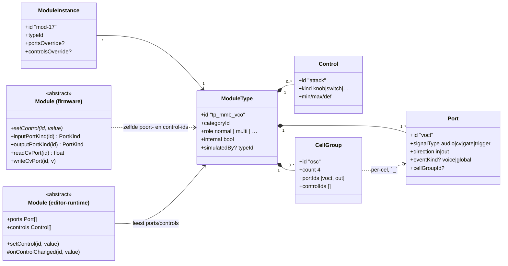
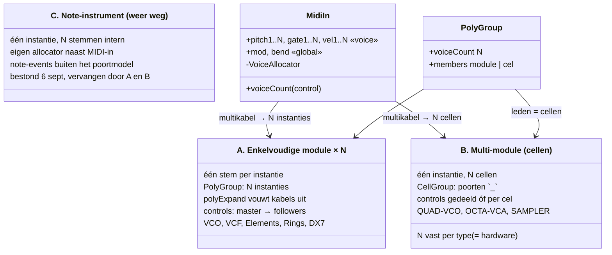

# 11 — Pas op de plaats: het modulemodel, polyfonie en de wasm-simulatie

**Geschreven:** 2026-09-06, na twee dagen browser-DSP. Bedoeld als
her-ijking: wat is het basisconstruct, welke drie manieren van "meer stemmen"
bestaan er, waar past wat vandaag gebouwd is — en wat past er *niet* in.

Vorige delen: `07` (runtime-houders), `08` (Module-hiërarchie), `09`/`10`
(audio- en CV-modules). ADR's: 0009 (moduleklassen), 0010 (MIDI-in en
polyfonie), 0011 (voice-levenscyclus).

---

## 1. Het basisconstruct: Module ◇— Port, Module ◇— Control

Dit klopt, met één nuance die alles daarna verklaart: **de compositie leeft in
de catalogus, niet in de runtime.**

De editor houdt een `ModuleType` vast met een lijst `Port`s en `Control`s.
Een `ModuleInstance` verwijst naar zo'n type. Op de Teensy bestaat geen
`Port`-object: een firmware-module beantwoordt vragen *over* poorten op naam
(`inputPortKind("voct")`), en controls komen binnen als `setControl("attack", v)`.
De namen zijn het contract; ze zijn in catalogus, firmware én wasm-wrapper
letterlijk gelijk.



Overerving gaat precies zoals je zegt: `Module ← AudioModule ← VcoModule` op
beide platforms. Een concrete module *kent* zijn poorten in code
(`if (portId == "voct")`) — hij hoeft ze niet te dragen.

---

## 2. Drie manieren van "meer stemmen"

Hier zat de verwarring. Er zijn niet twee constructen maar drie, en het derde
heb ik vandaag toegevoegd zonder het te benoemen.



### A — enkelvoudig × N (PolyGroup)

Exact jouw beschrijving. `PolyGroup` groepeert N instanties; de patcher toont
alleen de master; `polyExpand.ts` maakt er de echte kabellijst van:
keten 1 van A₁.x → B₁.y, keten 2 van A₂.x → B₂.y. De brain ziet een plat
graaf en is dom. Knoppen: master → alle followers, tegelijk.

### B — multi-module (cellen)

Ook jouw "meervoudig in – meervoudig uit". Eén `ModuleType` met een
`CellGroup` (`count: 4`, `portIds: [voct, out]`): poorten heten `voct_1..voct_4`,
`out_1..out_4`. Controls kunnen **gedeeld** zijn (QUAD-VCO: één waveform-knop
voor vier oscillators) of **per cel** (quad-mixer: pan per kanaal). Een
`PolyGroup` mag *cellen* als leden hebben, zodat een multikabel uit MIDI-in op
de cellen landt. `count` staat vast in het type — dat is de hardware-realiteit
die je noemt: een analoge OCTA-VCA heeft acht jacks en niet negen.

### C — note-instrument (bestond één middag; weer weg)

DX7-in-de-browser en de sampler kregen op 6 september kortstondig een eigen
weg: de engine gaf ze **elke noot los** (`noteOn(midi, vel)`), ze hielden
intern N stemmen bij en hadden een **eigen allocator** — een tweede naast die
in MIDI-in, buiten het poortmodel om. Het werkte, maar het was een sluiproute,
en hij is dezelfde dag nog vervangen:

- **Sampler → B.** Eén instantie, één bank, acht stem-cellen met `voct_k`,
  `gate_k`, `vel_k` (CellGroup `voice`, controls gedeeld), gemengde uitgang.
  De allocator zit weer in MIDI-in. Firmware (`SamplerModule.h`) en wasm-wrapper
  hebben dezelfde portmap; de kern (`sample_player.h`) veranderde niet.
- **DX7-simulatie → A.** Eén stem per instantie, precies als `Dx7Module.h`;
  de seed "DX7 poly ×8" is een PolyGroup van acht instanties. De DX7 is nu een
  gewone `WasmModule` (`tools/mmb-wasm/dx7_wasm.cc`); banken en de edit-patch
  gaan als blobs naar binnen, over dezelfde weg als samples bij de sampler.
- De note-API (`mmb_note_on`, `WasmModule.polyTypeIds`, `Dx7Node`) is
  verwijderd. De engine kent alleen nog A en B.

De spanning die C opriep — één instantie per stem is voor een sampler waanzin —
was echt; het antwoord was B, niet een derde construct.

Wat B daarvoor nog mist is een **instelbaar N**. De cellen staan vast op acht;
een PolyGroup ×4 gebruikt er vier. Dat is voor nu genoeg. Wordt het ooit een
knop (`countControl` op een `CellGroup`), dan hoeft `polyExpand` daar niets
voor te veranderen — hij werkt al op genummerde cel-poorten.

### De multikabel en de richtingen

- **MIDI-in ×8** heeft `pitch1..8`, `gate1..8`, `vel1..8` (`eventKind: 'voice'`)
  en enkelvoudige `mod`, `bend` (`eventKind: 'global'`). In de patcher is dat
  de gestreepte tegenover de gladde kabel — precies jouw afbeelding 2.
- **Enkel → meervoudig** kan en bestaat: `polyExpand` noemt het *fan-out*
  (een gedeelde LFO gaat naar elke stem). In hardware is dat een buffered mult.
- **Meervoudig → enkel** is óf genummerd (`in1` → `in1..inN` op een mixer) óf
  een som op dezelfde poort. "Zomaar" acht signalen in één jack kan niet, en
  de expansie staat dat ook niet toe.

Conclusie: **we zitten op jouw lijn.** A en B zijn precies wat je beschrijft;
C was een afwijking van één middag en is naar A en B teruggebracht.

---

## 3. De simulatie: hoe een Teensy-module in de browser draait

Twee soorten nodes in de engine. Een **Tone.js-proxy** benadert een module met
Web-Audio-bouwstenen; een **wasm-node** draait *dezelfde C++* als de firmware.

```mermaid
classDiagram
    direction TB

    class AudioEngine {
        -nodes  Map~id, EngineNode~
        -wasmGroups / wasmFollowerOf
        +build(project, patch)
        +noteOn(midi, vel) / noteOff(midi)
        -wire(conn)
        -expandPolyForSim(conns)
        -wasmNoteOn(id, midi, vel)
    }
    class EngineNode {
        <<union>>
        kind: vco|vcf|vca|envelope|lfo|mixer|…|wasm
        runtime: Module
    }
    class Registry {
        +register(typeId, factory)
        +create(type, instance, controls) Module
    }
    class TsModule["Module (editor-runtime)"] {
        <<abstract>>
    }
    class TsAudioModule["AudioModule"] {
        <<abstract>>
        +update()
    }
    class Vco { Tone.Oscillator }
    class Vcf { Tone.Filter }
    class WasmModule {
        +typeIds  Set  (incl. tp_mmb_dx7)
        +inGain(port) / outGain(port)  Tone.Gain
        +setInput(port, v)  klavierwaarde
        +markCabled(port)
        +setControl(id, v)
        +setBlob() / setZones()  blobs per type
        +registerAssets(typeId, loader)
        +broadcastControl(typeId, id, v)
        -node  AudioWorkletNode "mmb-wasm"
    }
    class dx7Host {
        <<module>>
        ROMs → blobs 0..7, USER → 8
        setEditPatch → blob 9 + control `edit`
    }

    AudioEngine "1" o-- "*" EngineNode
    EngineNode --> TsModule : runtime
    Registry ..> TsModule : factory per typeId
    TsModule <|-- TsAudioModule
    TsAudioModule <|-- Vco
    TsAudioModule <|-- Vcf
    TsAudioModule <|-- WasmModule
    dx7Host ..> WasmModule : blobs + controls
```



De stemtoewijzer in `AudioEngine` kent stem-id's van twee vormen: `moduleId`
(construct A, een hele module) en `moduleId#k` (construct B, cel k van een
multi-module). Een kabel MIDI-in → `voct_3` wijst dus naar stem `mod#3`, en de
allocator zet `voct_3`/`gate_3`/`vel_3`. Zo werkt de Elements ×4 (A) en de
Sampler ×8 (B) met dezelfde code.

De engine bekabelt Tone-nodes rechtstreeks. Rond een wasm-module staat per
poort een `Tone.Gain`, zodat de engine hem als elke andere node kan bekabelen —
audio én CV/gate zijn in de worklet gewoon signalen op audio-rate.

### Van poort tot C++: de mmb-wasm ABI

```mermaid
classDiagram
    direction LR

    class WasmModule["WasmModule (TS, hoofdthread)"] {
        postMessage: ctl | in | cabled | blob | zones | note
    }
    class Worklet["mmb-worklet.js (audio-thread)"] {
        leest poorten/controls uit de wasm
        resamplet: audio lineair, cv/gate hold
        mengt kabel + klavierwaarde per ingang
        connected = cabled || handmatig gezet
    }
    class Abi["mmb_abi.h (C, in de wasm)"] {
        MMB_INPUTS[]   {id, kind, connected, buf}
        MMB_OUTPUTS[]  {id, kind, buf}
        MMB_CONTROLS[] {id, value}
        mmb_set_control(i, v)
        mmb_input_ptr(i) / mmb_input_connected(i, c)
        mmb_render(frames)
    }
    class Wrapper["<x>_wasm.cc"] {
        mmb_setup()
        mmb_on_control(idx, v)
        mmb_process(frames)
        spiegelt <X>Module::setControl en de portmap
    }
    class Kernel["firmware-kern (C++)"] {
        mi-elements, mi-rings, msfa, mmb-dsp/…
        dezelfde bron als op de Teensy
    }
    class FwModule["<X>Module.h (Teensy)"] {
        setControl(id, v)
        writeCvPort(id, v)
        AudioStream::update()
    }

    WasmModule --> Worklet : MessagePort
    Worklet --> Abi : exports
    Abi --> Wrapper : roept aan
    Wrapper --> Kernel
    FwModule --> Kernel
    FwModule .. Wrapper : één-op-één spiegel
```

Lees de ABI naast de firmware-`Module` en het is dezelfde interface in C:

| firmware `Module`            | mmb_abi                                  |
|------------------------------|------------------------------------------|
| `setControl(id, value)`      | `mmb_set_control(idx, v)` → `mmb_on_control` |
| `inputPortKind(id)`          | `MMB_INPUTS[i].kind` (audio / cv / gate)  |
| `writeCvPort(id, v)`         | schrijven in `mmb_input_ptr(i)`           |
| kabel aanwezig (CvGraph schrijft elke tick) | `mmb_input_connected(i, 1)` |
| `AudioStream::update()`      | `mmb_render(frames)` → `mmb_process`      |

Dus ja: **met wasi-sdk draaien de modules letterlijk in de browser**, met een
wrapper van een paar tientallen regels per module die de portmap en de
control-switch van `<X>Module.h` naspeelt. Wat *niet* meegaat is de
Teensy-schil (Arduino, `AudioStream`, SD, PSRAM); dat is precies wat de
wrapper vervangt.

---

## 4. Stand van zaken

1. ✅ **Sampler → B** (6 sept, zelfde dag). Vast acht cellen; `countControl`
   voor een instelbaar N is een latere, kleine uitbreiding.
2. ✅ **DX7-simulatie → A** zoals de firmware. De 16-stemmige browserkern met
   eigen allocator is weg; `tools/dx7-wasm` houdt alleen de JS-port, het
   referentieharnas en `compare.mjs`.
3. ✅ **Note-API weg.** `mmb_note_on`, `WasmModule.polyTypeIds`, `Dx7Node`.
4. Open: **firmware bouwen** voor de nieuwe `SamplerModule.h` (cel-poorten) —
   geen toolchain op deze Mac, zie eerdere notities.
5. Dit document bijhouden als er een vierde vorm dreigt te ontstaan.
