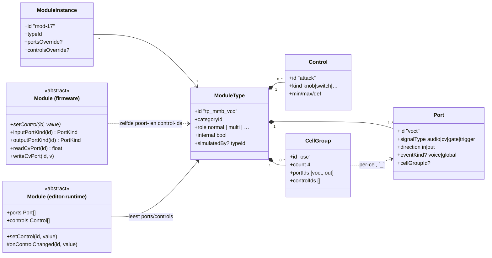
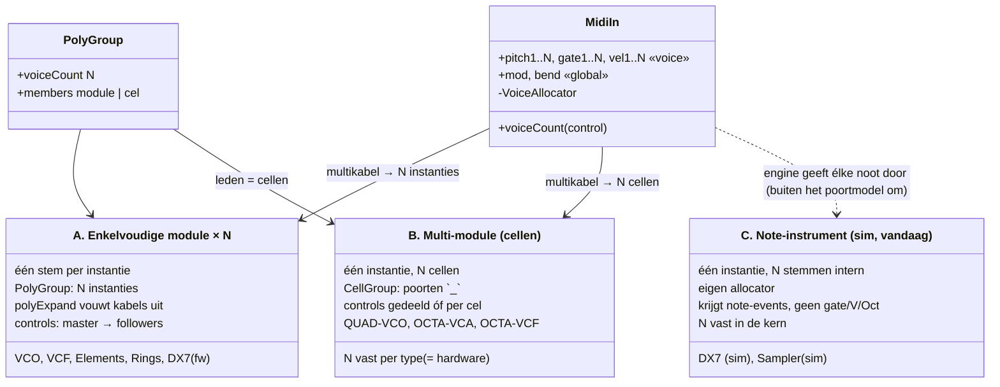
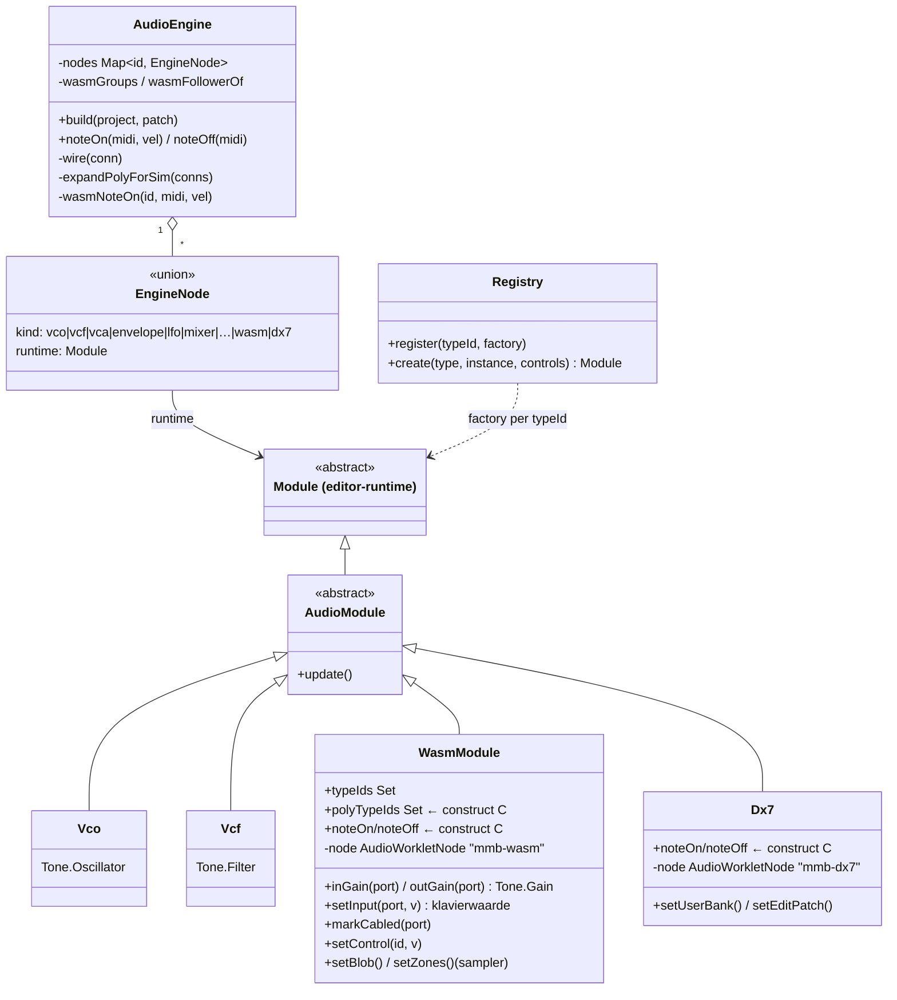

# 11 — Pas op de plaats: het modulemodel, polyfonie en de wasm-simulatie

**Geschreven:** 2026-09-06, na twee dagen browser-DSP. Bedoeld als
her-ijking: wat is het basisconstruct, welke drie manieren van "meer stemmen"
bestaan er, waar past wat vandaag gebouwd is — en wat past er *niet* in.

Vorige delen: `07` (runtime-houders), `08` (Module-hiërarchie), `09`/`10`
(audio- en CV-modules). ADR's: 0009 (moduleklassen), 0010 (MIDI-in en
polyfonie), 0011 (voice-levenscyclus).

---

## 1. Het basisconstruct: Module ◇— Port, Module ◇— Control

Dit klopt, met één nuance die alles daarna verklaart: **de compositie leeft in
de catalogus, niet in de runtime.**

De editor houdt een `ModuleType` vast met een lijst `Port`s en `Control`s.
Een `ModuleInstance` verwijst naar zo'n type. Op de Teensy bestaat geen
`Port`-object: een firmware-module beantwoordt vragen *over* poorten op naam
(`inputPortKind("voct")`), en controls komen binnen als `setControl("attack", v)`.
De namen zijn het contract; ze zijn in catalogus, firmware én wasm-wrapper
letterlijk gelijk.



Overerving gaat precies zoals je zegt: `Module ← AudioModule ← VcoModule` op
beide platforms. Een concrete module *kent* zijn poorten in code
(`if (portId == "voct")`) — hij hoeft ze niet te dragen.

---

## 2. Drie manieren van "meer stemmen"

Hier zat de verwarring. Er zijn niet twee constructen maar drie, en het derde
heb ik vandaag toegevoegd zonder het te benoemen.



### A — enkelvoudig × N (PolyGroup)

Exact jouw beschrijving. `PolyGroup` groepeert N instanties; de patcher toont
alleen de master; `polyExpand.ts` maakt er de echte kabellijst van:
keten 1 van A₁.x → B₁.y, keten 2 van A₂.x → B₂.y. De brain ziet een plat
graaf en is dom. Knoppen: master → alle followers, tegelijk.

### B — multi-module (cellen)

Ook jouw "meervoudig in – meervoudig uit". Eén `ModuleType` met een
`CellGroup` (`count: 4`, `portIds: [voct, out]`): poorten heten `voct_1..voct_4`,
`out_1..out_4`. Controls kunnen **gedeeld** zijn (QUAD-VCO: één waveform-knop
voor vier oscillators) of **per cel** (quad-mixer: pan per kanaal). Een
`PolyGroup` mag *cellen* als leden hebben, zodat een multikabel uit MIDI-in op
de cellen landt. `count` staat vast in het type — dat is de hardware-realiteit
die je noemt: een analoge OCTA-VCA heeft acht jacks en niet negen.

### C — note-instrument (wat ik vandaag deed, en waarom het wringt)

DX7-in-de-browser en de sampler krijgen van de engine **elke noot los**
(`noteOn(midi, vel)`), houden intern N stemmen bij en hebben een **eigen
allocator**. Dat is een tweede allocator naast die in MIDI-in, en de noot
loopt buiten het poortmodel om. Het werkt, en het was de kortste weg — maar het
is geen derde legitiem construct; het is een sluiproute in de simulator.

Het is ontstaan uit een echte spanning die jij ook benoemt: één instantie per
stem is voor een sampler waanzin (N × de hele bank), en de firmware-`Dx7Module`
ís één stem per instantie zoals VcoModule (poly via A). Maar het antwoord op die
spanning is **B**, niet C:

> **De sampler hoort een multi-module te zijn**: één instantie, één bank,
> N stem-cellen met `voct_k`, `gate_k`, `vel_k`, één gemengde uitgang (plus
> desgewenst `out_k`). De allocator blijft waar hij hoort: in MIDI-in of de
> poly-sequencer. De sampler wordt weer een domme stem × N, die toevallig zijn
> geheugen deelt.

Wat B nog mist voor dit geval: een **instelbaar N**. Bij hardware staat het
aantal vast in het type; bij een digitale module is "8 stemmen" een control.
Dat is een kleine uitbreiding van `CellGroup`: `count` mag ook een verwijzing
naar een control zijn (`countControl: 'voices'`, met `max`). De patcher toont
dan `voct_1..voct_N` voor de ingestelde N, en `polyExpand` heeft er niets aan
te veranderen — hij werkt al op genummerde cel-poorten.

Overigens speelt in de **firmware** hetzelfde: `SamplerModule.h` heeft nu ook
één `voct`/`gate`/`vel` met acht stemmen erachter, dus daar is een akkoord
evenmin mogelijk. Dezelfde ombouw naar cellen lost beide op.

### De multikabel en de richtingen

- **MIDI-in ×8** heeft `pitch1..8`, `gate1..8`, `vel1..8` (`eventKind: 'voice'`)
  en enkelvoudige `mod`, `bend` (`eventKind: 'global'`). In de patcher is dat
  de gestreepte tegenover de gladde kabel — precies jouw afbeelding 2.
- **Enkel → meervoudig** kan en bestaat: `polyExpand` noemt het *fan-out*
  (een gedeelde LFO gaat naar elke stem). In hardware is dat een buffered mult.
- **Meervoudig → enkel** is óf genummerd (`in1` → `in1..inN` op een mixer) óf
  een som op dezelfde poort. "Zomaar" acht signalen in één jack kan niet, en
  de expansie staat dat ook niet toe.

Conclusie: **we zitten op jouw lijn.** A en B zijn precies wat je beschrijft;
C is een afwijking van vandaag die naar B moet.

---

## 3. De simulatie: hoe een Teensy-module in de browser draait

Twee soorten nodes in de engine. Een **Tone.js-proxy** benadert een module met
Web-Audio-bouwstenen; een **wasm-node** draait *dezelfde C++* als de firmware.



De engine bekabelt Tone-nodes rechtstreeks. Rond een wasm-module staat per
poort een `Tone.Gain`, zodat de engine hem als elke andere node kan bekabelen —
audio én CV/gate zijn in de worklet gewoon signalen op audio-rate.

### Van poort tot C++: de mmb-wasm ABI

```mermaid
classDiagram
    direction LR

    class WasmModule["WasmModule (TS, hoofdthread)"] {
        postMessage: ctl | in | cabled | blob | zones | note
    }
    class Worklet["mmb-worklet.js (audio-thread)"] {
        leest poorten/controls uit de wasm
        resamplet: audio lineair, cv/gate hold
        mengt kabel + klavierwaarde per ingang
        connected = cabled || handmatig gezet
    }
    class Abi["mmb_abi.h (C, in de wasm)"] {
        MMB_INPUTS[]   {id, kind, connected, buf}
        MMB_OUTPUTS[]  {id, kind, buf}
        MMB_CONTROLS[] {id, value}
        mmb_set_control(i, v)
        mmb_input_ptr(i) / mmb_input_connected(i, c)
        mmb_render(frames)
    }
    class Wrapper["<x>_wasm.cc"] {
        mmb_setup()
        mmb_on_control(idx, v)
        mmb_process(frames)
        spiegelt <X>Module::setControl en de portmap
    }
    class Kernel["firmware-kern (C++)"] {
        mi-elements, mi-rings, msfa, mmb-dsp/…
        dezelfde bron als op de Teensy
    }
    class FwModule["<X>Module.h (Teensy)"] {
        setControl(id, v)
        writeCvPort(id, v)
        AudioStream::update()
    }

    WasmModule --> Worklet : MessagePort
    Worklet --> Abi : exports
    Abi --> Wrapper : roept aan
    Wrapper --> Kernel
    FwModule --> Kernel
    FwModule .. Wrapper : één-op-één spiegel
```

Lees de ABI naast de firmware-`Module` en het is dezelfde interface in C:

| firmware `Module`            | mmb_abi                                  |
|------------------------------|------------------------------------------|
| `setControl(id, value)`      | `mmb_set_control(idx, v)` → `mmb_on_control` |
| `inputPortKind(id)`          | `MMB_INPUTS[i].kind` (audio / cv / gate)  |
| `writeCvPort(id, v)`         | schrijven in `mmb_input_ptr(i)`           |
| kabel aanwezig (CvGraph schrijft elke tick) | `mmb_input_connected(i, 1)` |
| `AudioStream::update()`      | `mmb_render(frames)` → `mmb_process`      |

Dus ja: **met wasi-sdk draaien de modules letterlijk in de browser**, met een
wrapper van een paar tientallen regels per module die de portmap en de
control-switch van `<X>Module.h` naspeelt. Wat *niet* meegaat is de
Teensy-schil (Arduino, `AudioStream`, SD, PSRAM); dat is precies wat de
wrapper vervangt.

---

## 4. Wat er nu te doen staat

1. **Sampler → multi-module (B).** `CellGroup` met instelbaar N
   (`countControl`), cel-poorten `voct_k/gate_k/vel_k`, allocator eruit,
   bank gedeeld in de instantie. In firmware én wasm-wrapper — het is
   dezelfde `sample_player.h`, alleen de schil verandert.
2. **DX7-simulatie → A**, zoals de firmware al is: één stem per instantie,
   PolyGroup ×8. De wasm-allocator van vandaag wordt dan overbodig; de
   `edit-buffer` (patcheditor) blijft, die is per type.
3. **Note-API weg** zodra 1 en 2 er zijn. `WasmModule.polyTypeIds` en
   `Dx7Node` verdwijnen; de engine kent dan alleen nog A en B.
4. **Diagrammen bijhouden** in dit document als 1–3 landen.

Tot die tijd werkt C — je kunt akkoorden spelen op de sampler en de DX7 —
maar het staat hier expliciet als tijdelijk.
