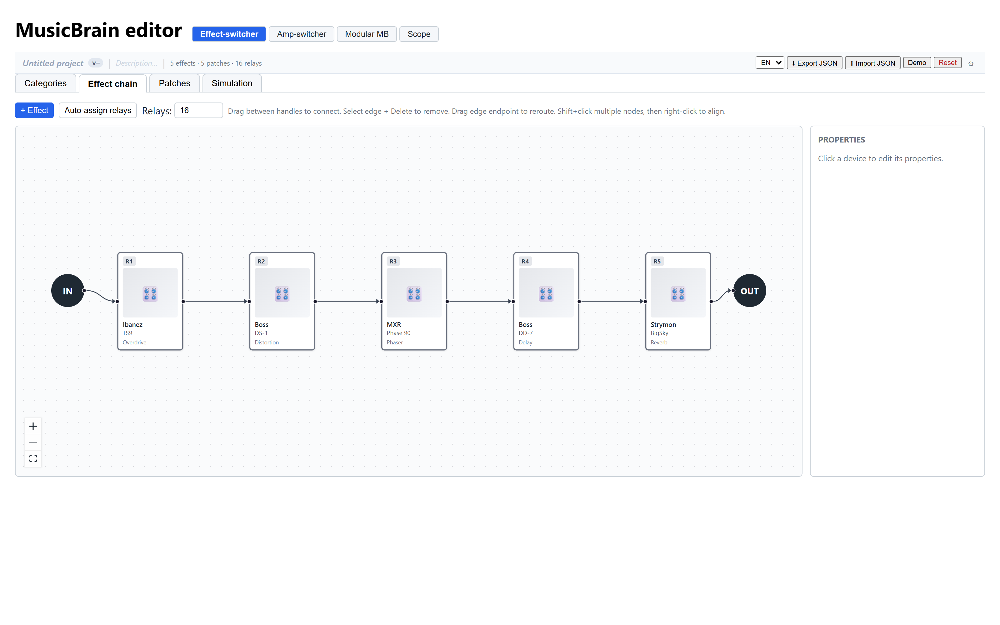
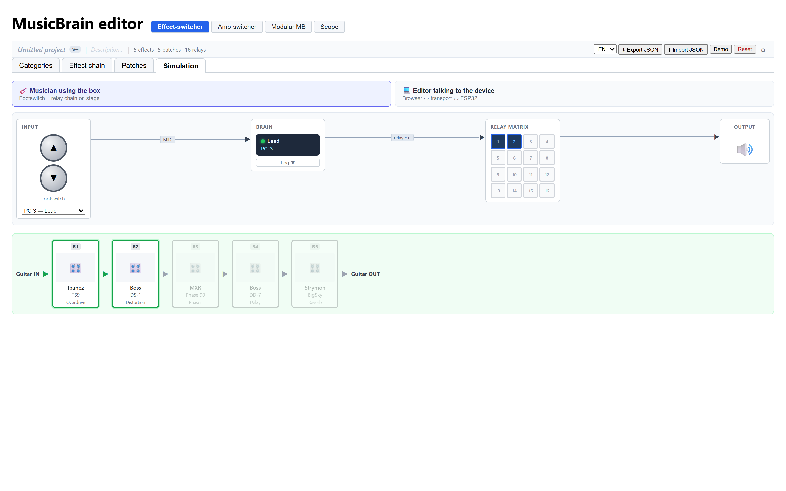
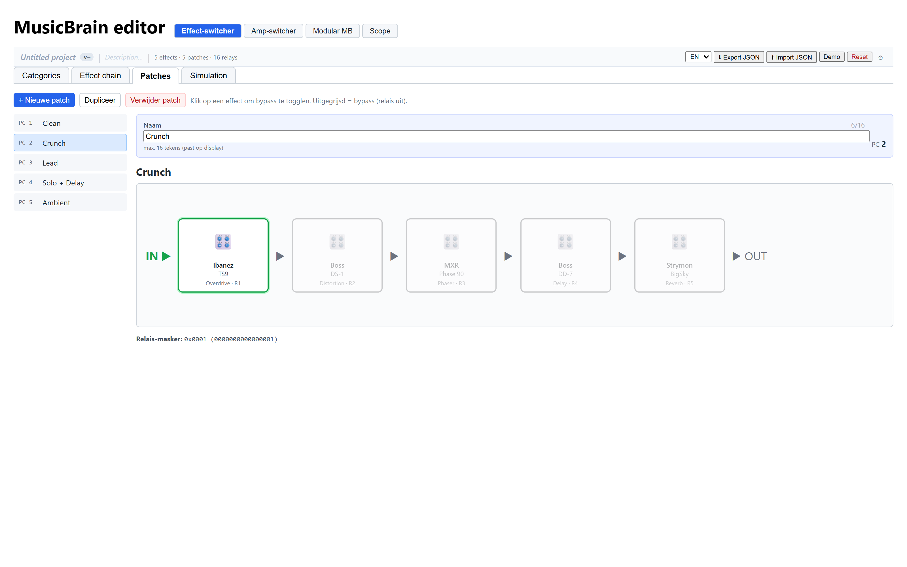
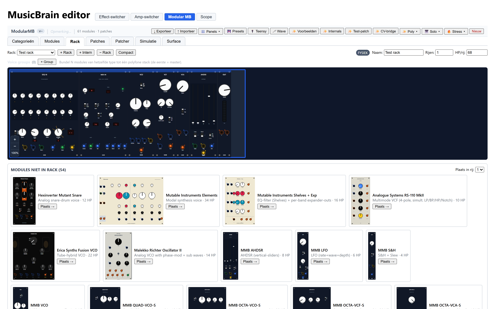
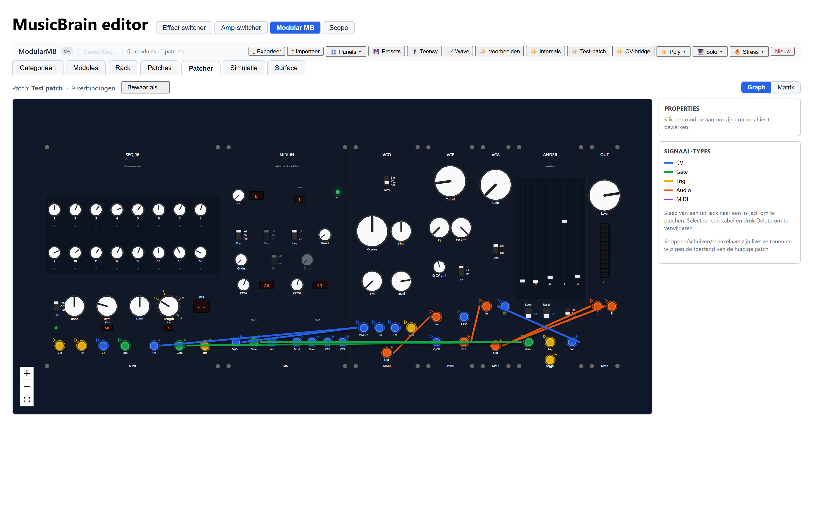

# `editor/` — React + TypeScript patch editor

Vite + React + strict TypeScript. Hosted externally; talks to the device via JSON-RPC over USB-CDC or WebSocket (see [ADR 0002](../doc/adr/0002-editor-stack.md)).

## Develop

```powershell
cd editor
npm install
npm run dev
```

Then open http://localhost:5173.

## Status

Drie projectmodi via knoppen bovenin:

| Modus | Status |
|---|---|
| **Effect-switcher** | Volledig werkende offline editor + simulatie (zie hieronder) |
| **Amp-switcher** | Placeholder — moet nog uitgewerkt worden |
| **Poly-synth (scope)** | Live CV/gate-trace van `mb_simulator` via `tools/scope-bridge` |

Device-discovery + WebSerial upload (synchroniseren met firmware) komt in Stage 7.

## Screenshots

Gemaakt met de demo-data (knop **Demo** resp. **✨ Voorbeelden**/**✨ Test-patch**);
bron in `screenshots/`, ook gebruikt voor de site.

| | |
|---|---|
|  |  |
| Effect-chain-editor (React Flow) | Simulatie: footswitch → MIDI → brain → relaismatrix |
|  | |
| Patches met bypass-toggling en relais-masker | |
|  |  |
| Modular MB: rack met panelen | Modular MB: patcher met signaalkleuren |

## Effect-switcher editor

Alles wordt opgeslagen in `localStorage` onder key `mb.effect-switcher.v1`. Geen backend. Knop **Demo laden** vervangt het project met 5 demo-pedalen en 5 patches; **Reset** wist alles.

Tabs:

| Tab | Voor wie | Wat |
|---|---|---|
| **Patches** | Muzikant | Patches doorklikken, effecten aan/uit togglen door op de kaart te klikken. Bypassed effecten worden grijs en lichter. Het signaalpad-▶ wordt groen tussen actieve effecten. Toont het samengestelde relais-masker (hex + binair) onderaan. |
| **Effect-chain** | Engineer | Grafische editor met [React Flow](https://reactflow.dev). Voeg apparaten toe (`+ Effect`), sleep tussen handles om signaalpad te tekenen. Rechts paneel: merk/model/categorie/relais-index/plaatje. Parallelle takken kunnen door meerdere edges van/naar één node. **Auto-assign relais** doet een topologische sort en geeft elk apparaat een relais 0..n-1; je kunt daarna per apparaat handmatig overschrijven. |
| **Categorieën** | Engineer | Beheer de lijst effectsoorten (Overdrive, Phaser, …). Een categorie die nog gebruikt wordt kan niet verwijderd worden. |
| **Simulatie** | Iedereen | Drie kolommen: links footswitch ▲/▼ + PC-selector, midden “brain” met huidige patch + event-log, rechts de output-pedalen. Optie **Compact** verbergt bypassed effecten zodat een patch met phaser+echo letterlijk maar twee pedalen toont. De MIDI-kabel tussen footswitch en brain is **end-to-end geëmuleerd**: elke knop serialiseert een Program-Change naar echte MIDI-bytes (zichtbaar als hex-chips die over de kabel reizen), de parser aan de brain-kant decodeert ze en zet de patch — exact dezelfde state-machine als in [`firmware/lib/midi_common/`](../firmware/lib/midi_common/). |

### Datamodel (samenvatting)

```ts
SwitcherProject {
  version: 1;                    // schema versie (intern, hoort bij deze editor-build)
  name?: string;                 // vrije naam van het project (bv. "Stage-rig 2026")
  description?: string;          // korte memory-aid, bv. "Live bezetting incl. octaver"
  configVersion?: string;        // door jou bijgehouden, bv. "1.2.3" — handig voor changelog/backup
  relayCount: number;            // 1..32, default 16
  categories: { id, label }[];
  devices:    { id, brand, model, categoryId, relayIndex, x, y, imageDataUrl? }[];
  edges:      { source, target }[];    // 'input' en 'output' zijn speciale endpoints
  patches:    { id, name, bypassed: deviceId[] }[];
  activePatchId: number;
}
```

We slaan `bypassed` op (niet `active`) zodat een nieuw toegevoegd apparaat
automatisch aan staat in alle bestaande patches.

> ⚠️ Let op het verschil tussen **`version`** (de schema-versie van het
> bestandsformaat, vast op `1`) en **`configVersion`** (door jou zelf
> bijgehouden, bv. semver). De ESP32-firmware weigert een import met
> `version != 1`; `configVersion` is puur informatief.

### Project-bar (header)

Bovenin staat de project-balk. Klik op een veld om te bewerken:

- **Naam** (vet) — vrije label, ook gebruikt in de default exportnaam.
- **Version-chip** (`v1.2.3`) — `configVersion`. Bump zelf bij elke release.
- **Description** — eenregelige omschrijving (max 120 tekens).
- **Stats** — `{n} effects · {p} patches · {r} relays`.
- **Taal-dropdown** — EN/NL, persistent in `localStorage`. Voegt vertaling toe via [`src/i18n.ts`](src/i18n.ts) (zero-dep, eenvoudig uit te breiden).
- **Export JSON** — vraagt om bestandsnaam (default `musicbrain-{naam}-v{ver}-{datum}.json`).
- **Import JSON** — vervangt huidige project; valideert `version === 1`.

### Plaatje uploaden

Op de Chain-tab: selecteer een apparaat → rechts paneel → **Uploaden**. Het plaatje wordt als base64 data-URL in localStorage opgeslagen (geen server-roundtrip). Houd plaatjes klein (<100 KB) om de quota niet te overschrijden.

### Toekomst (nog niet geïmplementeerd)

- Plaatje ophalen van internet via merk+model lookup
- MIDI-out per patch (CC-berichten meesturen om bv. echo-tijd te zetten)
- Bank-systeem voor >128 patches
- Sync met firmware via WebSerial / HTTP (Stage 7) — zie ook
  [`firmware/app-effect-switcher/esp32/`](../firmware/app-effect-switcher/esp32/README.md)
  voor de ESP32-doelhardware met REST-API.

## Connecting to a device

Two transports, both will speak the same JSON-RPC schema (`doc/protocols/schemas/api.jsonrpc.v1.json`, TBD):

| Transport | When | How |
|---|---|---|
| **WebSerial** (USB-CDC) | All projects, no extra hardware | Browser API; works in Chromium-based browsers. |
| **WebSocket** (via ESP32 side car) | Project 3 on stage / from tablet | mDNS-discovered `musicbrain.local`. |
| **Plain HTTP/REST** (ESP32 effect-switcher) | Project 1 op stage / vanaf tablet | mDNS `musicbrain.local`, eindpunten `GET/PUT /api/config`, `POST /api/patch/<id>`. Zie [esp32/README.md](../firmware/app-effect-switcher/esp32/README.md). |

## API-documentatie genereren (TypeDoc)

Alle geëxporteerde types en functies in `src/` hebben JSDoc-commentaar.
[TypeDoc](https://typedoc.org/) zet die om naar een doorzoekbare HTML-site.

```powershell
cd editor
npm run docs
# opent daarna: doc/api/index.html
```

De output komt in `doc/api/` (naast `doc/Simulation.md` e.d.).  
Die map staat in `.gitignore` — niet inchecken, op aanvraag regenereren.

Configuratie staat in [`typedoc.json`](typedoc.json) in deze map.

### Bekende waarschuwingen bij genereren

| Waarschuwing | Betekenis | Actie nodig? |
|---|---|---|
| `ProjectStore … not included in the documentation` | `ProjectStore` is een interne klasse die *wel* als type opduikt in publieke functies (bv. `useProject` retourneert ermee). TypeDoc ziet de verwijzing maar de klasse zelf is niet geëxporteerd. | Nee — de klasse is bewust privé. |
| `Props … not included in the documentation` | `ScopePanel` gebruikt een inline props-interface (geen `export`). TypeDoc meldt dat de parameter niet gedocumenteerd is. | Optioneel: geef de interface een naam en exporteer hem als `ScopePanelProps`. |
| `Code block with language powershell will not be highlighted` | In `README.md` staat een `powershell`-codeblok. TypeDoc laadt standaard geen PowerShell syntax-highlighter. | Nee — de code is gewoon leesbaar; alleen kleuring ontbreekt. Optioneel: `"highlightLanguages": ["powershell"]` toevoegen aan `typedoc.json`. |
