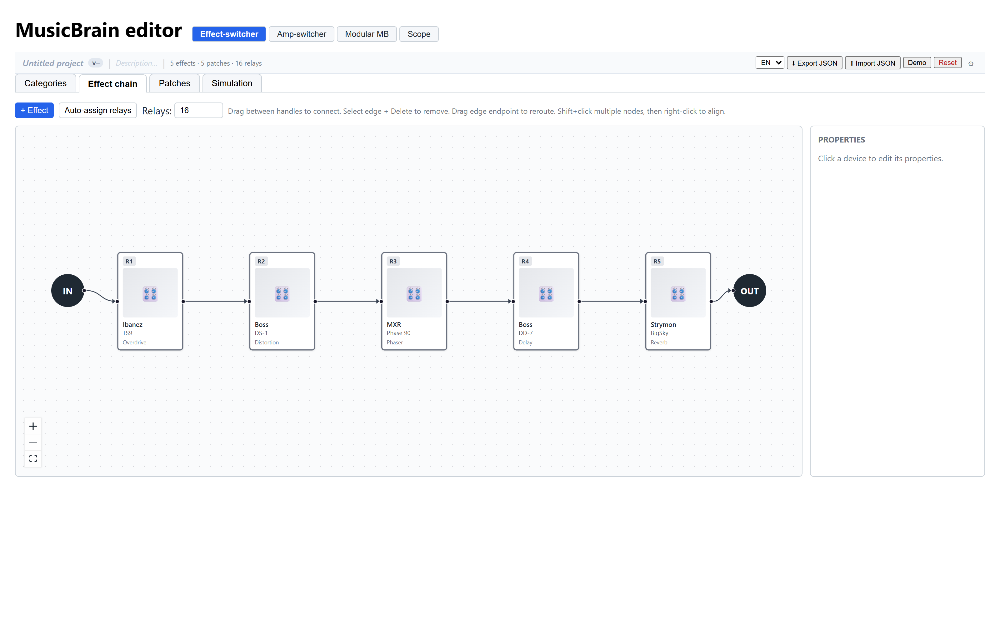
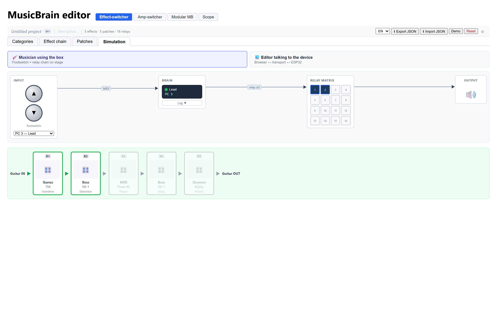
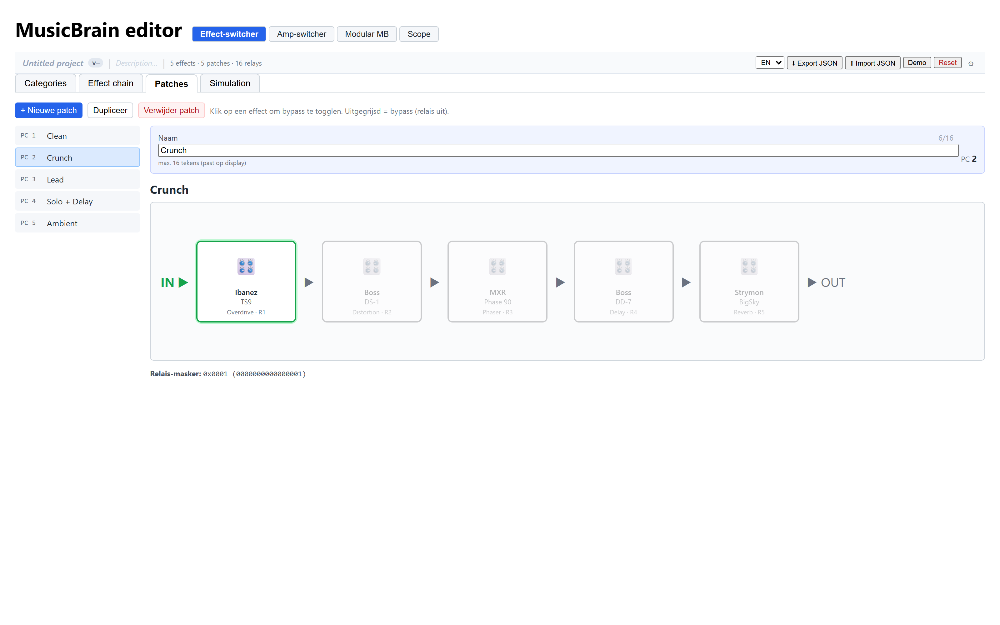
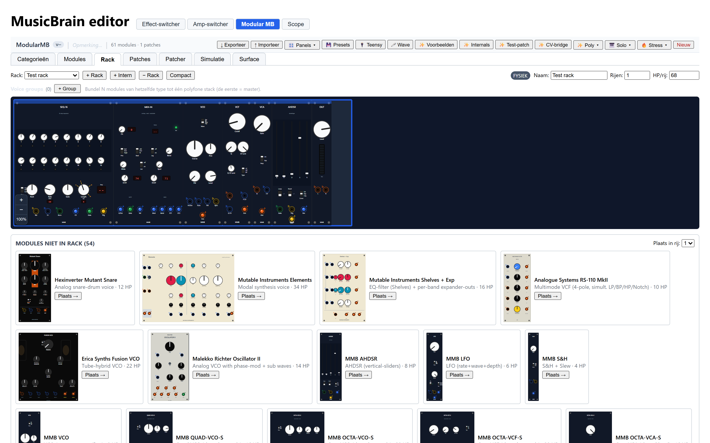
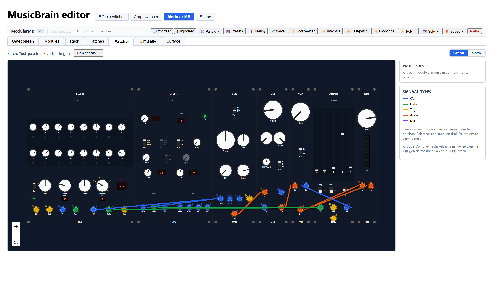

# `editor/` — React + TypeScript patch editor

Vite + React + strict TypeScript. Hosted externally; talks to the device via JSON-RPC over USB-CDC or WebSocket (see [ADR 0002](../doc/adr/0002-editor-stack.md)).

## Develop

```powershell
cd editor
npm install
npm run dev
```

Then open http://localhost:5173.

### UX-proeven

- [Toolbarvergelijking](../doc/plans/toolbar-vergelijking.html): klikbare
  vergelijking van de huidige en taakgericht gegroepeerde Modular MB-bovenbalk
  (hoort bij [doc/plans/editor-ux-aanbevelingen.md](../doc/plans/editor-ux-aanbevelingen.md)).
  Staat bewust in `doc/`, niet in `public/`, zodat de proef niet mee-deployt.

## Live demo

Draait als demo op **[editor.musicbrain.nl](https://editor.musicbrain.nl)**
(de website zelf staat op [www.musicbrain.nl](https://www.musicbrain.nl)).

## Styling

De huisstijl staat als stijlgids in het hoofd-repo:
**[doc/styleguide.md](../doc/styleguide.md)** — een kant-en-klaar
`tokens.css`-blok, typografie-specs en CSS-recepten voor paneel/badge/knop/
specs-strip/scope-trace. Geschreven op wat deze editor werkelijk is (gewone
CSS-klassen + inline styles, geen Tailwind). Migratie: importeer `tokens.css`
vóór bestaande styles en vervang hardcoded kleuren/fonts stap voor stap door
de variabelen (§5 van de gids). De tokens lopen gelijk met het "amber"-thema
van de site; wijzigt de huisstijl, pas dan beide aan (§6).

## Status

Drie projectmodi via knoppen bovenin:

| Modus | Status |
|---|---|
| **Effect-switcher** | Volledig werkende offline editor + simulatie (zie hieronder) |
| **Modular MB** | Rack, patcher, presets, Teensy-link én een browser-simulator die de Teensy-DSP als wasm draait (DX7, Elements, Rings, Marbles, Plaits, …) — zie [tools/mmb-wasm/README.md](../tools/mmb-wasm/README.md) en [doc/Simulation.md §9](../doc/Simulation.md). De Modules-tab heeft zoeken, sorteerbare kolommen en een Sim-kolom die per type laat zien of de simulator hem speelt (`src/modular-mb/sim/simSupport.ts`) |
| **Amp-switcher** | Placeholder — moet nog uitgewerkt worden |
| **Poly-synth (scope)** | Live CV/gate-trace van `mb_simulator` via `tools/scope-bridge` |

Verbinding met hardware verschilt per modus:

- **Modular MB**: de Teensy-link (knop **Teensy**) werkt via WebSerial (Chrome/
  Edge): patch/config naar de Teensy, DX7-/sample-/lyricbanken uploaden,
  firmware-release downloaden en de versie van het verbonden apparaat zien.
  Zie [doc/teensy-aan-de-pc.md](../doc/teensy-aan-de-pc.md).
- **Effect-switcher**: offline editor; sync met de ESP32-hardware is nog niet
  gebouwd (zie "Toekomst" hieronder).
- **Amp-switcher**: placeholder, geen verbinding.

### FOF Singing Voice

**Poly > FOF Stem (mono)** maakt een patch van MIDI-IN via FOF-VOICE naar OUT.
Geen opname, lyricbank of extra hardware nodig. Start audio in Simulatie.

| Control | Functie |
|---|---|
| Vowel | Continue A-E-I-O-U-morf, onafhankelijk van toonhoogte |
| Voice | Korte/heldere naar langere/zachtere glottale sluiting; default 0,35 |
| Vel-ingang | Aanslagsterkte 0-1 stuurt volume en fonatie; automatisch vanuit MIDI in nieuwe seeds |
| Press-ingang | Doorlopende expressie tijdens de noot (0-1): iets zachter (vloer −6 dB), duidelijk ademiger als Breath open staat, langere sluiting; zonder kabel volle druk |
| Vow+ / Air+ / Vib+ / Voi+ | CV telt op bij de Vowel-, Breath-, Vibrato- en Voice-knop |
| Attenuators | Kleine knop boven elke CV-jack: 1 = vol, 0 = kabel doet niets; bij Vel en Press is dit de gevoeligheid |
| Syl / Syl+ | Lettergreep uit een tabel van twintig: Vowel (de knop), doo, da en de hele Vader Jacob (va der ja cob slaapt gij nog al le klo ken lui den bim bam bom) plus de; synthetische medeklinkers, tweeklanken en slotmedeklinkers bij het loslaten. Syl+ (0-1 over de tabel) telt op: CC1 = index × 127 / 19 vanaf een pad-app; gelezen bij de gate-flank |
| Tone / Breath | Formantbreedte / pulsgebonden aspiratie |
| Vibrato / Level | Vibratodiepte (1,0 = een halve toon) / uitgangsniveau |

De gedeelde C++-kern draait in WASM en op Teensy. Dit is een experimentele
formantstem met een vereenvoudigde glottale bron, geen volledige CHANT- of
LF-reconstructie. Herlaad en maak de seed opnieuw voor het uitgebreide paneel;
oude FOF-definities worden daarbij vernieuwd zonder bestaande patches te wissen.
Zacht/hard vergelijken kan met een aanslaggevoelig MIDI-klavier of CV op `Vel`.
`Press` wordt bewust niet automatisch bedraad: MIDI-IN `Press` staat op 0 zonder
aftertouch en zou de stem dan zacht en dof maken. Patch hem zelf vanaf MIDI-IN
`Press` (aftertouch), een breath controller via CC of een LFO/envelope.
Zie [proefinstructies, tests en vervolgstappen](../doc/plans/stem-als-instrument.md)
en de [meetmatrix](../doc/plans/fof-voice-overdracht.md).

### Material Bridge

**Solo > Material Bridge (materiaalgeheugen)** voegt een bespeelbare patch toe:
MIDI-IN (pitch, gate, velocity) naar vier gekoppelde resonatoren, met twee
pickups naar stereo-OUT. Hard spelen bouwt stress op: de middelste brug
verzwakt tijdelijk en het materiaal dempt sterker. `Memory=0` schakelt die
invloed uit; `Recover` bepaalt het herstel. `Hit B` is een tweede aanslagpunt,
`In` accepteert externe audio en `Stress` is beschikbaar als CV.

| Onderdeel | Status |
|---|---|
| Paneel, solopatch, stereo en velocity | Geimplementeerd |
| Zelfspelende tweepuntsdemo en reproduceerbare Memory-A/B-takes | Geimplementeerd; blinde luisterbeoordeling open |
| Couple/Pickup-CV en 10-ms smoothing | Gedeelde DSP, paneel en beide wrappers getest |
| Browser/Teensy DSP | Dezelfde C++-kern; wasm en firmware gebouwd |
| Energie, hysterese, herstel en contracten | Automatisch getest |
| Muzikale beoordeling en Teensy CPU-meting | Nog open; niet geflasht |

**Solo > Material Bridge demo (2:3)** maakt twee Memory-varianten met twee
SEQ-16-ritmes en gedeelde zachte/harde velocity. Start **Sim**; MIDI is niet
nodig. `Cpl+` en `Pick+` tellen CV op bij de knop, begrensd op 0..1;
loskoppelen keert vloeiend terug naar de knopstand. De smoothingtijd is
10 ms; pitch, gates en reset krijgen geen vertraging.

Voor een gecontroleerde vergelijking: voer vanuit de repositoryroot
`node tools/mmb-wasm/render-material-bridge.mjs editor/public/material-bridge-ab`
uit. Dit maakt twee 20-seconden stereo-WAV's en een meetrapport, te openen via
`/material-bridge-ab/memory-on.wav` en `/material-bridge-ab/memory-off.wav` op
de editorserver. Iedere take begint gereset en gebruikt identieke stimuli;
een vaste gain per take matcht de stereo-RMS binnen 0,01 dB. Live patchwisselen
reset niet automatisch en is niet niveau-gematcht. RMS-matching vervangt geen
perceptuele of blinde luisterproef.

Dit is een klein onderzoeksinstrument, geen volwaardige state-graph-editor
en geen precies concertgestemde poly-synth. Het model, de controls en de
verificatie staan in [State-Graph Synthesis](../doc/plans/state-graph-synthesis.md#material-bridge-eerste-uitvoerbare-proef-2026-09-30).
Een volgende sessie kan beginnen bij het zelfstandige
[Material Bridge-overdrachtsdocument](../doc/plans/material-bridge-handover.md).

## Losse demo-pagina's

Naast de React-app staan er zelfstandige pagina's in `public/`. Ze hebben geen
bouwstap, draaien op zichzelf, en dienen als proeflab voor bedieningsvormen
die later in de editor kunnen landen.

| Pagina | Wat |
|---|---|
| `snaarbank-worklet.html` | Fysisch-model-snaar met exciter, resonator, tape echo en galm. Modulatiepad voor trackpad, Wacom en aanraakscherm. Zie [doc/snaarbank-testlab.md](../doc/snaarbank-testlab.md) |
| `pad-phone.html` | Aanraakvlak voor de telefoon; drie vingers, elk een assenpaar |
| `modlink.js` | Client die beide bovenstaande met elkaar verbindt |

Voor de telefoonpagina moet de dev-server op het netwerk luisteren; dat staat
aan via `server.host` in `vite.config.ts`. Open op het toestel
`http://<ip-van-je-mac>:5173/pad-phone.html`. Het doorgeefluik zit als plugin
in de dev-server, zie [modlink/README.md](modlink/README.md) en
[ADR 0016](../doc/adr/0016-modulation-surfaces-over-cc.md).

> Let op: `server.host` maakt de dev-server bereikbaar voor alles in je
> lokale netwerk, niet alleen voor localhost.

## Screenshots

Gemaakt met de demo-data (knop **Demo** resp. **✨ Voorbeelden**/**✨ Test-patch**);
bron in `screenshots/`, ook gebruikt voor de site.

| | |
|---|---|
|  |  |
| Effect-chain-editor (React Flow) | Simulatie: footswitch → MIDI → brain → relaismatrix |
|  | |
| Patches met bypass-toggling en relais-masker | |
|  |  |
| Modular MB: rack met panelen | Modular MB: patcher met signaalkleuren |

## Effect-switcher editor

Alles wordt opgeslagen in `localStorage` onder key `mb.effect-switcher.v1`. Geen backend. Knop **Demo laden** vervangt het project met 5 demo-pedalen en 5 patches; **Reset** wist alles.

Tabs:

| Tab | Voor wie | Wat |
|---|---|---|
| **Patches** | Muzikant | Patches doorklikken, effecten aan/uit togglen door op de kaart te klikken. Bypassed effecten worden grijs en lichter. Het signaalpad-▶ wordt groen tussen actieve effecten. Toont het samengestelde relais-masker (hex + binair) onderaan. |
| **Effect-chain** | Engineer | Grafische editor met [React Flow](https://reactflow.dev). Voeg apparaten toe (`+ Effect`), sleep tussen handles om signaalpad te tekenen. Rechts paneel: merk/model/categorie/relais-index/plaatje. Parallelle takken kunnen door meerdere edges van/naar één node. **Auto-assign relais** doet een topologische sort en geeft elk apparaat een relais 0..n-1; je kunt daarna per apparaat handmatig overschrijven. |
| **Categorieën** | Engineer | Beheer de lijst effectsoorten (Overdrive, Phaser, …). Een categorie die nog gebruikt wordt kan niet verwijderd worden. |
| **Simulatie** | Iedereen | Drie kolommen: links footswitch ▲/▼ + PC-selector, midden “brain” met huidige patch + event-log, rechts de output-pedalen. Optie **Compact** verbergt bypassed effecten zodat een patch met phaser+echo letterlijk maar twee pedalen toont. De MIDI-kabel tussen footswitch en brain is **end-to-end geëmuleerd**: elke knop serialiseert een Program-Change naar echte MIDI-bytes (zichtbaar als hex-chips die over de kabel reizen), de parser aan de brain-kant decodeert ze en zet de patch — exact dezelfde state-machine als in [`firmware/lib/midi_common/`](../firmware/lib/midi_common/). |

### Datamodel (samenvatting)

```ts
SwitcherProject {
  version: 1;                    // schema versie (intern, hoort bij deze editor-build)
  name?: string;                 // vrije naam van het project (bv. "Stage-rig 2026")
  description?: string;          // korte memory-aid, bv. "Live bezetting incl. octaver"
  configVersion?: string;        // door jou bijgehouden, bv. "1.2.3" — handig voor changelog/backup
  relayCount: number;            // 1..32, default 16
  categories: { id, label }[];
  devices:    { id, brand, model, categoryId, relayIndex, x, y, imageDataUrl? }[];
  edges:      { source, target }[];    // 'input' en 'output' zijn speciale endpoints
  patches:    { id, name, bypassed: deviceId[] }[];
  activePatchId: number;
}
```

We slaan `bypassed` op (niet `active`) zodat een nieuw toegevoegd apparaat
automatisch aan staat in alle bestaande patches.

> ⚠️ Let op het verschil tussen **`version`** (de schema-versie van het
> bestandsformaat, vast op `1`) en **`configVersion`** (door jou zelf
> bijgehouden, bv. semver). De ESP32-firmware weigert een import met
> `version != 1`; `configVersion` is puur informatief.

### Project-bar (header)

Bovenin staat de project-balk. Klik op een veld om te bewerken:

- **Naam** (vet) — vrije label, ook gebruikt in de default exportnaam.
- **Version-chip** (`v1.2.3`) — `configVersion`. Bump zelf bij elke release.
- **Description** — eenregelige omschrijving (max 120 tekens).
- **Stats** — `{n} effects · {p} patches · {r} relays`.
- **Taal-dropdown** — EN/NL, persistent in `localStorage`. Voegt vertaling toe via [`src/i18n.ts`](src/i18n.ts) (zero-dep, eenvoudig uit te breiden).
- **Export JSON** — vraagt om bestandsnaam (default `musicbrain-{naam}-v{ver}-{datum}.json`).
- **Import JSON** — vervangt huidige project; valideert `version === 1`.

### Plaatje uploaden

Op de Chain-tab: selecteer een apparaat → rechts paneel → **Uploaden**. Het plaatje wordt als base64 data-URL in localStorage opgeslagen (geen server-roundtrip). Houd plaatjes klein (<100 KB) om de quota niet te overschrijden.

### Toekomst (nog niet geïmplementeerd)

- Plaatje ophalen van internet via merk+model lookup
- MIDI-out per patch (CC-berichten meesturen om bv. echo-tijd te zetten)
- Bank-systeem voor >128 patches
- Sync met firmware via WebSerial / HTTP (in het oude plan "Stage 7") — zie ook
  [`firmware/app-effect-switcher/esp32/`](../firmware/app-effect-switcher/esp32/README.md)
  voor de ESP32-doelhardware met REST-API. Alleen Modular MB heeft nu een
  werkende link (zie "Status").

## Connecting to a device

Transports per project (the shared JSON-RPC schema `doc/protocols/schemas/api.jsonrpc.v1.json` is still a plan; Modular MB speaks JSON lines over USB-CDC today):

| Transport | When | How |
|---|---|---|
| **WebSerial** (USB-CDC) | Modular MB: working (Teensy link). Other projects: planned. | Browser API; works in Chromium-based browsers. |
| **WebSocket** (via ESP32 side car) | Project 3 on stage / from tablet | mDNS-discovered `musicbrain.local`. |
| **Plain HTTP/REST** (ESP32 effect-switcher) | Project 1 op stage / vanaf tablet | mDNS `musicbrain.local`, eindpunten `GET/PUT /api/config`, `POST /api/patch/<id>`. Zie [esp32/README.md](../firmware/app-effect-switcher/esp32/README.md). |

## API-documentatie genereren (TypeDoc)

Alle geëxporteerde types en functies in `src/` hebben JSDoc-commentaar.
[TypeDoc](https://typedoc.org/) zet die om naar een doorzoekbare HTML-site.

```powershell
cd editor
npm run docs
# opent daarna: doc/api/index.html
```

De output komt in `doc/api/` (naast `doc/Simulation.md` e.d.).  
Die map staat in `.gitignore` — niet inchecken, op aanvraag regenereren.

Configuratie staat in [`typedoc.json`](typedoc.json) in deze map.

### Bekende waarschuwingen bij genereren

| Waarschuwing | Betekenis | Actie nodig? |
|---|---|---|
| `ProjectStore … not included in the documentation` | `ProjectStore` is een interne klasse die *wel* als type opduikt in publieke functies (bv. `useProject` retourneert ermee). TypeDoc ziet de verwijzing maar de klasse zelf is niet geëxporteerd. | Nee — de klasse is bewust privé. |
| `Props … not included in the documentation` | `ScopePanel` gebruikt een inline props-interface (geen `export`). TypeDoc meldt dat de parameter niet gedocumenteerd is. | Optioneel: geef de interface een naam en exporteer hem als `ScopePanelProps`. |
| `Code block with language powershell will not be highlighted` | In `README.md` staat een `powershell`-codeblok. TypeDoc laadt standaard geen PowerShell syntax-highlighter. | Nee — de code is gewoon leesbaar; alleen kleuring ontbreekt. Optioneel: `"highlightLanguages": ["powershell"]` toevoegen aan `typedoc.json`. |
