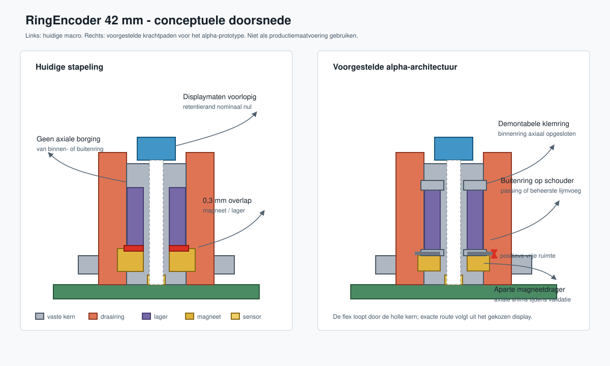
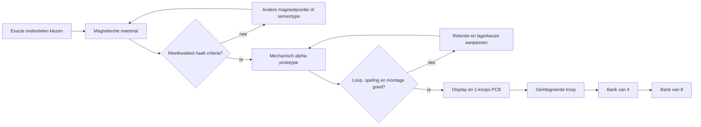
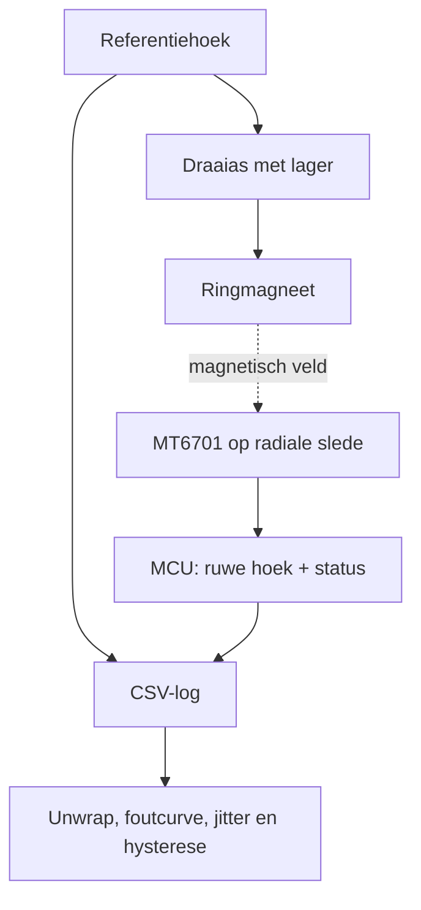

# RingEncoder — prototype- en validatieplan

Datum: 2026-08-31  
Doel: met zo weinig mogelijk maatwerk vaststellen of een goedkope, vaste displaykern
met een magnetisch uitgelezen draairing technisch en ergonomisch levensvatbaar is.

## Ontwerpprincipe

De huidige CAD is een goed ruimtelijk concept, maar nog geen maakbaar ontwerp. De
eerstvolgende stap is daarom niet een bank-PCB of firmwareplatform. Eerst moeten drie
onafhankelijke hypotheses worden bewezen:

1. Een off-axis sensor kan de gekozen ringmagneet rondom betrouwbaar en reproduceerbaar uitlezen.
2. Lager, magneetdrager en bedieningsring kunnen zonder axiale speling worden geborgd met een prettig draaimoment.
3. Het exact ingekochte display past, is te monteren en laat een betrouwbare flexroute toe.

De rechterdoorsnede is een architectuurvoorstel, geen definitieve maatvoering. De
axiale schouders en klemring maken de krachtpaden expliciet; shims houden de
magneetafstand tijdens het experiment instelbaar.

## Beslisroute

## Fase 0 — onderdelen vastzetten

Bestel nog geen zestien sets. Koop voor twee meetopstellingen:

- twee exacte 0,71-inch displays uit dezelfde listing en batch;
- bijbehorende datasheet met outline, actieve diameter, flexpinout, contactzijde en aanbevolen connector;
- twee 6805-lagers van elk van twee kansrijke uitvoeringen, bijvoorbeeld 2RS en ZZ/open;
- twee typen expliciet diametraal gemagnetiseerde ringmagneten;
- MT6701 in de daadwerkelijk te gebruiken package plus een eenvoudige adapter-PCB;
- kunststof en niet-magnetische shims van 0,2, 0,5 en 1,0 mm.

Leg leverancier, bestelcode, revisie en gemeten maten vast in `SOURCING.md`. Een
generieke controllernaam of een "FH12-achtige" connector is niet voldoende om CAD
of een footprint op te baseren.

**Beslispoort:** alle kritieke onderdelen hebben een datasheet of eigen maatrapport;
de display-outline en FPC zijn met een schuifmaat/microscoop gecontroleerd.

## Fase 1 — magnetische meetmal

Bouw een losse mal zonder display. Gebruik het 6805-lager en de uiteindelijke
ringmagneet, maar maak sensorstraal en axiale afstand verstelbaar. Voeg een
onafhankelijke hoekreferentie toe: bij voorkeur een optische encoder; voor de eerste
screening kan een geprinte 360-graden schaal met vaste camera volstaan.

Meet minimaal:

- sensorstraal in stappen rond de nominale 17,5 mm;
- axiale afstand in stappen van 0,5 mm;
- met en zonder het echte stalen lager op zijn uiteindelijke positie;
- 360 graden rechtsom en linksom, ten minste vijf herhalingen;
- stilstandjitter op twaalf hoeken en na opwarming;
- verschillende rotatiesnelheden, inclusief snelle handbewegingen.

Bewaar per sample tijd, referentiehoek, ruwe sensorwaarde, magnetische statusbits,
richting en configuratie. Analyseer monotoniciteit, ontbrekende samples, piek-piek
jitter, hysterese en de residufout na een periodieke kalibratietabel.

**Voorlopige acceptatiecriteria:** geen drop-outs of richtingomkeringen; stilstandjitter
kleiner dan 0,2 graad piek-piek; herhaalbare gekalibreerde fout kleiner dan 0,5 graad;
geen wezenlijke verslechtering door het lager. Stel deze eisen bij op basis van een
UI-proef, maar niet achteraf om een instabiel meetprincipe goed te praten.

**Stopcriterium:** als het veld met lager niet monotoon of niet reproduceerbaar is,
verplaats de magneet/sensor of gebruik een andere encoderarchitectuur. Ga dan nog
niet verder met de geïntegreerde CAD.

## Fase 2 — mechanisch alpha-prototype

Herbouw alleen de vaste kern en roterende ring. Maak de krachtpaden expliciet:

- klem de binnenring tussen een onderste pilaarschouder en een demontabele bovenring;
- ondersteun de buitenring axiaal in de bedieningsring en borg hem met een passende passing of gecontroleerde lijmvoeg;
- plaats de magneet in een aparte drager onder het lager, met shims voor de axiale afstand;
- zorg dat montagekracht nooit door de kogels wordt geleid;
- geef de displaykern en bedieningsring een aantoonbare radiale en axiale vrijloop;
- definieer print- of freestoleranties in plaats van nominale lagerdiameters direct over te nemen.

Maak eerst een doorsnedecoupon om passing en lijmspleet te testen. Print daarna drie
ringen met verschillende lagerpassingen. Meet aanloopmoment, gemiddeld draaimoment,
axiale speling en radiale slingering voor en na duizend handmatige omwentelingen.

**Voorlopige acceptatiecriteria:** geen voelbare axiale klik; geen aanlopen op paneel
of kern; minder dan 0,2 mm axiale beweging aan de ringrand; consistent draaimoment
tussen exemplaren; demontage mogelijk zonder display of PCB te beschadigen.

## Fase 3 — display en eenknops-elektronica

Pas de CAD pas nu aan op het gemeten display. Modelleer apart:

- paneeloutline en actieve beeldcirkel;
- lijm- of klemband met minimaal 0,3 mm dragende rand rondom waar mogelijk;
- minimale buigradius en trekontlasting van de flex;
- exacte FPC-connector, contactzijde en insteekruimte;
- servicemontage: display vervangbaar zonder het lager los te persen.

Maak een 1-knops PCB met MT6701, FPC-connector, ontkoppeling en testpunten. Houd
display-SPI en sensor-SSI elektrisch apart totdat busdeling op de werkbank is bewezen.
Meet ook backlightstroom en thermiek; acht displays kunnen de voedingsbegroting meer
bepalen dan de MCU.

Reken voor bandbreedte met de bovengrens: een 160x160 RGB565-frame is 51,2 kB. Acht
displays maal twintig volledige frames per seconde vraagt 8,2 MB/s exclusief protocol-
overhead. Gebruik daarna dirty rectangles en meet de werkelijke worst-case UI-update.

**Beslispoort:** honderdduizend encoder-samples zonder communicatiefout terwijl alle
displays wisselende content tekenen; geen zichtbare tearing; voeding en temperatuur
blijven binnen de vastgelegde marges.

## Fase 4 — geïntegreerde knop

Combineer de bewezen onderdelen in één 42 mm-prototype. Test niet alleen technisch,
maar ook als muziekinstrument:

- leesbaarheid van parameternaam en waarde op armlengte;
- precisie bij langzaam draaien en acceleratie bij snel draaien;
- verblinding en kijkhoek in een donkere en lichte ruimte;
- bediening met één vinger, twee vingers en naastliggende knoppen;
- geluid, wobble en gevoel na herhaald gebruik.

Pas na deze proef de push-functie toe. Een tact-switch verandert de volledige axiale
lagering en hoort daarom niet ongemerkt in hetzelfde prototype te worden toegevoegd.

## Fase 5 — opschalen

Bouw eerst vier knoppen om mechanische hartafstand, ergonomie, voeding en firmware-
scheduling te testen. Schaal daarna naar acht. Kies ESP32-S3 versus RP2040 op gemeten
SPI-belasting, benodigde DMA/PIO-kanalen, USB-MIDI-eisen en ontwikkelrisico, niet op
de theoretische pieksnelheid alleen.

Voor een bank van acht moeten minimaal worden vastgelegd:

- voedingsbudget bij maximale witte backlightweergave;
- boot- en foutgedrag als een display of sensor ontbreekt;
- connector- en kabelarchitectuur;
- EMI/ESD-aanpak voor USB, MIDI en eurorack;
- firmware-updatepad en unieke bankidentificatie;
- productietest voor display, sensor, richting en kalibratiedata.

## CAD-werkwijze

Gebruik voor de volgende iteratie geen losse magische getallen in twee gekopieerde
macro's. Maak één parametrisch model met benoemde afgeleiden en assertions voor:

- positieve axiale afstand tussen magneet en lager;
- minimale wand- en randdikte;
- lagerpassing en lijmspleet;
- axiale retentie van beide lagerringen;
- display-retentierand;
- boutgaten versus boring en flexsleuf;
- ringvrijloop tegenover kern en frontpaneel.

Exporteer per geldige configuratie een `.FCStd`, STEP van de maakdelen en een SVG/PDF-
doorsnede. Laat de export stoppen zodra een assertion faalt. De huidige macro's zijn
headless uitvoerbaar gemaakt, zodat deze controles later in een script of CI-taak
kunnen draaien. Draai `GenerateColoredFCStd.FCMacro` vanuit de FreeCAD-GUI om de
gekleurde referentiemodellen in `visuals/` opnieuw te genereren. Kleuren zijn
ViewObject-eigenschappen en worden door `freecadcmd` niet aangemaakt of opgeslagen.

## Directe werkvolgorde

1. Exact display, magneet en twee lageruitvoeringen bestellen.
2. Magnetische meetmal modelleren en bouwen.
3. Meetlogger plus analyseplot maken; resultaten en ruwe CSV bewaren.
4. Alleen bij een geslaagde magnetische test de lagering opnieuw modelleren.
5. Mechanisch alpha-prototype testen en toleranties vastleggen.
6. Daarna pas de 1-knops PCB en displayhouder ontwerpen.
7. Eén geïntegreerde knop evalueren, vervolgens vier en uiteindelijk acht.

Dit houdt elke mislukking goedkoop: de duurste onzekerheid wordt niet verstopt in
een fraaie maar moeilijk te wijzigen bank van acht knoppen.