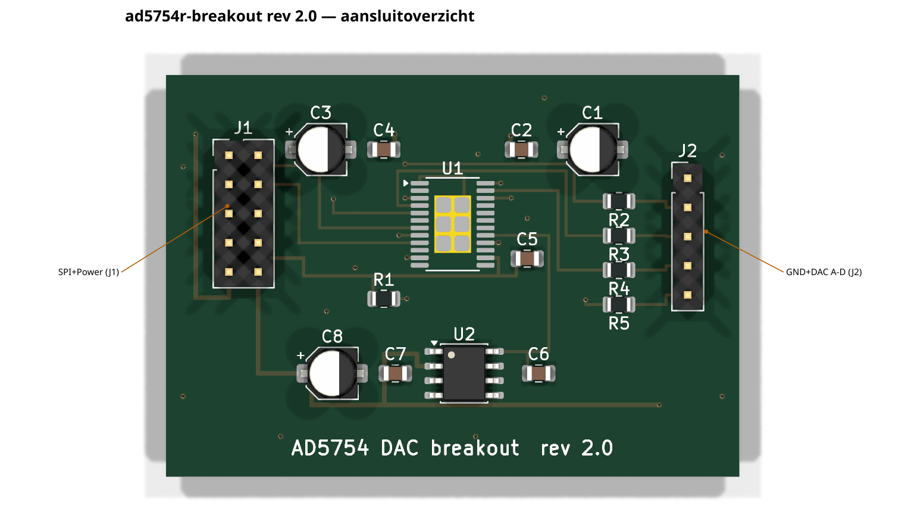
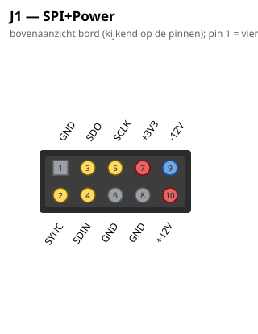
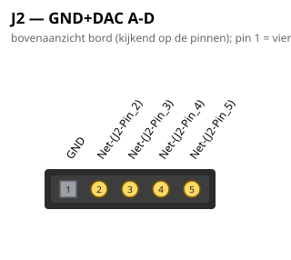

# AD5754 Quad DAC Breakout — 4× CV-uitgang

**Status**: schema ERC-schoon; PCB volledig geroute (DRC 0 fouten,
0 unconnected). Bord: 50×35 mm, 2 lagen. Rev 2.0.

## Wat het is

Het eerste hardware-experiment van het project: een breakout rond de
**AD5754BREZ** (quad 16-bit DAC, bipolair ±5V) om de SPI-keten met de
Teensy te bewijzen. Sluit via een 2×5 lintkabel aan op een hub-header
van het busboard (of rechtstreeks op een Teensy op breadboard).

## Kernbeslissingen

- **ADR421 externe referentie is verplicht**: de gekozen BREZ-variant
  (non-R) heeft géén interne referentie. De ADR421 levert 2,5V op 3 ppm/°C.
- **BIN/2sCOMP → DVCC = offset binary**: 0x0000 = −FS, 0x8000 = 0V,
  0xFFFF = +FS. Dit volgt de firmware-afspraak (SPI-frame = 16-bit
  offset-binary); het oorspronkelijke schema had de pin per abuis aan GND
  (two's complement) terwijl de eigen outputtabel offset binary beschreef.
- **LDAC → GND**: uitgangen updaten op de stijgende flank van SYNC.
  (Op een toekomstige *slotkaart*-versie hoort LDAC aan de buslijn, zodat
  meerdere DAC's sample-synchroon updaten.)
- **CLR → 10k pull-up naar DVCC**: geen onbedoelde clears.
- **Exposed pad (pin 25) = AVSS (−12V)**, niet GND! Het package is
  TSSOP-24 **met** thermisch pad (RE-24); footprint
  `HTSSOP-24-1EP_4.4x7.8mm_P0.65mm_EP3.2x5mm`, pad met thermische via's
  naar een −12V-eilandje op de onderlaag.
- 100 Ω serie in elke uitgang (kortsluitbescherming), ±12V/DVCC/REFIN
  lokaal ontkoppeld (10 µF + 100 nF per rail).

## SPI

Mode 1 (CPOL=0, CPHA=1), max 30 MHz; data wordt in de DAC gelatcht op de
stijgende flank van SYNC. Teensy 4.1 direct: SCLK=13, SDIN=11(MOSI),
SDO=12(MISO), SYNC=10(CS) — of via het busboard op een hub (CS7/CS8).

## Aansluitingen

- **J1** (2×5 IDC): 1 GND, 2 SYNC, 3 SDO, 4 SDIN, 5 SCLK, 6 GND, 7 +3V3,
  8 GND, 9 −12V, 10 +12V — identiek aan de hub-headers op het busboard.
- **J2** (1×5): 1 = GND, 2–5 = OUT A..D (het jack4-printje-contract).

## PCB-notities

Dichtst bevolkte bord van de familie (0,65 mm pinpitch). VREF loopt kort
langs de oostflank (ADR421 → C6 → REFIN); de SPI-fanout zit links; de
−12V voedt via het westkanaal zowel AVSS als het exposed-pad-eiland
(2 thermische via's). GND-vlakken op beide lagen, solid connect,
stitching-via's; één bewust GND-brugspoor tussen J1-pin 6 en 8 bindt het
zuidelijke vlakdeel aan het hoofdvlak.

## Aansluitoverzicht

### Pinouts

Bovenaanzicht van het bord (kijkend op de pinnen); pin 1 = vierkant. Gegenereerd uit het bordbestand met `hardware/kicad-generators/pinout_svg.py`.

