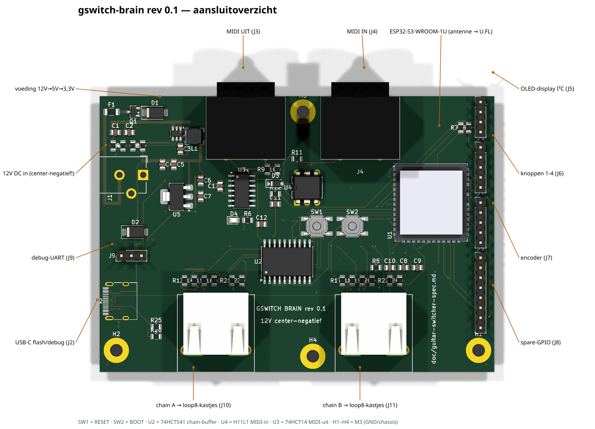

# gswitch-brain — ESP32-S3-hoofdbord (Guitar Effect Switcher)

**Status**: rev 0.1 geroute — ERC 0, netcheck OK, DRC 0/0 (2026-07-12).
**Nog niet bestellen**: eerst `jlc_fix.py`-LCSC-match + fab-pakket + review.
Leidende spec: [`doc/guitar-switcher-spec.md`](../../../doc/guitar-switcher-spec.md).

*(Regenereren: `python hardware/kicad-generators/gswitch_overzicht.py` —
exporteert de topview via kicad-cli en zet de callouts erbij.)*

## Wat dit bord is

Het "moederbord" van de switcher: ESP32-S3-WROOM-**1U** (U.FL-antenne →
SMA-bulkhead op de stalen kast), 12V **center-negatief** in (omkeer-P-FET +
polyfuse + SMAJ15A), buck 12→5V (TPS563201), AMS1117-3.3, USB-C voor
flash/debug (SS34-diode naar de 5V-rail: bord draait op USB zonder 12V),
MIDI-DIN in (H11L1) + uit (74HCT14-buffer op 5V), en 2× chain-poort
(74HCT541 → RJ45, met 100R-serieweerstanden en 10k/15k-spanningsdelers
voor de DATA_RET-teruglezing).

- Bord: 100 × 70 mm, 2-laags, GND-vlakken beide zijden.
- Randen: west DC + USB-C + debug-UART; noord 2× MIDI-DIN; zuid 2× RJ45;
  oost module + headers (OLED-I²C, 4 knoppen, encoder, 8× spare-GPIO).
- RESET- en BOOT-tactschakelaars naast de module; status-LED (IO42).

## GPIO-toewijzing (firmware-contract)

| Functie | GPIO | | Functie | GPIO |
|---|---|---|---|---|
| Chain A CLK/DATA/LATCH/EN | 4/5/6/7 | | I²C SDA/SCL | 10/13 |
| Chain B CLK/DATA/LATCH/EN | 15/16/17/18 | | MIDI RX/TX | 11/12 |
| DATA_RET A / B (in, 3V-deler) | 8 / 9 | | Knoppen 1-4 | 35/36/37/38 |
| Encoder A/B/SW | 39/40/41 | | Status-LED | 42 |
| Spare-header | 21/14/47/48/1/2 | | Debug-UART | 43/44 |

Strapping-pinnen IO0/IO3/IO45/IO46 zijn vrijgehouden (IO0 = BOOT-knop).

## Onderdelen-notities

- **Module**: ESP32-S3-WROOM-**1U**-N8R2 — de -1U (U.FL) is verplicht in de
  metalen kast. EP-thermal-vias (0,2 mm) zijn uit de lib-footprint gefilterd
  (onder JLC-minimumboring); EP soldeert op het vlak.
- **MIDI-DIN**: CUI SDS-50J (footprint uit de maattekening, zie
  `doc/data-sheets/`-werkwijze). MIDI-out op 5V met 2×220R (spec-conform).
- **RJ45**: zelfde "56-klasse" afgeschermde 8P8C als loop8; schermen → GND
  (de brain is het sterpunt van de besturingsketen).
- **DC**: 2,1 mm barrel, **center-negatief** (pedaalconventie!).
- **Buck**: TPS563201 (SOT-23-6) + SRN4018 4,7 µH; FB 56k/10k (≈5,07 V);
  EN-deler 100k/33k vanaf 12V.
- **BOM/LCSC**: nog geen LCSC-velden — `jlc_fix.py` vóór fab-run.

## Bouwen

Zelfde pijplijn als loop8: `gen_gswitch_brain.py` → ERC/netcheck/DRC →
`export_dsn` → `gswitch_dsn_prep.py <dsn> --no-keepout --clearance-150` →
freerouting → generator opnieuw (SES native) → gnd_stitch/gnd_bridge → DRC 0/0.

### Routing-opbouw (rev 0.1)

- **Hand** (permanent geskipt bij SES-apply): +12V-ruggegraat, +3V3-snelweg
  (B, y=158,9), USB DP/DM/VBUS (bondlusjes + lanen, usb-netclass 0,1/0,15),
  CC2 (B-duik naast de DM-jog), en de **F-bus U2.7/8/9 → module p9/p10/p11**
  (B_DATA/B_LATCH/B_EN): lanen noord van de SW1/SW2-padrand, schuine
  eindstukjes de pads in.
- **Freerouting**: hoofdronde (r6) + hybride naruns (`--narun=<netten>` in
  `gswitch_dsn_prep.py`) voor netten die de hoofdronde niet haalde. De
  narun-SES wordt met `only=NARUN_NETS` over de hoofdronde gelegd.
- **GND**: 15 hand-stitchvia's + `gnd_stitch.json` (9 auto + 1 brugvia);
  de laatste brugplek is met een polygon-doorsnede (B-flard × F-hoofdvlak)
  bepaald op (163,78, 123,43).
