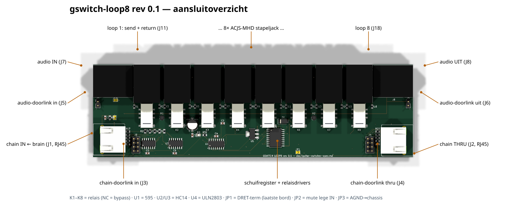

# gswitch-loop8 — 8× true-bypass relaisloop (Guitar Effect Switcher)

**Status**: rev 0.1 geroute — ERC 0, netcheck OK, DRC 0/0 (2026-07-12).
**Nog niet bestellen**: eerst ACJS-MHD-sample doorpiepen (T–TN) én
LCSC-matching/fab-pakket maken (`make_fab.sh` + `jlc_fix.py`).
Leidende spec: [`doc/guitar-switcher-spec.md`](../../../doc/guitar-switcher-spec.md).



*(Regenereren: `python hardware/kicad-generators/board_overview.py
<pcb> gswitch-loop8-overzicht.json` — 3D-render via kicad-cli met
callouts in bord-mm.)*

## Wat dit bord is

8 effect-loops met elk één DPDT-signaalrelais (bypass op het NC-contact:
stroom weg = signaal loopt door) en een Amphenol ACJS-MHD stapeljack
(SEND boven, RETURN onder). RETURN-tip-verbreekcontact is genormaliseerd
naar SEND-tip: lege loop = doorgeven. Keten-besturing via RJ45
(CLK/DATA/LATCH/EN + DATA_RET, 5V-logica, per bord herbuffered met 74HC14),
74HC595 + ULN2803A drijven de spoelen. Audio in west (J7), uit oost (J8).

- Bord: 200 × 58 mm, 2 laags. Jacks/RJ45's/headers THT (zelf solderen),
  rest SMD (JLC-assemblage).
- **AGND en GND zijn gescheiden zones** (audio noord, besturing zuid);
  koppeling alleen via JP3 (AGND=CHASSIS) en de hybride RC (C7/R33,
  GND=CHASSIS). RJ45-schermen → CHASSIS; zuidrand-spoor verbindt beide
  RJ45-schermen.
- Bitvolgorde firmware: **D1 (bit 0) = loop 1 … D8 (bit 7) = loop 8**;
  let op: op de 595 is D8 = Q0 (pin 15), D1..D7 = Q1..Q7. De
  ULN-toewijzing is geografisch gespiegeld voor de oostgroep
  (RLY6→pin18, RLY7→17, RLY8→16) — zie `OUTPIN` in de generator.

## Connector-pinouts

**J1 — chain IN (RJ45, van de brain) / J2 — chain THRU (naar het
volgende bord).** ⚠️ Géén ethernet: pin 4 voert 12 V! J3/J4 zijn
dezelfde signalen als 2×4-header (interne doorlink, pin 1…8 = RJ45
1…8); RJ45-schermen → CHASSIS.

| pin | 1 | 2 | 3 | 4 | 5 | 6 | 7 | 8 |
|---|---|---|---|---|---|---|---|---|
| functie | CLK | GND | DATA | **+12V** | GND | DRET (terug) | LATCH | EN |

**Loop-jacks J11–J18 (ACJS-MHD, gestapeld):** bovenste jack = SEND,
onderste = RETURN. Return-tip-verbreekcontact is genormaliseerd naar de
send-tip (lege loop = signaal door); ring + sleeve → AGND.

**J7 audio IN / J8 audio UIT (ACJS-MH):** tip = signaal, ring/sleeve →
AGND; J7-tip-verbreek → JP2 (mute lege ingang). J5/J6 = dezelfde audio
als soldeerpads: pin 1 = signaal, pin 2 = AGND.

## Jumpers

| Jumper | Functie | Wanneer dicht |
|---|---|---|
| JP1 TERM | sluit DATA_RET-lus (SER → DRET) | alleen op het **laatste** bord in de keten |
| JP2 IN-TN=AGND | mute een lege IN-jack | dicht bij losse kastjes; **open** bij audio-doorlink via J5 |
| JP3 AGND=CHASSIS | sterpunt audio-massa → behuizing | standaard dicht (één per kastje!) |

## Doorlink (16-loops-kastje, 2 borden)

- J5/J6: audio in/uit als soldeerpads (parallel aan J7/J8-tip) — bord 1 J6 →
  bord 2 J5 met kort afgeschermd draadje; J7/J8 op de binnenkant onbestukt.
- J3/J4: chain-link 2×4-headers (parallel aan RJ45 in/thru) voor een korte
  interne verbinding; RJ45's op de binnenkant onbestukt.

## Onderdelen-notities

- **Relais**: footprint = Kemet EE2-NU (KiCad-lib). EE2-12NU, TQ2SA-12V of
  HFD4/012-S — ⚠️ vóór bestellen land-pattern van de gekozen variant naast
  de EE2-footprint leggen (pads 1,11×3 op ±3,645; kolommen x ±3,645).
  9V-rig: -9V-spoelvariant, zelfde print.
- **Jacks**: ACJS-MHD (duaal) / ACJS-MH (enkel), Mouser. Pinout afgeleid uit
  de Amphenol-tekeningen (`doc/data-sheets/double jack/`): verbreekcontacten
  in de achterste pinrij. ⚠️ Bij eerste levering doorpiepen: zonder plug is
  T–TN gesloten.
- **RJ45**: afgeschermd 8P8C "56-klasse" THT (Ninigi GE / HanRun
  HR911105-zonder-magnetics-familie); footprint-maat uit KiCad-lib
  RJ45_Ninigi_GE. ⚠️ check gekochte type op de 2×NPTH-posts (ø3,25 @
  (−1,27/10,16, 6,35)).
- **BOM/LCSC**: symbolen hebben nog géén LCSC-veld — vóór fab-run
  `jlc_fix.py`-matching doen en false matches checken (order-recept).

## Bouwen

```
python hardware/kicad-generators/gen_gswitch_loop8.py   # sch + pcb (+ SES indien aanwezig)
kicad-cli sch erc --severity-error --exit-code-violations ...
kicad-cli sch export netlist ... ; cardlib.netcheck(...)
kicad-cli pcb drc --severity-error --refill-zones ...
# routing controlecluster:
#   mcp export_dsn -> gswitch_dsn_prep.py -> docker freerouting
#   -> gswitch-loop8.ses -> generator opnieuw (bakt SES native in)
```
