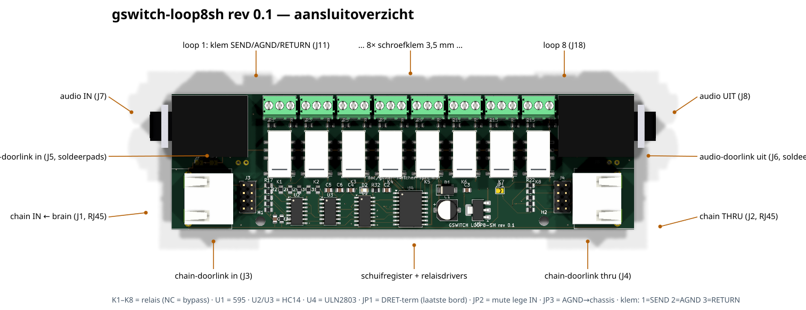
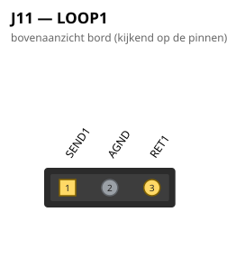
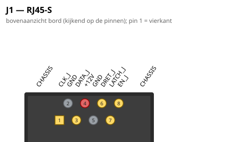

# gswitch-loop8sh — 8× true-bypass relaisloop, klem-variant (Sander van Herk)

**Status**: rev 0.1 geroute — ERC 0, netcheck OK, DRC 0/0 (2026-07-16).
**Nog niet bestellen**: eerst LCSC-matching/fab-pakket maken
(`jlc_fix.py`, zie order-recept) en klemmen-type bevestigen.
Leidende spec: [`doc/guitar-switcher-spec.md`](../../../doc/guitar-switcher-spec.md).



*(Regenereren: `python hardware/kicad-generators/board_overview.py
<pcb> gswitch-loop8sh-overzicht.json`.)*

## Wat dit bord is

De compacte variant van [gswitch-loop8](../gswitch-loop8/): zelfde
schakeling (8 DPDT-relaisloops, bypass op NC, RJ45-keten, 595 + ULN2803A),
maar de acht ACJS-MHD-stapeljacks zijn vervangen door **3-polige
schroefklemmen** — de klant soldeert/klemt zijn eigen kabels. Audio-IN/UIT
(J7/J8, ACJS-MH), RJ45 chain in/thru en de doorlink-voorzieningen blijven.

- Bord: **150 × 44 mm**, 2 laags (loop8: 200 × 58). Klemmen/jacks/RJ45's
  THT, rest SMD (JLC-assemblage).
- AGND en GND gescheiden zones (audio noord, besturing zuid); koppeling
  alleen via JP3 (AGND=CHASSIS) en de hybride RC C7/R33 (GND=CHASSIS).
- Bitvolgorde firmware identiek aan loop8: D1 (bit 0) = loop 1 …
  D8 (bit 7) = loop 8; oostgroep ULN-toewijzing geografisch gespiegeld
  (`OUTPIN` in de generator).

## ⚠️ Geen normalling op de klemmen

De stapeljack van loop8 heeft een verbreekcontact dat een **lege loop
automatisch doorlust**. Een schroefklem heeft dat niet: een geactiveerde
loop zonder aangesloten effect breekt het signaalpad. Regels:

- Lege loop **nooit activeren** (relais uit = NC = bypass, signaal loopt
  gewoon door) — in de firmware/brain de ongebruikte loops uitvinken.
- Of: SEND en RETURN van de lege klem doorlussen met een draadbruggetje.

## Klem-pinout (J11–J18, steek 3,5 mm)

| klem-pin | 1 (west) | 2 | 3 (oost) |
|---|---|---|---|
| functie | **SEND** (naar effect-in) | AGND (kabelscherm) | **RETURN** (van effect-uit) |



## Overige connectoren

**J1 — chain IN (RJ45, van de brain) / J2 — chain THRU.** ⚠️ Géén
ethernet: pin 4 voert 12 V! J3/J4 = zelfde signalen als 2×4-header
(interne doorlink); RJ45-schermen → CHASSIS.

| pin | 1 | 2 | 3 | 4 | 5 | 6 | 7 | 8 |
|---|---|---|---|---|---|---|---|---|
| functie | CLK | GND | DATA | **+12V** | GND | DRET (terug) | LATCH | EN |



**J7 audio IN / J8 audio UIT (ACJS-MH):** tip = signaal, ring/sleeve →
AGND; J7-tip-verbreek → JP2 (mute lege ingang). **J5/J6** = dezelfde
audio als soldeerpads (pin 1 = signaal, pin 2 = AGND) voor de
doorlink naar een tweede bord.

Diagrammen van álle connectoren: [`pinouts/`](pinouts/)
(gegenereerd met `pinout_svg.py --alle`).

## Jumpers

| Jumper | Functie | Wanneer dicht |
|---|---|---|
| JP1 TERM | sluit DATA_RET-lus (SER → DRET) | alleen op het **laatste** bord in de keten |
| JP2 IN-TN=AGND | mute een lege IN-jack | dicht bij losse kastjes; **open** bij audio-doorlink via J5 |
| JP3 AGND=CHASSIS | sterpunt audio-massa → behuizing | standaard dicht (één per kastje!) |

## Onderdelen-notities

- **Relais**: TQ2SA-12V(-Z) — JLC **C2684447** (SMD, voorraad). Kleinere
  5V-relais (Omron G6K) winnen niets: de klemmenrij zet de 12 mm-steek,
  en 12 V-spoelen passen bij de bestaande keten/brain.
- **Klemmen**: Phoenix PT 1,5/3-3,5-H (3,5 mm steek, 3-polig, liggend).
  Alternatief met zelfde land-pattern kan; footprint uit KiCad-lib.
- **Jacks**: ACJS-MH (enkel), Mouser. ⚠️ eerste levering doorpiepen:
  zonder plug is T–TN gesloten.
- **RJ45**: zie loop8-README (Ninigi GE-familie; NPTH-posts checken).
- **BOM/LCSC**: symbolen hebben nog géén LCSC-veld — vóór fab-run
  `jlc_fix.py`-matching doen en false matches checken (order-recept).

## Bouwen

```
python hardware/kicad-generators/gen_gswitch_loop8sh.py  # sch + pcb (+ SES indien aanwezig)
kicad-cli sch erc --severity-error ... ; kicad-cli sch export netlist ... ; cardlib.netcheck(...)
kicad-cli pcb drc --severity-error --refill-zones ...
# routing: mcp export_dsn -> gswitch_dsn_prep.py --keepout-box=100.5,100.5,249.5,124.0
#   -> docker freerouting -> gswitch-loop8sh.ses -> generator opnieuw (bakt SES in)
# GND-eilanden: gnd_stitch.py (KiCad-python) -> gnd_stitch.json -> generator opnieuw
```
