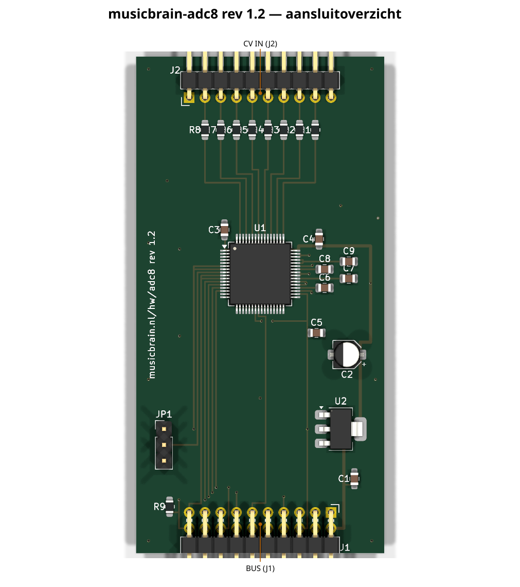
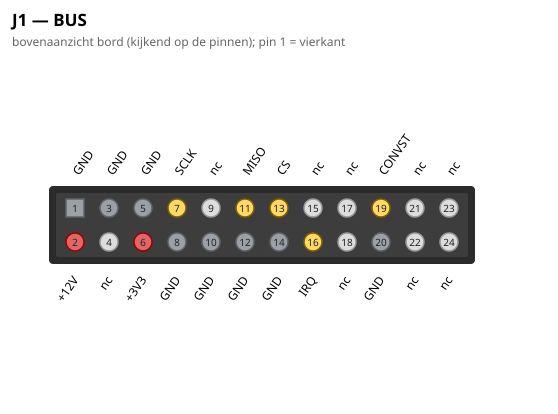
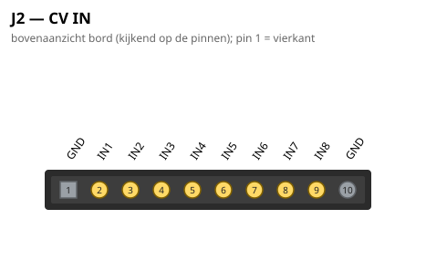

# MusicBrain ADC8 — 8× CV-ingang (slotkaart)

**Praktisch:** acht CV-ingangen voor je patch. Hiermee lees je externe
stuurspanningen (LFO's, envelopes, sequencers, expressiepedalen) de
software-synth in — ±10 V direct erop, alle kanalen tegelijk gesampled.
Combineer met een jack8 als front.

**Status**: rev 2.0 — ERC 0, netlijst pad-voor-pad geverifieerd, DRC 0/0.
**Spec**: `doc/spi-bus-spec.md` v2.0. Bord **65 × 45 mm**, 2 lagen.

## Gen 2 (rev 2.0, 2026-07-16)

- Slot **2×12**: CONVST = pin 19 (busbrede sample-strobe).
- **RESET is lokaal** (C15/R9 RC-power-up, τ = 10 ms) — de SPARE2-buslijn
  is in gen 2 vervallen.
- GND-binnenring onder de LQFP (zone-vulling haalt 0,5 mm-pads niet);
  koper via freerouting met `--route-gnd`. v1.2-kanaalmapping blijft.

De schakelingbeschrijving hieronder is ongewijzigd; waar de lopende
tekst nog gen-1-maten of 2×10 noemt, geldt bovenstaande. Overzicht en
pinouts hieronder zijn gen-2-gegenereerd.

## Wat het is

8 CV-ingangen op een **AD7606** (16-bit SAR, 8 kanalen simultaan gesampled):
±10V of ±5V **rechtstreeks de chip in** — 1 MΩ ingangsimpedantie en interne
clamps, dus géén opamp-frontend per kanaal. Keuze overgenomen van Nic
Newdigate's teensy-eurorack-breakout (met toestemming); de pinout is tegen
zijn bewezen ontwerp geverifieerd.

## Busaansluiting (seriële mode)

| AD7606 | Buslijn | Toelichting |
|---|---|---|
| ~RD/SCLK, ~CS | SCLK, CS | seriële uitlezing |
| DOUTA | MISO | 8×16 bit achter elkaar; DOUTB ongebruikt (nc) |
| CONVST A+B (gekoppeld) | **SPARE1 = CONVST** | busbrede "sample nú"-strobe — alle ADC-kaarten samplen synchroon |
| BUSY | IRQ (slotpin 16) | hoog tijdens conversie (~4 µs); dalende flank = data klaar → interrupt |
| RESET | **SPARE2 = ADC_RESET** | resetpuls na power-up, firmware-gestuurd; 100k pulldown (R9) op de kaart |
| PAR/~SER, ~STBY, REF_SELECT | +3V3 | serieel, actief, interne 2,5V-referentie |
| RANGE | JP1 | jumper: +3V3 = ±10V, GND = ±5V |
| OS0..2, DB0-6, DB9-15 | GND | geen oversampling; parallelle databus plat |

Firmware-cyclus: CONVST-puls → wacht op IRQ (BUSY↓) → CS laag → 8×16 bit
klokken via MISO → CS hoog.

## Voeding & ondersteuning

- AVCC = 5V **lokaal** (AMS1117-5.0 uit +12V, zoals op de gate-kaart);
  VDRIVE = +3V3 van de bus, zodat de logica op busniveau praat.
- REGCAP ×2 (1 µF), REFCAPA/B gekoppeld (10 µF), REFIN/REFOUT (10 µF) —
  de voorgeschreven ondersteuning voor de interne referentie.
- 1 kΩ serie in alle acht ingangen (bescherming); VxGND-pinnen aan het
  GND-vlak.

## Aansluitingen

- **J1** (haakse male 2×10, onderrand): bus-slotcontract; MOSI/LDAC/SDA/SCL nc.
- **J2** (haakse male 1×10, bovenrand, recht boven het midden van J1):
  1 = GND, 2–9 = IN1..8, 10 = GND — **identiek contract als GATE8-J2**,
  dus hetzelfde jack8-printje past.
- **JP1** (1×3): RANGE-keuze ±10V / ±5V.

## PCB-notities (v1.1)

De volgorde-omkering tussen de chip-ingangen (V1 oost … V8 west op de
noordrij) en het J2-contract (IN1 west … IN8 oost) is opgelost met
**Manhattan-routing**: F.Cu draagt uitsluitend verticalen (escape onder elk
V-pad, drop naar elke serieweerstand), B.Cu draagt acht horizontale lanes
(y 118,4–124,0, steek 0,8 mm) — zo kruist niets op dezelfde laag. De
SPI/stuur-lijnen bereiken de westkolom van de chip via zes F-verticalen
("diepste entry → oostelijkste verticaal"), gevoed vanaf J1 via korte
B-lanes onderin. De GND-pads tussen de V-escapes hangen aan een eigen
verzamelrail (y 130,5) met via's naar het B-vlak.

## v1.2 (2026-07-11): recht-toe-bedrading + firmware-remap

De V-omkering (kruisende B.Cu-lanes) is eruit: **V-kanaal V_k is nu recht
bedraad naar paneeljack (9−k)** — simpeler koper, minder via's. De remap zit
in de firmware: `MbAdc8::read()` spiegelt de AD7606-stream zodat
`out[0..7]` = paneeljack 1..8 (boven→onder). Jack-contract op J2 ongewijzigd
(1=GND, 2..9=jack 1..8, 10=GND).

## Aansluitoverzicht

### Pinouts

Bovenaanzicht van het bord (kijkend op de pinnen); pin 1 = vierkant. Gegenereerd uit het bordbestand met `hardware/kicad-generators/pinout_svg.py`.

