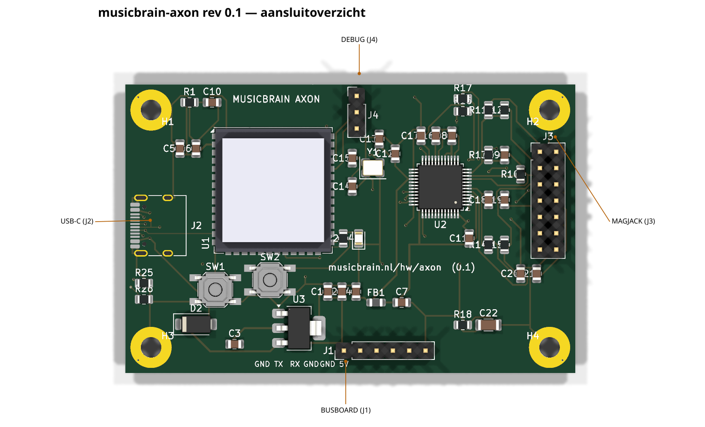
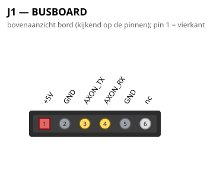
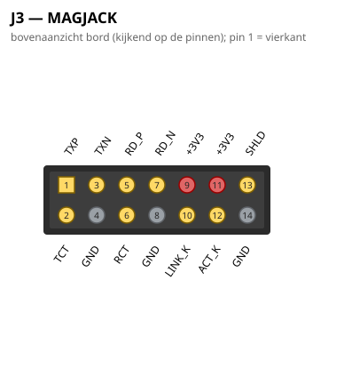
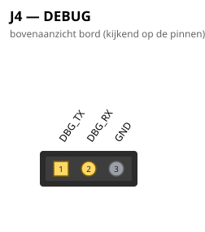

# MusicBrain Axon — ESP32-S3-netbridge (rev 0.1)

**Praktisch:** de netwerkkaart van het Cortex-systeem. Een ESP32-S3 serveert
de editor-API over WiFi én bekabeld netwerk (W5500) en praat via één UART
met de master-Teensy op het busboard — zo krijgen patches en instellingen
het systeem in zonder USB-kabel. Plan: `doc/axon-plan.md`; ADR 0001/0002
beschrijven de sidecar-architectuur en de API (HTTP + WebSocket + mDNS).

**Status**: rev 0.1 AF — ERC 0, netcheck OK, **DRC 0/0** (freerouting met
protected handroutes voor USB/CC/LED; `--route-gnd`). Fab-pakket in `fab/`.
Nog niet besteld; eerst firmware-bring-up-plan.

## Aansluitoverzicht

## Blokken

- **U1 ESP32-S3-WROOM-1U** — de 1U met U.FL: antenne per kabel naar het
  paneel (metalen omgeving). Strapping IO0/IO3/IO45/IO46 vrijgehouden;
  BOOT+RESET-tactschakelaars.
- **U2 W5500** (SPI-Ethernet, LQFP48) op de ESP32-FSPI-pinnen
  (SCLK=IO12, MOSI=IO11, MISO=IO13, CS=IO10; INT=IO9, RST=IO14).
  Analoog front-end per WIZnet-referentie: 49R9-pull-ups op TXP/TXN,
  10R naar de TX-centertap, 6n8-seriecondensatoren in RX, 49R9+10n
  RX-terminatie, 22n op de RX-centertap, 12k4 EXRES, 25 MHz + 2×18p.
- **J3 MAGJACK (2×7)** — kabel naar een paneel-RJ45 mét geïntegreerde
  magnetics (HanRun HR911105A-klasse). **Kabel kort houden (<15 cm) en de
  TX/RX-paren bij elkaar**; shield via 1n/2kV + 1M aan GND.
- **J1 BUSBOARD (1×6)** — twee **rechte 1:1-kabeltjes** naar het busboard.
  Pin-volgorde bewust zó dat er niets gekruist hoeft (de UART-TX↔RX-wissel
  zit al in de pinvolgorde):

  | J1 | signaal | → busboard | kabel |
  |----|---------|-----------|-------|
  | 1  | +5V     | J25.1 +5V | power (2 draden) |
  | 2  | GND     | J25.2 GND | power |
  | 3  | GND     | J19.1 GND | UART (4 draden) |
  | 4  | RX (AXON_RX) | J19.2 DLG1_TX | UART |
  | 5  | TX (AXON_TX) | J19.3 DLG1_RX | UART |
  | 6  | GND     | J19.4 GND | UART |

  Op busboard rev 3.2 kan dezelfde 1×6 rechtstreeks in een verticale socket.

  > ⚠️ **Oriëntatie bij assemblage**: enkelrijige headers keyen niet. De
  > **2-pin (+5V/GND)** omgekeerd = voeding omgepoold (schade). De **4-pin**
  > lijkt symmetrisch (GND aan beide kanten) maar omgedraaid wisselen RX↔TX.
  > Pin 1 (silk "5V") van elke kabel markeren. Bij de directe koppeling op
  > busboard 3.2 (geen kabel): gekeyde/geshroude connector — zie
  > `doc/axon-plan.md`.
- **J2 USB-C** — alleen eerste flash/debug; VBUS voedt het bord via een
  SS34 (bus-5V wint als beide aangesloten zijn). Daarna gaat firmware
  via WiFi-OTA.
- **U3 AMS1117-3.3** + ferriet naar de analoge 3V3 van de W5500.
- **J4 DEBUG (1×3)**: UART0 TX/RX/GND.

## Firmware-kant (nog te bouwen)

Zelfde JSON-RPC-frames als over USB-CDC (ADR 0002): de Teensy ziet een
`Transport` op Serial3; de ESP32 termineert HTTP/WebSocket/mDNS
(`musicbrain.local`) en straks OTA. Recepten uit het gswitch-project
(ESP32-S3, WiFi-OTA, USB-flash) zijn herbruikbaar.
