# MusicBrain busboard v2 — 16×CS / 12×IRQ + expansie + MIDI/CAN/codec/TUNE

**Status**: rev 2.0 AF — ERC 0, netlijst pad-voor-pad geverifieerd, **DRC 0/0**;
koper via de freerouting-pijplijn (+ hybride narun voor /CAN_TX en /IRQ5,
GND-hechtvia's automatisch geplaatst met `gnd_stitch.py`/`gnd_bridge.py`).
Fab-pakket in `fab/`. **Bestelbaar.**
**Plan + pintabel**: `doc/busboard-v2-plan.md` (leidend voor alle pinnummers).

## Blokken

- **Teensy 4.1** (west, verticaal, op 2× 1×24 socketstrip; SMD ≤ 6 mm mag
  eronder) — poort-daughterboard-model: de Teensy prikt op het busboard.
- **6 slots** (J1–J6, 2×10) + **2 hubs** (J7/J8, 2×5 IDC): zelfde slot/hub-
  pinout als v1 → alle bestaande kaarten passen ongewijzigd.
- **74HC154-CS-decoder** (U4): CSA0–3 + /E → 16 geografische CS-lijnen.
- **IRQ-keten**: 2× 74HC165 (U5 zuidwest: IRQ1–6; U6 noordoost: IRQ7–12,
  gelezen via decoder-Y14/IRQSTAT; per chip een PL-RC). Firmware-bytevolgorde
  1e byte = [IRQ5, IRQ6, x, x, IRQ1..4] — staat ook als noot in het schema.
- **Expansie**: 74LVC245-gebufferde lijnen + J21 (2×13 IDC) voor een tweede
  segment/busboard.
- **MIDI**: 2× IN (H11L1-opto's U9/U10) + 1× UIT (74LVC1G17 U11).
- **CAN3**: SN65HVD230 (U12) op Teensy-pins 30/31 + JP1-terminator + J16.
- **Codec-poort** (J17, 2×7): I2S1 (pins 7/8/20/21/23) + CODEC_RST (pin 22);
  I²C via de Qwiic-keten (J12).
- **TUNE-IN** (J18 + klem/deler, pin 1), **DLG-UART's** (J19/J20, Serial3/4).
- Voeding: J9 (2×5 IDC) → +12/−12 door; R-78E5.0 (U2) → 5 V; AMS1117 (U3)
  → 3V3; ontkoppelbank C1–C8.

## Mechanica-afwijkingen t.o.v. v1 (bovenplaat = v2!)

- M3 noord-midden: (115, 13) → **(163, 13)** (routecorridor).
- M3 zuid-west: (60, 122) → **(125, 122)** (lag midden op de DLG-headers).

## Werkwijze koper

Handrouting van vóór de placement-reparatie is geschrapt. De generator
(`hardware/kicad-generators/gen_bus2_pcb.py`) emit placement + GND-hechtvia's
en leest een freerouting-SES native in (zelfde pijplijn als enc5front:
DSN-export via de KiCad-MCP-server → GND-vlakken uit de DSN strippen → rand
0,6 mm inkrimpen → power-class 0,5 mm → Docker-freerouting, best-of-N →
netcheck + DRC als poortwachters).

## Aansluitoverzicht

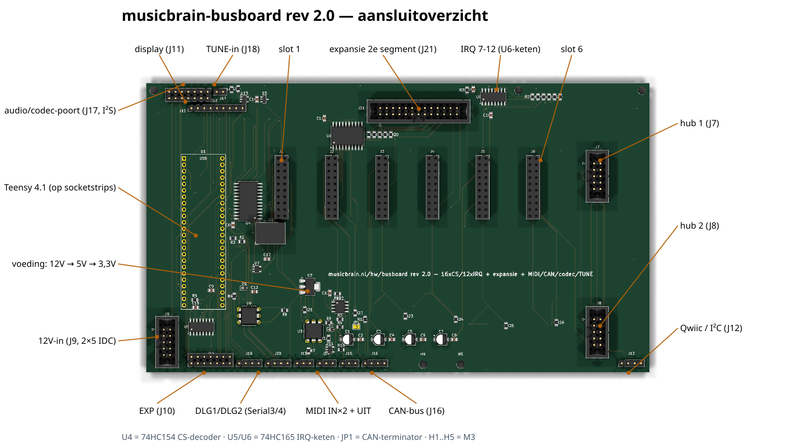

### Pinouts

Bovenaanzicht van het bord (kijkend op de pinnen); pin 1 = vierkant. Gegenereerd uit het bordbestand met `hardware/kicad-generators/pinout_svg.py`.

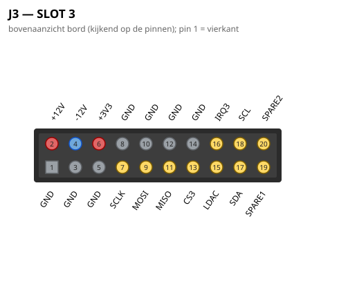

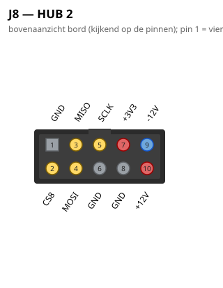
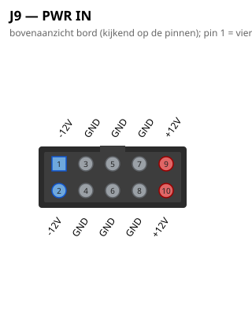
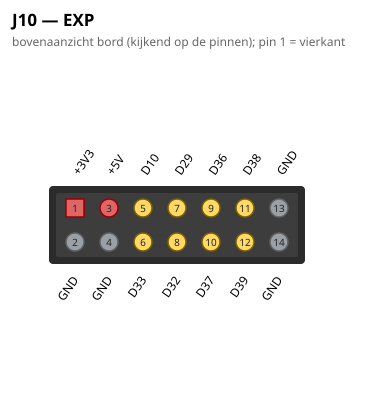
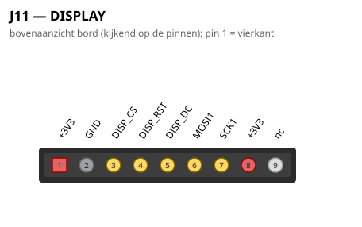
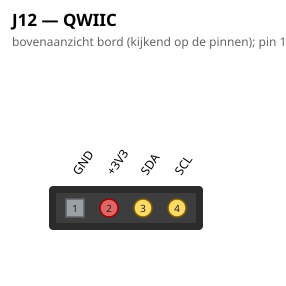

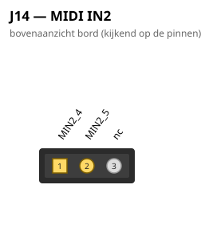
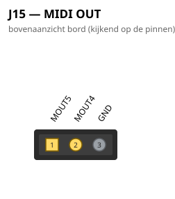
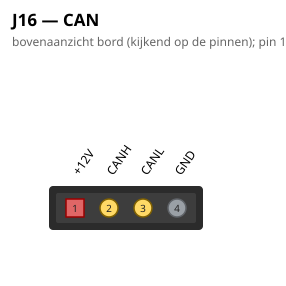
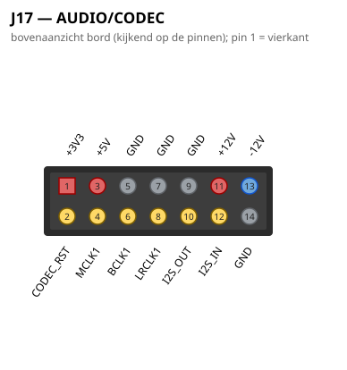
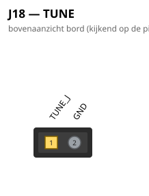
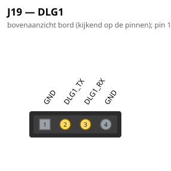
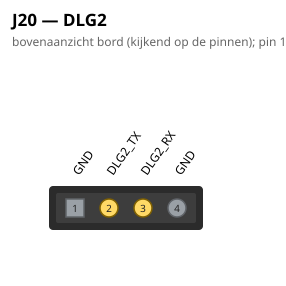

