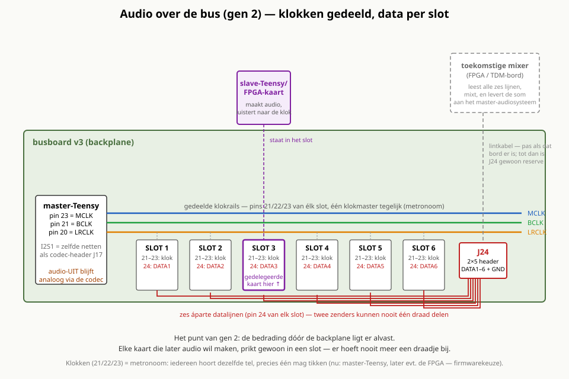
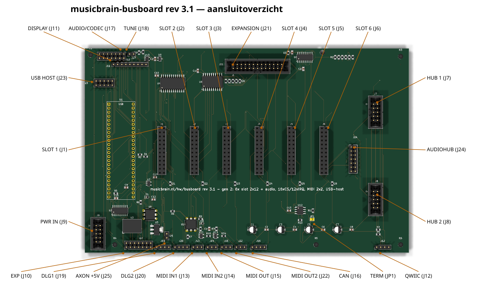
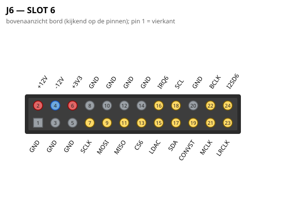
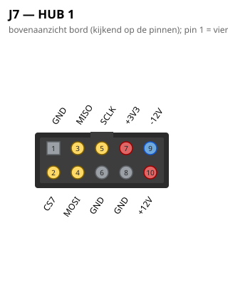
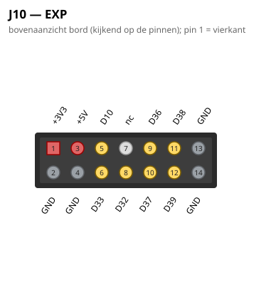
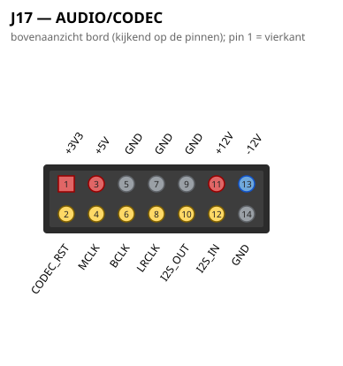
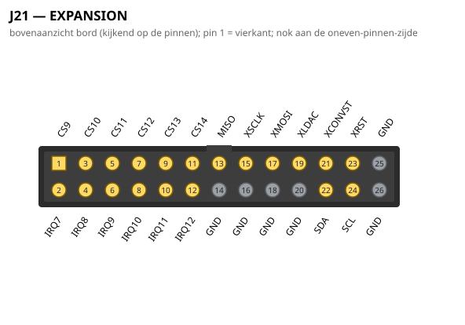
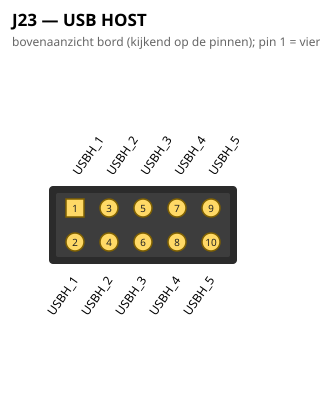
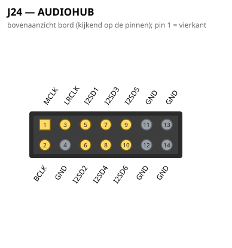

# MusicBrain busboard — Teensy 4.1-backplane (rev 3.0, gen 2)

**Praktisch:** dit is de ruggengraat van het systeem. Eén Teensy 4.1
bestuurt alle functiekaarten die je in de zes slots prikt; het bord
verzorgt voeding, de SPI-bus, MIDI (2 in / 2 uit), USB-host, CAN, het
display en de gedeelde audio-lijnen. Hier begint elke MusicBrain-bouw.

**Status**: rev 3.0 AF — ERC 0, netlijst pad-voor-pad geverifieerd, **DRC 0/0**;
koper volledig via de freerouting-pijplijn (`--route-gnd`). Fab-pakket in
`fab/`. **Bestelbaar.**
**Plannen**: `doc/busboard-v3-plan.md` (v3-delta's) + `doc/busboard-v2-plan.md`
(architectuur/pintabellen) + `doc/spi-bus-spec.md` v2.0 (leidend voor de bus).

## Wat is v3 (gen 2)

- **Bord 203,2 × 128,5 mm (40 HP × 3U-paneelvlak)** — paneel, fronts en
  grondbord delen één footprint en gatenraster (M3: 4 hoeken + noord/zuid-
  midden) → zelfstandige unit mogelijk.
- **6 slots 2×12** (was 2×10), gecentreerd op het bordhart, steek 20,32 mm
  (4 HP). Slot-pinout per spi-bus-spec v2.0: pin 19 = CONVST, 20 = GND-guard,
  21–24 = MCLK/BCLK/LRCLK/I2SD·slot.
- **Audio over de bus**: klokrails gedeeld (zelfde netten als Teensy-I2S1 en
  de codec-header — klokmaster is een firmwarekeuze), één datalijn per slot.
- **J24 audiohub** (2×7, oostrand naast de hubs, búiten het kaartvolume):
  klokken + I2SD1–6 verzameld voor een toekomstige FPGA-/TDM-mixer; een
  expander-segment krijgt zijn klokken via zijn eigen J24 aangeleverd.
- **MIDI 2× IN / 2× UIT**: J22 (OUT2 = TX7/pin 29) met eigen 74LVC1G17 (U14).
- **J23 USB-host-doorvoer** (2×5): rij A = kabeltje van de Teensy-hostpads,
  rij B = kabeltje naar de paneel-USB-A; pin-voor-pin doorverbonden en
  volgorde-ongevoelig. VBUS loopt via VIN = de +5V-rail → daarom U2 nu
  **R-78E5.0-1.0** (1 A).

## Blokken (architectuur = v2)

- **Teensy 4.1** (west, op 2× 1×24 socketstrip; SMD ≤ 6 mm eronder mag).
- **6 slots** (J1–J6, 2×12) + **2 hubs** (J7/J8, 2×5 IDC, pinout = v1).
- **74HC154-CS-decoder** (U4, noordstrook): CSA0–3 + /E → 16 geografische CS.
- **IRQ-keten**: 2× 74HC165 (U5 zuidwest: IRQ1–6; U6 noordoost: IRQ7–12,
  uitlezen via decoder-Y14/IRQSTAT; per chip een PL-RC).
- **Expansie**: 74LVC245-buffer (U8) + J21 (2×13 IDC) voor één
  expander-segment (CS9–14, IRQ7–12; XRST-lijn = reserve sinds gen 2).
- **MIDI**: 2× IN (H11L1-opto's U9/U10) + 2× UIT (74LVC1G17 U11/U14).
- **CAN3**: SN65HVD230 (U12, zuidoost) + JP1-terminator + J16 (+12V mee).
- **Codec-poort** (J17, 2×7): I2S1 + CODEC_RST; I²C via de Qwiic-keten (J12).
- **TUNE-IN** (J18 + klem/deler → pin 1), **DLG-UART's** (J19/J20, Serial3/4).
- Voeding: J9 (2×5 IDC, 10-pins Eurorack: alleen ±12V/GND) → R-78E5.0-1.0
  (U2) → 5 V; AMS1117 (U3) → 3V3; ontkoppelbank C1–C8.

## Werkwijze koper

`gen_bus3_sch.py` + `gen_bus3_pcb.py` (placement + SES native inlezen).
Pijplijn: DSN-export via de KiCad-MCP-server → `prep_dsn.py --route-gnd`
(GND blijft routeerbaar net: de router respecteert dan de GND-pads én maakt
het net zelf af; de kopervlakken zijn bonus) → Docker-freerouting best-of-N →
netcheck + DRC 0/0 als poortwachters. `BUS3_NOROUTE=1` geeft het kale
placement-bord voor de DSN-export.

## Aansluitoverzicht

### Pinouts

Bovenaanzicht van het bord (kijkend op de pinnen); pin 1 = vierkant.
Gegenereerd uit het bordbestand met `hardware/kicad-generators/pinout_svg.py`.

