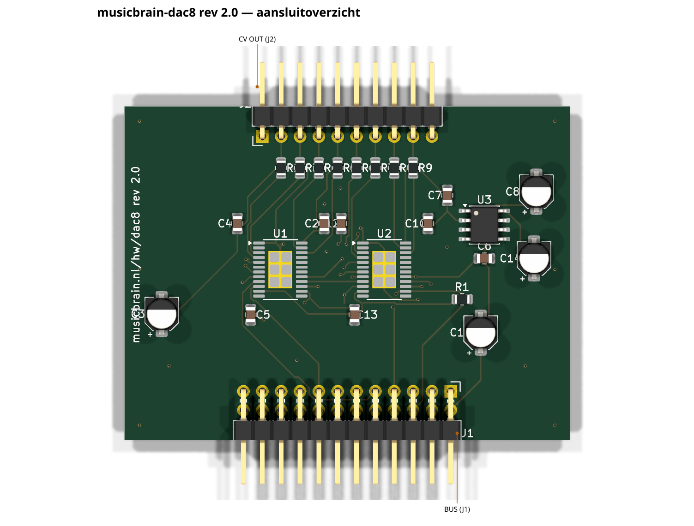
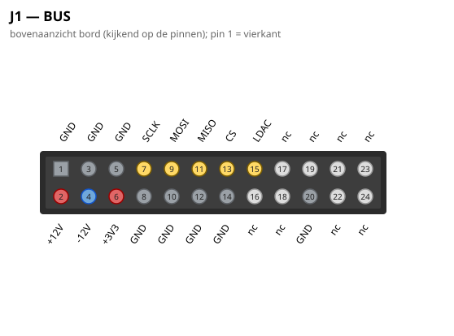
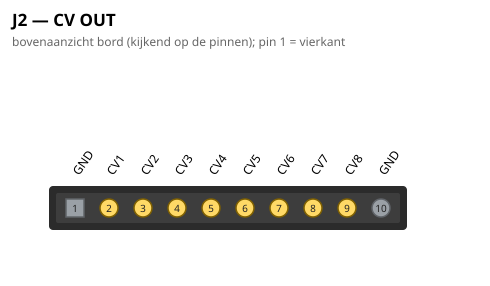

# MusicBrain DAC8 — 8× CV-uitgang (slotkaart)

**Praktisch:** acht CV-uitgangen. Hiermee stuurt de software analoge
modules aan: sequenties, LFO's, envelopes of random spanningen naar
elke Eurorack-ingang, sample-synchroon over alle kanalen (LDAC).
Combineer met een jack8 als front.

**Status**: rev 2.0 — ERC 0, netlijst pad-voor-pad geverifieerd, DRC 0/0.
**Spec**: `doc/spi-bus-spec.md` v2.0. Bord **60 × 45 mm**, 2 lagen.

## Gen 2 (rev 2.0, 2026-07-16)

- Slot **2×12**; H 80 → 45; DACs onder hun CV-kolommen (U1 → CV1–4,
  U2 → CV5–8). Daisy-chain, LDAC-buslijn en J2-contract ongewijzigd.
- DGND-reddingsspoor (pin 15) vast in de generator; koper via freerouting.

De schakelingbeschrijving hieronder is ongewijzigd; waar de lopende
tekst nog gen-1-maten of 2×10 noemt, geldt bovenstaande. Overzicht en
pinouts hieronder zijn gen-2-gegenereerd.

## Wat het is

8 nette CV-uitgangen uit **2× AD5754BREZ** (16-bit quad-DAC, ±10V-bereik)
met een gedeelde **ADR421**-referentie (2,5 V precisie) — hetzelfde
gevalideerde recept als de AD5754-breakout, nu als slotkaart in lijn met
GATE8/ADC8.

## Architectuur

- **Daisy-chain**: MOSI → U1.SDIN, U1.SDO → U2.SDIN, U2.SDO → MISO.
  Eén CS voor beide chips; de firmware klokt 48-bit frames (2×24) en
  bereikt beide DAC's in één transactie. U2.SDO is tri-state bij CS hoog.
- **LDAC = buslijn** (slotpin 15): beide chips laden hun uitgangsregisters
  tegelijk op LDAC↓ — en tegelijk met álle andere DAC-kaarten op de bus.
  Dat is precies waarvoor de LDAC-lijn in de spec bestaat.
- **Offset binary** (BIN/2sCOMP = pin 5 → +3V3), ~CLR (pin 11) met 10k
  pull-up (R1), DVCC (pin 14) = +3V3, DGND (pin 15) = GND, interne
  versterkers op ±12V (AVDD/AVSS), EP-pads aan AVSS.
- **~LDAC = pin 10** → de bus-LDAC-lijn (slotpin 15); pin 12/13 = NC.
  De AD5754-pinnummering is geverifieerd tegen de datasheet
  (`doc/data-sheets/AD5754BREZ data.md`), Nic Newdigate's ontwerp én het
  ComponentSearchEngine-symbool — drie onafhankelijke bronnen.
- **AD5754BREZ heeft géén interne referentie** (de "R" in de datasheet-titel
  slaat op de R-variant die dat wél heeft). Vandaar de **ADR421** (U3, 2,5 V
  precisie) → REFIN (pin 17) van beide chips, met **0,1 µF (C6) + 10 µF (C14)**
  ontkoppeling op VREF zoals de datasheet voorschrijft.
- 100 Ω serie per uitgang (R2–R9), kortsluitbescherming.

## Kanaaltoewijzing

| CV | DAC | | CV | DAC |
|---|---|---|---|---|
| CV1 | U1·B | | CV5 | U2·A |
| CV2 | U1·A | | CV6 | U2·B |
| CV3 | U1·C | | CV7 | U2·C |
| CV4 | U1·D | | CV8 | U2·D |

(CV1/CV2 verwisseld t.o.v. alfabetisch — routinggedreven; firmware-tabel.)

## Aansluitingen

- **J1** (haakse male 2×10, onderrand): volledig contract incl. +12V,
  −12V, +3V3, LDAC; MOSI én MISO in gebruik (daisy).
- **J2** (haakse male 1×10, bovenrand): 1 = GND, 2–9 = CV1..8, 10 = GND —
  zelfde jack8-contract; **JP1 op het jack8-printje OPEN laten** (outputs!).

## PCB-notities

De acht VOUT's verlaten de chips via korte F-escapes naar via's en lopen
als B.Cu-lanes (y 114,3–118,3, strikt genest) naar de serieweerstandsrij.
De stuursignalen dalen als B-rijen onderin (CS 168,6 / SCLK 169,4 /
MOSI 170,2 / CLR 162,4) naar F-verticalen die de 0,65 mm-westkolommen
in nesten ("diepste entry → oostelijkste verticaal"); LDAC heeft een
F-band op y 167,3 en stapt bij U1 van onderen de padkolom in. De
±12V/+3V3-verdeling loopt via een F-corridor (y 120,3/121,1) boven de
chips en B-banden (y 160,8/161,6) onderlangs. VREF loopt op B.Cu van de
ADR421 naar beide REFIN-pinnen. DGND-pads tussen de fijne entries hangen
aan eigen redding-via's.

## Firmware

Setup per chip (via de keten): power-up register (alle kanalen aan),
output range ±10V, BIN-coding. Daarna per sample: 2×24 bit data door de
keten schuiven, CS hoog, en LDAC↓ (buslijn) voor de synchrone update.

## Aansluitoverzicht

### Pinouts

Bovenaanzicht van het bord (kijkend op de pinnen); pin 1 = vierkant. Gegenereerd uit het bordbestand met `hardware/kicad-generators/pinout_svg.py`.

