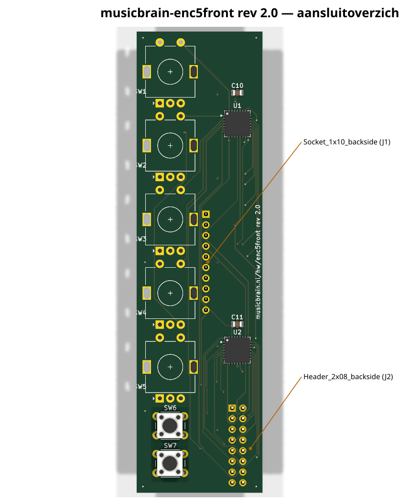
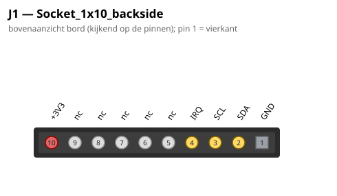
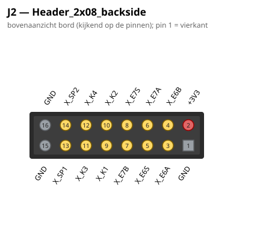

# MusicBrain ENC5-FRONT — slim front: 5× encoder + 2 knoppen + display-expansie

**Praktisch:** vijf encoders en twee knoppen aan het paneel — de
menu- en parameterbediening van het systeem, via de i2criser aan de
bus.

**Status**: rev 2.0 — ERC 0, netlijst pad-voor-pad geverifieerd, DRC 0/0. Bord **30×110 mm**, 2 lagen.
**Riser**: `musicbrain-i2criser/` (domme I²C-doorlus; de generieke riser past NIET meer — rev 2.0 gebruikt de 1×10-front-koppeling).

## Wat het is

Slim front-bord (route 2): ligt plat aan het paneel, met **2× MCP23017**
(I²C, 32 GPIO-bits) erop. Bedient:

- **5× EC11E-encoder** (verticaal, met drukas — **drukassen zijn bedraad**)
  op de as-hartlijn 8,0 mm, steek **17,6 mm** → paneelknoppen tot ~17 mm;
- **2× drukknopje** (6 mm THT-tact) onder de encoders, ook op de hartlijn;
- **J2 = 2×8 expansieheader** (male, achterzijde) voor het **display-deel**:
  2 extra encoders + 4 knoppen + 2 reservelijnen, via bandkabel.

Dit front zit **uiterst links of rechts** in het paneel: daarom mag het
30 mm breed zijn (i.p.v. de 20 mm-kolom); de as-hartlijn blijft op 8,0.
De encoders zijn 90° gedraaid (pinnenrij horizontaal), zodat de
socketkolom over de hele bordlengte vrij is.

## Koppeling (front-koppel-standaard)

**J1 = 1×10 female socket op de ACHTERZIJDE**, kolom **x = 16,5 mm van de
westrand, pin 1 op 43,57 mm van de bovenrand** — identiek aan pot8front/
jack8/jack4. Contract ENC-front:

| pin | functie |
|----|----|
| 1 | GND |
| 2 | SDA |
| 3 | SCL |
| 4 | /IRQ |
| 5–9 | nc |
| 10 | +3V3 |

## GPIO-toewijzing (firmware-mapping)

**U1 = 0x20** (noord): GPA0–7 = E1A,E1B,E2A,E2B,E3A,E3B,E4A,E4B;
GPB0–3 = E1S..E4S (drukassen), GPB4/5 = X_SP1/X_SP2 (J2-spares), GPB6/7 vrij.

**U2 = 0x21** (zuid): GPA0–7 = X_E6A,X_E6B,X_E6S,X_E7A,X_E7B,X_E7S,X_K1,X_K2;
GPB0/1 = X_K3/X_K4, GPB2/3 = **K1/K2 (knopjes op dit bord)**,
GPB4–6 = E5A,E5B,E5S, GPB7 vrij.

**Firmware**: GPPU aan (alle ingangen, schakelaars schakelen naar GND);
INTA van beide chips deelt /IRQ → **IOCON.ODR = 1 (open-drain) + MIRROR**.

## J2-expansie (display-deel)

| pin | | pin | |
|----|----|----|----|
| 1 | GND | 2 | +3V3 |
| 3 | E6A | 4 | E6B |
| 5 | E6S | 6 | E7A |
| 7 | E7B | 8 | E7S |
| 9 | K1 | 10 | K2 |
| 11 | K3 | 12 | K4 |
| 13 | SP1 | 14 | SP2 |
| 15 | GND | 16 | GND |

(K1..K4/E6/E7 = knoppen/encoders **onder het display**; SP = reserve, op U1.)

## Routing & controlepunten

Koper via de freerouting-pijplijn (DSN → Docker-freerouting → SES native in
de generator), clearance **0,15 mm** (netclass in het .kicad_pro; JLC kan
0,127). X_E7S is een handroute (oostcorridor).

1. ⚠️ **QFN-pinvolgorde** (pin 1 = GPB1, EP = VSS, DS20001952) vóór
   assemblage-order nogmaals tegen de datasheet houden.
2. ⚠️ **Pin-1-oriëntatie** socket ↔ i2criser-J2 bij de eerste fysieke
   passing verifiëren.

## Aansluitoverzicht

### Pinouts

Bovenaanzicht van het bord (kijkend op de pinnen); pin 1 = vierkant. Gegenereerd uit het bordbestand met `hardware/kicad-generators/pinout_svg.py`.

