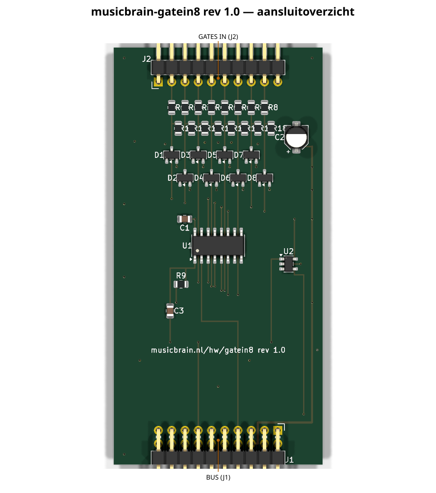
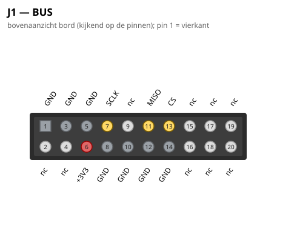
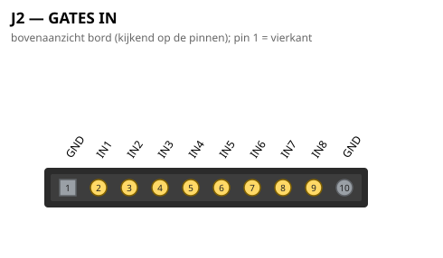

# MusicBrain GATEIN8 — 8× gate/trigger-ingang (slotkaart)

**Status**: schema ERC-schoon + netlist geverifieerd; PCB volledig geroute
(DRC 0 fouten, 0 unconnected). **Spec**: `doc/spi-bus-spec.md`.
Bord: 40 mm breed × **80 mm hoog** (H-standaard), 2 lagen.

## Wat het is

8 digitale ingangen (gates, triggers, clocks) die de firmware in één
SPI-transactie binnenhaalt via een **74HC165** schuifregister (parallel-in,
serieel-uit) op +3V3. Elke ingang is Eurorack-proof geconditioneerd:

- **100 kΩ serie** (R1–R8): stroombegrenzing bij hete signalen;
- **100 kΩ pulldown** (R11–R18): ongepatcht = netjes laag;
- **BAT54S-clamp** (D1–D8): knoop geklemd tussen GND en +3V3 — ±10V mag
  er zo in (≤ ~70 µA clampstroom door de 100k).
- HC-drempel op 3V3 ≈ 1,65 V → alles boven ~2 V telt als hoog.

## Latch-truc (~PL vanaf CS)

De '165 laadt parallel zolang ~PL laag is en schuift pas als hij weer
hoog is — maar CS blijft laag tijdens de hele SPI-transactie. Daarom maakt
**C3 (220p) + R9 (10k naar 3V3)** van de CS-neerflank een korte
~PL-latchpuls (~2 µs): de kaart bevriest zijn 8 bits op CS↓, daarna klokt
de Teensy ze binnen. **Firmware: wacht ≥5 µs tussen CS-laag en de
transfer.** Q7 gaat via een **74LVC1G125** (OE = CS) naar MISO, zodat de
kaart de bus loslaat als hij niet geselecteerd is.

## Bitvolgorde

Routinggedreven mapping (firmware hertelt met een tabel), eerste bit
(Q7/D7) eerst: **IN6, IN5, IN4, IN3, IN1, IN2, IN7, IN8**.

## Aansluitingen

- **J1** (haakse male 2×10, onderrand): bus-slotcontract; alleen SCLK,
  MISO, CS en +3V3 gebruikt — MOSI/±12V nc.
- **J2** (haakse male 1×10, bovenrand): 1 = GND, 2–9 = IN1..8, 10 = GND —
  zelfde contract als GATE8/ADC8, dus hetzelfde jack8-printje past.
  **JP1 op het jack8-printje dichtsolderen** (inputs → ongepatcht 0 V).

## PCB-notities

Per kanaal een knoopkolom onder de serieweerstand: pulldown-tap opzij,
diode-pad-3 op de kolom (het spoor duikt tussen de diodepads 1/2 door).
De acht knopen bereiken de '165 via B.Cu-lanes: vier bovenlangs
(y 129–131,4) naar de noordrij, vier onderlangs (y 145–147,4) dwars
tussen de SOIC-padrijen door naar de zuidrij. De +3V3-spine loopt langs
de oostrand met B-aftakrijen voor de diodes (y 122,9/127,3), VCC (132,9)
en R9 (148,9). MISO duikt onder de J1-padrij door (B.Cu) het THT-pad in.

## Aansluitoverzicht

### Pinouts

Bovenaanzicht van het bord (kijkend op de pinnen); pin 1 = vierkant. Gegenereerd uit het bordbestand met `hardware/kicad-generators/pinout_svg.py`.

