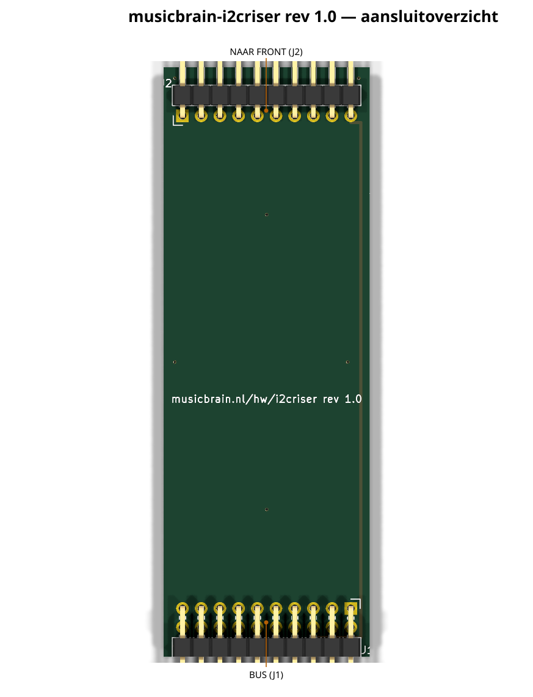
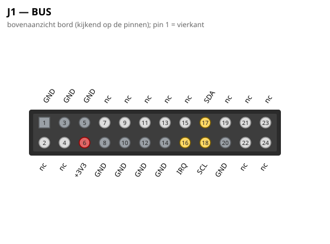
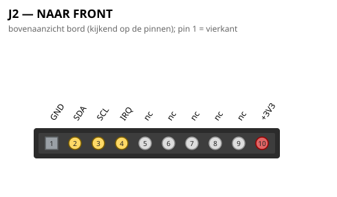

# MusicBrain I2C-RISER — domme riser voor I²C-fronts

**Praktisch:** koppelt een encoder/knoppen-front (enc5front) aan de
bus via I²C — passieve riser, alleen voeding + Qwiic-keten.

**Status**: rev 2.0 — ERC 0, netlijst pad-voor-pad geverifieerd, DRC 0/0.
Bord **40 × 45 mm**, 2 lagen, geen componenten.

## Gen 2 (rev 2.0, 2026-07-16)

- Slot **2×12** (alleen GND/3V3/SDA/SCL/IRQ aangesloten; audio loopt niet mee).
- H 80 → 45; bord 28 → 40 breed (de 2×12 paste niet meer op 28).
- Paneelheader-inzet gecorrigeerd (volle 6 mm paarpin).

De schakelingbeschrijving hieronder is ongewijzigd; waar de lopende
tekst nog gen-1-maten of 2×10 noemt, geldt bovenstaande. Overzicht en
pinouts hieronder zijn gen-2-gegenereerd.

## Wat het is

Verticaal printje tussen een **busboard-slot** en het **ENC5-FRONT** (of elk
ander I²C-front). Lust alleen GND / +3V3 / SDA / SCL / /IRQ door; geen
elektronica (I²C-pull-ups zitten aan de busmaster-kant, Qwiic-keten).

- **J1** (haakse male 2×10, onderrand): in het busboard-slot
  (standaard slotpinout; gebruikt pinnen 6=+3V3, 16=/IRQ, 17=/SDA, 18=/SCL
  + GND's).
- **J2** (haakse male 1×10, bovenrand): in de front-socket op de
  **front-koppel-standaard**. Contract: **1 = GND, 2 = SDA, 3 = SCL,
  4 = /IRQ, 5–9 = nc, 10 = +3V3** (zelfde mechanische plek als de
  potriser-J2; alleen de pinfuncties verschillen per front-soort).

## Familie

| riser | front | inhoud |
|---|---|---|
| `musicbrain-potriser` | pot8front | MCP3208 + 100n-reservoirs (SPI) |
| `musicbrain-i2criser` | enc5front | kale doorlus (I²C) |
| `musicbrain-riser` | generiek | volledige 2×10-bus 1-op-1 |

⚠️ Pin-1-oriëntatie van J2 t.o.v. de front-socket bij de eerste fysieke
passing controleren (zelfde controlepunt als bij de potriser).

## Aansluitoverzicht

### Pinouts

Bovenaanzicht van het bord (kijkend op de pinnen); pin 1 = vierkant. Gegenereerd uit het bordbestand met `hardware/kicad-generators/pinout_svg.py`.

