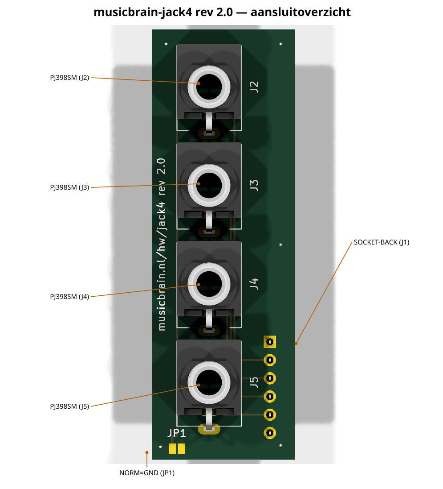
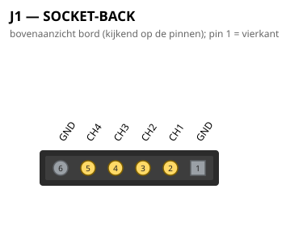

# MusicBrain jack4 — Thonkiconn-paneeldrager (4 jacks)

**Status**: rev 2.0 — ERC 0, netlijst geverifieerd, DRC 0/0. Bord **20 × 60 mm**.

## Gen 2 (rev 2.0, 2026-07-16)

- 4 jacks op steek **13,75**; kabelbord aan de hub-DAC (centrering van de
  socket is hier niet relevant).
- Zelfde pad-slanking en randmarge als jack8.

De schakelingbeschrijving hieronder is ongewijzigd; waar de lopende
tekst nog gen-1-maten of 2×10 noemt, geldt bovenstaande. Overzicht en
pinouts hieronder zijn gen-2-gegenereerd.
**Zusje: `musicbrain-jack8/` (8 jacks + 1×10 header).**

**v1.2 (2026-07-11)**: socket op de **front-koppel-standaard** (kolom x = 16,5
van de westrand, pin 1 op 43,57 van de bovenrand); 3D-model op de gatenrij;
silk-URL naar bordmidden; PCB-papier A3.

## Wat het is

Een passieve strip met **4× Thonkiconn** (PJ398SM = PJ301M-12 = WQP518MA,
onderling uitwisselbaar) op 15 mm steek, die als **frontpaneel-drager**
dient: de strip ligt horizontaal onder de bovenplaat, de schroefbussen steken erdoorheen en de moeren klemmen paneel
en printje op elkaar — geen extra steunen nodig.

## Aansluiting op de kaarten

- **J1** (1×6): 1 = GND, 2–5 = CH1..4, 6 = GND — hetzelfde contract als
  J2 op GATE8 én ADC8, dus één jack4 past op beide kaartsoorten.
- **Montage**: de female socket wordt op de **achterzijde** gesoldeerd
  (opening richting kaart); de kaart krijgt aan zijn frontrand een haakse
  male header. Het silkscreen op de achterzijde markeert de positie.
- Headerpositie: hart in het **midden van de strip**; de kaart heeft zijn
  paneelconnector recht boven het slotcentrum (spec-standaard), zodat elk
  jack-printje op elke kaart past en de strips op de bovenplaat uitlijnen.

## JP1: schakelcontact-normalling

Elke Thonkiconn heeft een schakelcontact (TN) dat bij een ongepatchte jack
tegen de tip ligt. Alle TN's zijn gebust naar één soldeerjumper **JP1**:

- **INPUT-kaart (ADC8): JP1 dichtsolderen** → ongepatchte ingangen lezen
  netjes 0 V.
- **OUTPUT-kaart (GATE8/DAC): JP1 OPEN laten!** Anders wordt elke
  ongepatchte uitgang via het schakelcontact naar GND kortgesloten
  (de 100R/1k serieweerstanden beperken dat, maar het hoort niet).

## Paneel

3U Eurorack: paneelhoogte 128,5 mm; boorpatroon = 4× Ø6 mm gat op 15 mm
steek, gecentreerd op de jackposities (eerste jack 8 mm van de bovenrand
van het printje). Printje zelf is 65 mm hoog (half 3U-paneel of 3U half gevuld).

## Aansluitoverzicht

### Pinouts

Bovenaanzicht van het bord (kijkend op de pinnen); pin 1 = vierkant. Gegenereerd uit het bordbestand met `hardware/kicad-generators/pinout_svg.py`.

