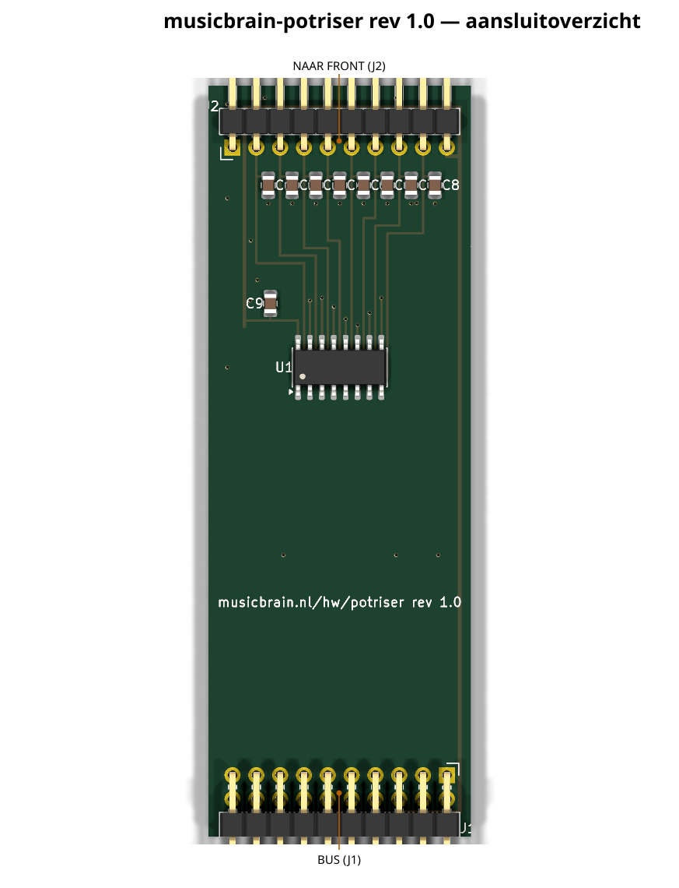
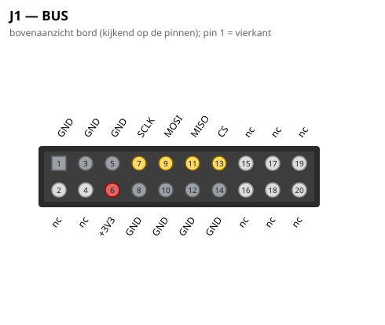
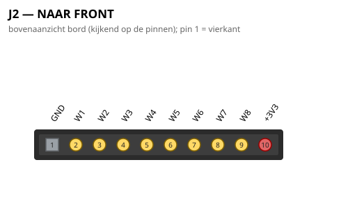

# MusicBrain POT-RISER — MCP3208-riser voor het POT8-FRONT

**Praktisch:** maakt van acht paneelpotmeters CV-bronnen: staat in een
slot, leest het pot8front uit en zet alle acht waardes op de bus.

**Status**: rev 2.0 — ERC 0, netlijst pad-voor-pad geverifieerd, DRC 0/0.
Bord **40 × 45 mm**, 2 lagen.

## Gen 2 (rev 2.0, 2026-07-16)

- Slot **2×12**; H 80 → 45; bord 28 → 40 breed.
- MCP3208 gedraaid: kanalen noordwaarts naar de reservoirs, SPI+GND
  zuidwaarts (anders raakte AGND opgesloten van het vlak).
- Koper via freerouting (SES naast het bord).

De schakelingbeschrijving hieronder is ongewijzigd; waar de lopende
tekst nog gen-1-maten of 2×10 noemt, geldt bovenstaande. Overzicht en
pinouts hieronder zijn gen-2-gegenereerd.
**Model**: route 2 — het domme POT8-FRONT ligt plat aan het paneel; deze smalle
riser staat eronder in het busboard-slot en draagt de elektronica.

## Connectoren

- **J1** (haakse male 2×10, onderrand): het busboard-slot in. Gebruikt alleen
  GND / +3V3 / SCLK / MOSI / MISO / CS; de rest (±12V, LDAC, IRQ, I2C, SPARE)
  is onaangesloten.
- **J2** (haakse male 1×10, bovenrand): het POT8-FRONT in.
  **Contract: 1 = GND, 2..9 = W1..W8 (lopers), 10 = +3V3.**
  ⚠️ Pin-1-oriëntatie t.o.v. de front-socket bij de eerste passing verifiëren
  (front-socket zit op de achterzijde); klopt de volgorde niet, dan de
  J2-map in `gen_potriser.py` spiegelen en regenereren.

## Elektrisch

- MCP3208 (SOIC-16), SPI mode 0, ratiometrisch (VREF = VDD = +3V3).
- CH0..CH7 = W1..W8 = paneel boven→onder.
- 100 nF-laadreservoir per loper (C1–C8) direct achter J2, 100 nF ontkoppeling (C9).
- Firmware: bestaande `MbPot8`-driver werkt ongewijzigd (zelfde chip + mapping).

## Waarom dit bord

De pot8-slotkaart (110×80, met haakse pots erop) is geen drager voor het
front-model: pots zitten in de weg, geen frontconnector en onnodig breed
(besluit 2026-07-11). Deze riser vervangt hem in het pot-spoor; de pot8-kaart
blijft bruikbaar als losstaand alternatief zonder front.

## Aansluitoverzicht

### Pinouts

Bovenaanzicht van het bord (kijkend op de pinnen); pin 1 = vierkant. Gegenereerd uit het bordbestand met `hardware/kicad-generators/pinout_svg.py`.

