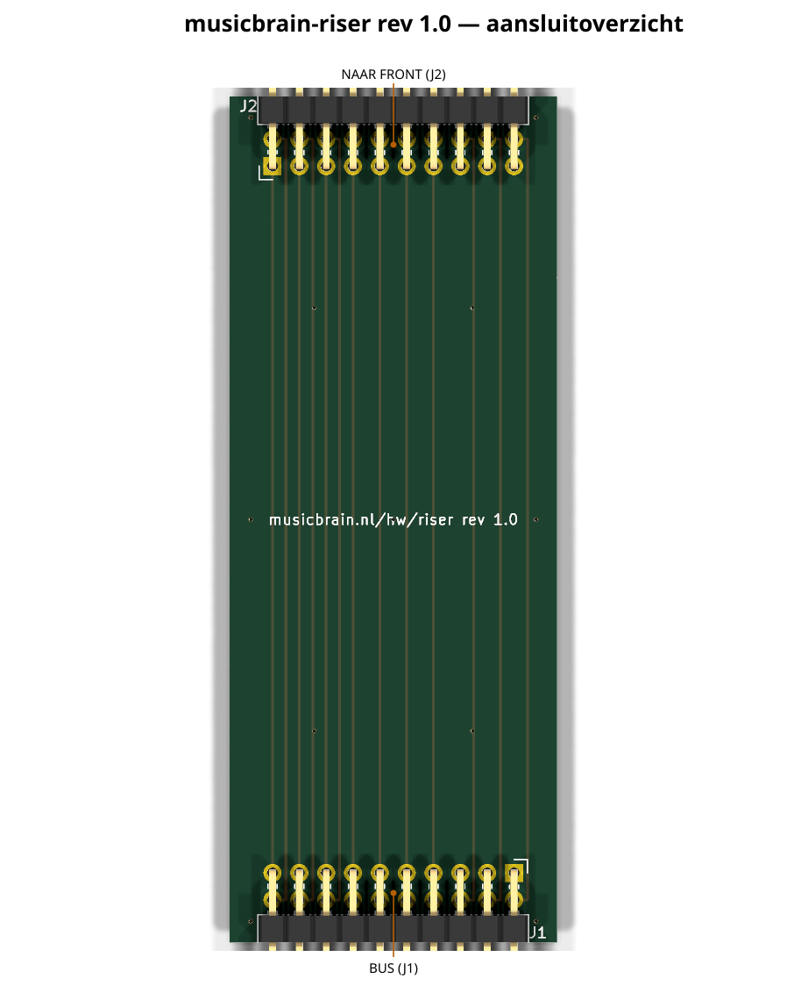
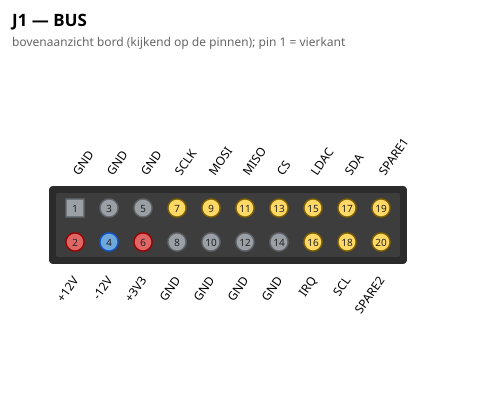
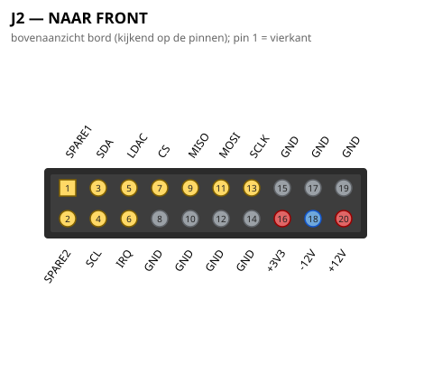

# MusicBrain RISER — generieke slot-verlenger

**Status**: schema ERC-schoon + netlist geverifieerd; PCB DRC 0/0.
**Spec**: `doc/spi-bus-spec.md`. Bord: ~31 mm × 80 mm (H-standaard), 2 lagen.

## Wat het is

Een dun verticaal printje dat **de volledige 2×10-bus van een busboard-slot
1-op-1 omhoog draagt** naar een horizontaal *front-bord* op paneelhoogte. Zo
kunnen de bediening-front-borden (POT8, ENC, …) plat aan de bovenplaat/​het
paneel liggen terwijl de elektronica (chip) op het front-bord zit.

- **J1** (haakse male 2×10, onderrand): in het busboard-slot — de standaard
  slotpinout (zie spec).
- **J2** (haakse male 2×10, bovenrand): naar het front-bord — draagt **alle**
  buslijnen mee (power + SPI + CS + LDAC + I2C + IRQ + SPARE).

Eén riser past onder **elk** front-bord dat de volledige 2×10-bus wil zien.
Let op (stand 2026-07-11): de twee bestaande front-sporen gebruiken inmiddels
**eigen smalle risers** — het pot-spoor de `musicbrain-potriser` (MCP3208 op
de riser, 1×10 naar het front) en het enc-spoor de `musicbrain-i2criser`
(domme I2C-doorlus, 1×10 naar het front). De generieke riser blijft nuttig
als slot-verlenger voor prototyping en voor toekomstige fronts die meer
buslijnen nodig hebben.

## Front-koppel-pinout (J2)

J2 (rot 90) spiegelt J1 (rot 270) in x, dus de nets zijn via **x-matching**
toegekend zodat alle doorverbindingen **recht** lopen (oneven rij op F.Cu recht,
even rij op F.Cu met 1,27 mm offset; GND via het vlak — geen via's, geen
kruisingen). Het front-bord moet dus J2's **fysieke** pinout volgen (niet de
slot-nummering): J2-pin *q* draagt de bus-functie van slot-pin (20−q) [oneven]
of (22−q) [even]. De front-generatoren gebruiken diezelfde afbeelding, dus dat
komt vanzelf goed.

## Mechanisch

Bus onder, front boven; hoogte H = 80 mm (gelijk aan de signaalkaarten, zodat
alle front-borden coplanair zijn). Dun in de slot-steek-richting (PCB-dikte),
past ruim binnen de 20 mm slotafstand.

## Aansluitoverzicht

### Pinouts

Bovenaanzicht van het bord (kijkend op de pinnen); pin 1 = vierkant. Gegenereerd uit het bordbestand met `hardware/kicad-generators/pinout_svg.py`.

